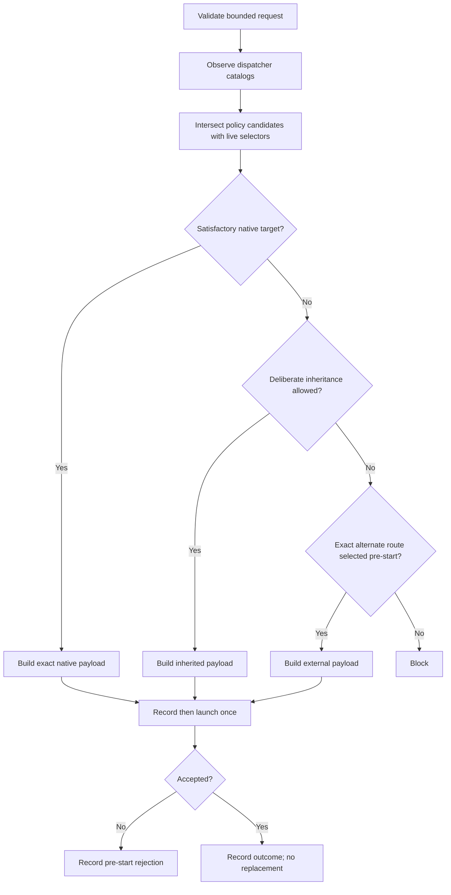

# Dispatching OAT Subagents

Use this internal contract to delegate bounded work while keeping judgment in
the calling skill. It standardizes provider selection and launch evidence. It
does not decide what work should be delegated or synthesize worker results.

## Progress Indicators (User-Facing)

This skill is an internal dependency; the calling skill owns the user-facing
mode and decides whether a sub-banner is useful. When surfacing a distinct
dispatch wave, use:

━━━━━━━━━━━━━━━━━━━━━━━━━━━━━━━━━━━━━━━━━━━━━━━━━━━━━
OAT ▸ SUBAGENT DISPATCH
━━━━━━━━━━━━━━━━━━━━━━━━━━━━━━━━━━━━━━━━━━━━━━━━━━━━━

Do not repeat the banner for every lane. Return a compact selection or blocking
summary for the caller to incorporate.

## Ownership Boundary

The calling skill owns:

- decomposition, lane boundaries, and output schemas;
- user-facing progress, authorization context, and decisions;
- verification of load-bearing worker claims;
- cross-lane synthesis, prioritization, and artifact writes.

This skill owns:

- capability and authorization probing;
- live catalog evidence and candidate intersection;
- model, effort, role, route, authority, and deadline selection;
- launch acceptance, continuation, recovery, and dispatch records.

Do not read OAT project state, interpret `pNN-tNN` identifiers, or add phase,
gate, commit, or worktree policy here. Project workflows must load
`oat-project-dispatch-subagents`, which adapts those concerns into this
contract.

## Required Loading

Read this file before every OAT-managed subagent dispatch. Resolve the active
provider first, then read exactly one provider reference:

- Claude: `references/provider-claude.md`
- Codex: `references/provider-codex.md`
- Cursor: `references/provider-cursor.md`

Do not merge provider references into one policy. For an unsupported provider,
apply this provider-neutral contract and fail closed when exact launch controls
cannot be established.

Read `references/record-schema.md` only when constructing or validating a
dispatch request, dispatch record, or homogeneous recon-wave record.

## Caller Request Contract

Require the caller to provide:

- a unique request ID and calling skill;
- bounded objective and scope;
- action and role name mapped to a baseline role class;
- expected output and verification evidence;
- authority, deadline, escalation conditions, and retry limit;
- fallback policy and authorization scope;
- route-selection source for any non-native route;
- optional resolved dispatch policy or named ceiling.

Reject an over-broad request before selection. Every nontrivial request must
state the exact objective, scope, expected output, verification evidence, and
conditions that require escalation. Model routing never repairs poor
decomposition.

The optional policy and ceiling are already-resolved inputs. Do not infer where
they came from or resolve project state to obtain them.

## Capability and Authorization

Classify delegation before launch:

| State                       | Meaning                                                         | Action                                                                  |
| --------------------------- | --------------------------------------------------------------- | ----------------------------------------------------------------------- |
| `available`                 | The host exposes a usable launch surface now.                   | Continue to catalog observation and selection.                          |
| `authorization-required`    | A usable surface exists but needs user approval or scope grant. | Ask once, preserve the approved scope, then re-probe.                   |
| `unresolved-or-unsupported` | No exact usable surface can be established in this environment. | Use only a pre-approved alternate route or block; do not invent syntax. |

Authorization-required is not unavailability. Do not silently reduce coverage
or run expensive work inline merely because one approval question is needed.
The caller owns the user interaction; this skill returns the question and
required scope.

## Native-First Route Selection

Use these route tiers:

1. **Native same-runtime:** Always the preferred default when it can satisfy
   the resolved role, model, effort, authority, and isolation requirements. It
   needs no additional authorization.
2. **Policy-resolved CLI/programmatic or cross-runtime:** Permitted without a
   per-run prompt when configured dispatch policy selected the route. Project
   policy resolved by `oat-project-dispatch-subagents` and configured
   cross-family gates are standing, scope-bound authorization. Some harnesses
   require this tier—for example Cursor task subagents when native model
   availability cannot satisfy the resolved project target.
3. **Agent-improvised CLI/programmatic or cross-runtime:** Prohibited unless
   the user explicitly approves the named target and scope for the current
   run. Approval from a prior run, task, branch reset, or materially different
   scope does not carry forward.

Availability of a provider CLI, SDK, API, or other programmatic surface is
capability evidence, not route authorization. The engine must distinguish a
policy-resolved alternate route from one proposed by the agent. If neither
configured policy nor current explicit approval authorizes the alternate
route, use an eligible native route or block.

Do not re-prompt for each task or gate when the caller provides a complete
policy-resolved route and scope. Record `selection_source: policy-resolved`
with the owning configuration evidence. Use
`selection_source: explicit-user` for a current-run operator grant and
`selection_source: native-default` for the preferred native route.

## Dispatch Axes

Keep these controls independent in selection and evidence:

- dispatch context: root native, nested native, provider CLI/programmatic,
  workflow, gate, or blocked;
- role or agent definition;
- model selector and selector granularity;
- effort or reasoning selector, when exposed;
- inheritance source and context-fork controls;
- authority, writable roots, deadline, and retry limit;
- route and fallback policy.

A materialized role may package defaults, but its record must preserve each
configured axis separately.

## Deliberate Dispatch Mode

Choose foreground or background deliberately from expected duration and the
host interaction model. Multi-minute implementers, fix loops, and reviewers
must survive ordinary session interaction and therefore run in background when
the host supports a durable awaited handle. Reserve foreground dispatch for
short checks whose interruption risk is negligible. Record the selected mode
and reason with the launch payload.

Background does not mean fire-and-forget. Retain and await the accepted handle,
apply the Acceptance and Recovery contract below, and surface useful progress.
In headless gate contexts, fire-and-forget background dispatch is forbidden:
use the gate's inline or synchronously awaited route contract instead.

For a silent background child, provider transcript filesystem metadata at the
documented runtime path can provide observable liveness evidence. Check only
metadata such as mtime and size. This evidence shows observable activity; it
is never a health verdict and never authorizes replacement, timeout extension,
or a second launch.

## Baseline Role Classes

Specific role names are extensible, but map every dispatch to one class:

| Class          | Default contract                                                                                                                  |
| -------------- | --------------------------------------------------------------------------------------------------------------------------------- |
| `recon`        | Read-only, bounded evidence collection. Select an explicit economical target; never silently inherit an expensive root model.     |
| `dossier-lead` | Reconcile dispersed evidence within one declared scope. May coordinate bounded recon only when nesting is supported and approved. |
| `generator`    | Produce a self-contained artifact within caller-declared authority.                                                               |
| `worker`       | Execute bounded work with explicit authority, outputs, and verification.                                                          |
| `reviewer`     | Perform independent or inherited review exactly as caller policy specifies.                                                       |
| `coordinator`  | Coordinate a caller-defined topology without taking over caller synthesis or user dialogue.                                       |

Use stronger workers when context, ambiguity, or consequence requires them,
not merely because many files exist. Keep coherence-critical synthesis and
cross-scope judgment in the root caller.

## Catalog Evidence

A catalog snapshot belongs to one dispatch context. A root native catalog does
not establish a nested coordinator's catalog, and a provider CLI account
catalog does not establish native eligibility.

Before explicit selection:

1. Observe selectors exposed to the dispatcher that will launch the child.
2. Observe role or agent-type selectors when exposed before selection.
3. Record catalog source, context, and observation time.
4. Intersect configured candidates allowed by policy and ceiling with that
   catalog, preserving exact provider strings.
5. Keep volatile observations out of durable configuration unless the user
   explicitly changes the owning configuration.

Do not launch a diagnostic child solely to obtain a catalog the provider
cannot expose before selection. Record the visibility timing instead.

## Full-Information Selection

For every dispatch:

1. Validate the caller request and capability state.
2. Resolve provider, context, role class, policy, ceiling, and candidates.
3. Observe the launching dispatcher's relevant catalogs.
4. Compute the exact native intersection.
5. Prefer an eligible native route. Otherwise select one policy-resolved or
   explicitly authorized inherited, provider-CLI/programmatic, workflow, gate,
   or blocked route before launch.
6. Build the complete redacted payload.
7. Record route, selection source, selection reason, candidates, catalog
   source, authority, and deadline.
8. Launch once.
9. Record launch acceptance separately from child outcome and runtime identity.

## Homogeneous Recon Waves

Multiple read-only recon lanes may share one selection record only when all of
these axes are identical: provider, dispatch context, catalog snapshot,
selected route, role class, role selector, model, effort, authority, deadline,
retry limit, and fallback. Include a lane manifest with lane-specific scope,
acceptance, and outcome.

If any axis differs, create separate records. The record-level scope is the
aggregate wave boundary; each lane may narrow that boundary.

## Acceptance and Recovery

- An accepted launch is terminal for automatic replacement eligibility.
- Completion, failure, timeout, interruption, `BLOCKED`, and contract refusal
  are post-acceptance outcomes; none makes another route eligible.
- A wrapper failure or payload rejection before child start is a pre-start
  rejection. A new recorded selection is allowed only within caller retry
  policy.
- Continuing the same accepted child through its valid handle is allowed.
  Record continuation separately and preserve selectors and route.
- A caller may cancel accepted handles only after it proves that the enclosing
  run itself is invalid under caller-owned containment or integrity policy.
  Record `invalid-run-abort` and the invalidating evidence. Cancellation never
  makes another route eligible and never authorizes replacement, fallback, or
  a successful child outcome.
- Operator-authorized recovery is a new explicit action, never automatic
  fallback.
- Runtime identity is optional corroboration. Missing runtime identity does not
  invalidate launcher-owned configured invocation evidence.

## Return Contract

Return the structured record plus the child output or blocking diagnostic to
the caller. Do not write caller artifacts, reinterpret results, or make user
decisions. The caller verifies claims before depending on them.

Use the schema in `references/record-schema.md`. Existing parseable dispatch
stamps may remain for compatibility, but they do not replace the structured
record.
