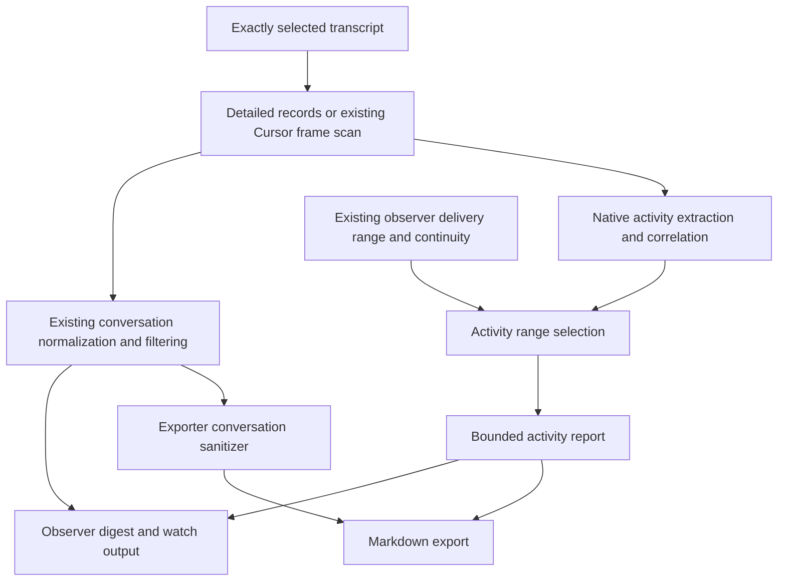

# Design: session-fidelity

## Overview

Add a shared deterministic activity pipeline alongside conversation normalization. `--include-activity` exposes source-attributable calls, results, lifecycle evidence, and selected metadata through both `session-observer` and `session-export-transcript`. With the flag absent, activity does not alter serialized output, legacy flags, or sanitization. The separately authorized Codex identity correction deliberately fixes parent/child selection and refuses unsafe saved cursor reuse in all modes. The digest retains its current schema v1 or Cursor v2 and gains an optional `activity` object with `activitySchemaVersion: 1`; the exporter remains Markdown-only.

Read one captured transcript view, extract native evidence without display truncation, correlate calls and results across that view, select the existing delivery range, then project a bounded activity report. A result delivered later can reference a prior call through minimal contextual identity without redelivering or recounting that call. Physical byte/line provenance, legacy logical record positions, and Cursor frame/delivery positions remain separate coordinates.

The first increment uses evidence recorded in the selected transcript. It includes parent-side subagent spawn, lifecycle messages, and returned results when recorded; it does not read the child's own trajectory or external output sidecars. Such references carry recorded identity and explicit `not-read` coverage. The user approved this source-local scope in Fable’s session and explicitly added the Codex child-pinning fix to this project. Real-session schema evidence and sanitized fixtures are also approved project scope. Source-local metadata is included conservatively; instruction bodies and recorded reasoning remain excluded from the new flag.

## Architecture



The shared owner is `src/shared/transcript/activity/`, plus an additive detailed reader beside the current `readRecords`. Each skill owns flag parsing, consumer policy, and presentation. Shared code never writes offsets, arms collaboration, discovers adjacent sessions, reads output-linked files, or executes provider commands.

For Claude/Codex activity mode, reuse the same decoded read result for legacy normalization and activity extraction. Whole-source correlation is already compatible with existing whole-file reads, but extraction has additional CPU/memory cost; do not claim it is free. No persistent activity cache, daemon, or warehouse is introduced. The captured view records byte length and capture time, and its offsets refer to that read only; no immutable-snapshot claim is made.

Cursor reuses the existing frame scanner and analyzer. Its activity delivery obeys the same safe prefix, malformed/partial-frame barrier, stable content checks, grow-in-place reconciliation, terminal lifecycle, and exact identity evidence as observation. Export activity uses a stateless frame scan with honest availability, while its default conversation export retains its existing terminal-oriented normalization. It must not acquire or advance an observer cursor.

### Review and delivery sequence

Use one `gh stack` with three review layers, selected by the user:

1. **Schema documentation:** the dated evidence snapshot and maintained native-format reference from `c970c876`, including its inventory/privacy checks and site navigation. This layer is implementation-independent.
2. **Identity and cursor binding:** native Codex identity, selection/cache correction, path-bound state validation, regression tests, recovery guidance, generated outputs, and required skill versions/changelog.
3. **Activity support:** detailed reads, captured fixtures, shared activity extraction/projection, observer/exporter integration, Cursor settlement, consumer documentation, generated outputs, and final acceptance checks.

The docs commit currently follows planning commits on `session-fidelity`. Before implementation, arrange the branch layers using `gh stack` so the docs diff stands alone and each later layer contains only its dependent concern. Preserve the original commits as recoverable history while arranging the stack; do not create hidden worktrees or rewrite a peer's active branch. Each code layer must build and pass its own relevant checks. Shared-runtime version fan-out belongs to the layer that changes the generated payload, and a later layer bumps again where needed. Place the project discovery/design/plan/state commits in the top activity layer, leaving the bottom docs diff implementation-independent. Preserve the pre-stack history with a local recovery ref; layer-local validation evidence belongs with its code. Planning artifacts are workflow bookkeeping, not evidence that the feature is implemented. Stack submission, merge, installation, and live-provider acceptance have not happened.

## Component Design

### Native identity and saved cursor binding

Implement the Codex identity fix first. For actual `session_meta` records, the native `payload.id` identifies the physical session; a message record's `payload.id` never identifies a session. Retain root/parent lineage independently, using `payload.session_id` and explicit `source.subagent.thread_spawn.parent_thread_id` only according to their observed meaning. Use the first physical `session_meta` header as the file identity, corroborated by the native UUID in a recognized rollout filename. The observed child format can immediately repeat the parent header as inherited history; those later headers are not competing file identities. A first-header/filename mismatch, malformed first identity, or duplicate physical sources for one native pin fails explicitly. Do not require every inherited header in a child file to have the same ID. Older supported records without native metadata retain their documented session-ID field handling, not a new alias for child sessions.

Carry native identity and recorded parent/subagent annotations through discovery, candidates, cache, exact lookup, digest/export metadata, and whoami. When a pinned child includes inherited context, emit a digest/export warning identifying the ordinal boundary when known, or unknown ownership when evidence is incomplete. This warning is included in the identity layer even without activity; leave conversation entries intact rather than attributing inherited parent text silently to the child. Cwd/recency lookup should prefer root sessions when root and child candidates coexist and expose children as labelled candidates; explicit child pins override ranking. An exact pin must resolve to one canonical source path. Duplicate or contradictory native identities fail with an ambiguity diagnostic listing the candidates; neither recency nor snippet ranking may decide an exact pin.

Bind stateful reads and an armed watcher to native ID plus canonical transcript path. A changed path under the same pin fails before emitting a delta or updating offsets; never treat the wrong-file transition as ordinary shrink/replay. Existing cached ID mappings are revalidated against authoritative metadata and replaced through the owning cache mechanism. Reuse the existing saved `transcriptPath`: canonicalize and read that recorded file, require its runtime-specific authoritative identity to equal the state key/pin and its canonical path to equal the selected source. The first-session_meta-header rule applies only to Codex. Claude Code retains its existing recorded session identity checks; Cursor retains its frame/source continuity and supported path identity checks, without inventing a header on either runtime. A valid legacy entry keeps its offset; no new binding marker or blanket reset is required. Nonzero offsets with a missing stored path, mismatched native identity, or changed path require explicit scoped reset/replay; never move a child offset to the parent or bind an old offset using a newly selected file. Fresh zero-offset state may establish the path. Existing scoped reset remains the recovery operation; unrelated sessions are untouched.

On a watcher path/identity mismatch, emit one machine-readable `error` event on stdout (or the corresponding text diagnostic) naming expected and observed identities/paths, then exit nonzero without changing offsets. A collaboration lease created against a mislabelled child remains invalid: fail closed, require owner-scoped disarm/re-arm after corrected pin verification, and never rewrite the peer lease automatically. Mixed old/new installations may still write the shared state, so revalidate stored path/native identity on every stateful read. Current non-Cursor state updates spread existing fields; do not claim a proven fixed-field stripping defect. This design adds no state schema or receipt file.

This strengthens the existing exact-identity decision and changes faulty selection behavior intentionally. The implementation plan must cover shared consumers, cache invalidation, ambiguity reporting, watcher path checks, and recovery diagnostics, not just swap one ID expression. No native provider fork/continuation, public alias, or broad state cleanup is added.

### Evidence inventory and native schema documentation

Use the approved existing local session corpus read-only; do not start providers or create new conversations for capture. Fable completed the evidence and documentation lane in commit `c970c876`. The durable snapshot lives at `.oat/repo/reference/research/session-schemas-2026-09-18/`; maintained pages live at `documentation/docs/engineering/architecture/session-schemas/`. The driver owns synthesis and the design/plan. Reports distinguish observed structure, inferred semantics, unsupported shapes, unread or skipped records, and version uncertainty. Preserve research packets unchanged and record differences in the new evidence.

The inventory reduces data to record discriminators, field paths/types, bounded counts, observation dates, and corroborated client versions. Values are emitted only at explicitly validated native discriminator/version paths. A field called `name`, `source`, or `action` is not globally safe; arbitrary object keys, parsed argument JSON, URLs, identifiers, and filenames must be generalized rather than copied into paths. Include read/size/depth/sample limits and diagnostics so a partial corpus is never represented as complete. Keep private source locators local; tracked reports use synthetic source identifiers and aggregate provenance.

Document the three supported runtimes' identity/lineage and activity-relevant shapes in the engineering docs beside transcript-core, with a navigation group if needed. Each shape states observed versions/date, required versus merely observed fields, and what was not observed. Add parser-support annotations with the implementation that proves them; the committed native-format reference does not claim new runtime support. A locally installed current version is not proof that it created an old transcript. Use corroborated source metadata when present and explicitly unknown versions otherwise. New schema docs must not convert a sample's absence into a provider guarantee.

Derive small fixtures from selected observed records with consistent ID remapping, synthetic paths/text/commands, preserved call/result relationships and type structure, and removed encrypted reasoning. Review every candidate fixture for private literals and free-form/dynamic keys before committing. Authored stress/error fixtures supplement these captured shapes. Keep temporary raw material outside tracked paths. Promote the bounded inventory/sanitization workflow to dev tooling under `scripts/` during implementation; it is not a runtime dependency.

### Detailed source reader

Add `readRecordsDetailed(path)` returning decoded records with physical locations, logical indices, and parse diagnostics. Split on LF bytes only and parse from UTF-8 bytes so multibyte characters, CRLF, and blank lines do not corrupt byte offsets. U+2028/U+2029 inside strings are content, not record boundaries; never use a broader Unicode line splitter. An escaped `\r` remains content, while literal unescaped control characters retain ordinary JSON parse diagnostics. Byte ranges are start-inclusive/end-exclusive; physical lines are one-based. The compatibility projection yields exactly the current decoded array, skip behavior, warning behavior, and treatment of a valid final line without newline. Cursor keeps its stricter frame scanner semantics.

The detailed result holds the raw source carrier and parsed value internally. Public output uses a bounded preview plus a JSON Pointer/source locator, never an unbounded copy of the carrier. Diagnostics cover malformed interior lines and incomplete trailing input without inventing a record or renumbering later physical lines.

### Native extractors and correlation

Claude extraction preserves `tool_use`/`tool_result` blocks, every content block, exact names/IDs, error flags (including empty errors), and supported model/usage/lifecycle/compaction fields. Read the top-level `toolUseResult` carrier as well as content blocks, checking whether it is an object, array, or string. `persistedOutputPath`/size identify unread external results; a bare content marker alone does not reveal the path. Agent async-launch evidence is not a completed child result; later `user` records with top-level `origin.kind == "task-notification"` remain non-human result/lifecycle evidence. Do not mistake `attachment.origin.kind` or the record role for human provenance. Deduplicate repeated usage by native session plus `message.id`, retaining disagreements as diagnostics rather than summing them. No numeric Bash exit code was observed; preserve explicit `is_error`, interruption, and source status without inventing success from absence. Codex covers `function_call`, `function_call_output`, `custom_tool_call`, `custom_tool_call_output`, and source-native web-search shapes demonstrated by fixtures. Read `event_msg/item_completed` alongside the response stream: CommandExecution, FileChange, McpToolCall, WebSearch, SubAgentActivity, and related lifecycle records provide otherwise missing evidence. `SubAgentActivity.agent_thread_id` supplies a recorded child ID when the spawn call/output does not. Record first-header native identity separately from inherited parent headers and history markers. Parsed object arguments and original string/object carriers coexist; invalid argument JSON leaves the call available with a parse diagnostic.

Keys are scoped by runtime, selected native session, canonical source identity, source record/frame and block pointer. Native call IDs are separate fields, never substituted with message IDs. Pair only by explicit native correlation; ambiguous reuse remains unmatched and warned. Missing IDs do not justify matching by tool name, proximity, or argument text. Multiple outputs remain ordered events. Repeated identical commands remain distinct invocations. Child files may embed parent history: where the first header records `subagent_history_start_ordinal`, classify records with a top-level ordinal below that boundary as inherited and exclude them from child invocation counts; classify records at or above the boundary as child-owned when the source markers agree. When ownership cannot be established, report it as unknown; do not count inherited context as new child work. Captured-file counts may include inherited records only with that scope labelled.

A tool result may establish the outcome of that invocation; it does not necessarily establish the outcome of a running shell process. A returned process/session handle means the command is pending or unknown. Preserve later poll/stdin invocations separately and link their process evidence only when an explicit handle and source context support it. Recorded terminal status, recorded exit code, and prose-parsed outcome have distinct evidence strength; no absent `is_error` default or generic result text implies success. In the measured Codex formats, command exit/status evidence is principally in `item_completed`; `custom_tool_call.status=completed` does not establish tool success. Attach an item outcome to a response-stream call only when an explicit, corroborated native ID relation exists. Otherwise retain a standalone execution-evidence event with its recorded command/outcome and source pointer. A turn/ordinal association may be shown as an inferred candidate relation (`adjacent-item-stream`), but cannot set that call's canonical outcome. Response-stream calls alone determine invocation counts; unlinked item events have separate evidence counts, avoiding invented duplicates.

### Classification and projection

Classify native calls into shell/read/write/edit/grep/glob/search/fetch/task/ask/MCP/other while retaining their exact native names. Unknown MCP tools retain generic calls/results without bespoke handlers. Enrichments such as command, query, URL, file path, and diff preview derive only from recorded payloads; they are not claims that files changed successfully.

The pure projector receives extraction, delivery range, and an internal budget policy. It returns chronological events, minimal out-of-range call contexts, grouped invocation summaries, curated metadata, and coverage. Grouping does not replace chronology or conflate invocations. A late result receives a `callContext` containing the prior event key, exact tool name/native call ID when recorded, and source locator, marked `outside-delivered-range`, plus an optional input/command preview capped at 256 UTF-8 bytes; this context is not a delivered event and contributes no invocation count.

Budget policy depends on the consumer:

| Mode                   | Activity budget                                                                             | Selection                                                                                                                                |
| ---------------------- | ------------------------------------------------------------------------------------------- | ---------------------------------------------------------------------------------------------------------------------------------------- |
| Watch delta / catch-up | 32 KiB UTF-8 serialized activity envelope; up to 80 invocations                             | Prioritize explicit failures/cancellations and recent invocations, then display chronologically.                                         |
| Stateless review       | 128 KiB envelope; up to 1,024 invocations                                                   | Same deterministic priority with a larger retrospective window.                                                                          |
| Markdown export        | No invocation-count cap; 64 MiB activity-section safety cap; 2 KiB per input/output preview | Include eligible invocation groups in source order; on the safety cap, prioritize failures and report omitted groups/updates explicitly. |

All modes cap each displayed input/output preview at 2 KiB and late-call context at 256 bytes. For bounded JSON modes, metadata, groups, diagnostics, call contexts, JSON escaping, and coverage all count toward the envelope cap. Select invocation groups (call plus related results) rather than isolated events; cap pathological multiple updates with explicit omitted-update counts and pointers. Selection priority is distinct from canonical call outcome. A standalone item event with recorded failed status or nonzero exit code is independently failure-priority, even when no response-stream call can be linked. Its explicitly inferred candidate group may receive that priority without changing the call outcome or claiming exact linkage; ambiguous candidates are not fanned out into authoritative joins. A failure must retain its call/context or a clearly marked unmatched identity. Test a late Codex failure recorded only in the item stream under a tight budget. Reserve space for coverage, truncate previews first, then omit lower-priority groups. If mandatory context cannot fit, emit a minimal coverage-only report instead of breaking an event or exceeding the cap.

Record omitted invocation/update counts, bounded omitted source ranges, and category/outcome summaries so late failures cannot disappear silently. Export walks projections incrementally while writing, avoiding a second unbounded rendered-string copy even though native extraction currently reads the whole source. Tail previews use the full _available_ inline carrier; unread external stubs and known source truncation cannot be described as complete output. Payload lengths at observed Codex cap-like values generate a `possible-source-truncation` warning, not a proven `truncated` fact or invented omitted-byte count. Gate such heuristics by observed format/version evidence; absence of a warning is not proof of completeness.

These are internal mode defaults, not additional CLI flags. Omitted JSON-mode ranges are recoverable through raw source locators or the fuller activity export; no existing observer flag selects an arbitrary source range, and the docs must not imply one does.

### Observer integration

Thread `includeActivity` through review, catch-up, catch-up-then-watch, digest options, and watch-loop configuration. Apply conversation tail limits and its large-digest fallback independently before attaching activity. Activity uses the delivered source range plus its own budget; it may include activity outside the displayed conversation window, which the separate ranges explain. `--max-turns` and `--max-bytes` retain their existing conversation meanings.

In activity mode, suppress duplicate legacy tool-call/result markers while preserving ordinary messages and operator questions/answers. Keep ask-user human/automatic-resolution caveats and do not label automatic control as human content. Counts come from extracted invocations, not rendered marker count. Without activity, every legacy flag combination retains its current behavior.

A watch delta with new activity is renderable even if it contains no conversation entry. `--quiet-empty` must not discard it. Polls with no newly deliverable events remain quiet; report a new parse/coverage diagnostic once per source change, not on every poll. Each delta's activity object is independently capped; the pre-existing conversation line size is not redefined by this feature. Mark a delta `activityOnly: true` when it contains activity/coverage but no conversation content. Collaboration watchers do not enable `--include-activity`; its presence never authorizes a wake or completed-peer continuation. Metadata-only activity does not imply idle or terminal success. Observer offsets continue to advance through the existing delivery/write path only, including when activity display is truncated. Turning activity on later does not replay consumed history; use stateless review for retrospective activity.

Stateful Cursor activity v1 is terminal-settled only. Use the previous existing terminal continuity checkpoint and the newly accepted terminal checkpoint as the activity delivery range, separately from conversation's content-delivery range. Emit all eligible calls in newly settled turns exactly once, including calls from frames already observed as open-turn conversation; a settled error/aborted turn is still reportable with its actual turn outcome. Per-call outcome stays unknown and results are `not-recorded` for the observed supported surface. In the measured corpus, calls have name/input/type but no native ID, so event identity is canonical source plus frame/block position within the settled prefix.

In stateful catch-up/watch, open-turn activity stays buffered until a terminal arrives. Stateless review/export includes visible calls from valid open-turn frames, marked `pending-lifecycle`, with unsettled source coordinates and separate pending counts; these calls are not represented as settled deliveries and never advance state. In-place revisions are current-snapshot evidence, not stable cross-snapshot event identities. A malformed barrier still limits the readable prefix. Missing terminal evidence never implies successful completion. This avoids revision receipts, new cursor fields, and a new state schema. An activity-only settlement must trigger a watch delta even if no conversation entry is new. On/off toggling follows the existing terminal checkpoint: activity from turns settled while the flag was off is not replayed; stateless review/export can recover it. Inspect both checkpoints before the existing atomic state update and include activity in that delivery outcome; do not advance a separate cursor.

Keep ordinary early conversation observation and confirmed-completion collaboration behavior unchanged. A stability-wait suffix, malformed barrier, replaced prefix, or unsuccessful turn is never promoted to successful completion by activity. Source-local Cursor references may identify a child or agent-tools file when the transcript actually records them; do not discover children or inspect directories merely to fill missing references. Record path-layout lineage only when already supported by the selected source's identity evidence, with provenance distinct from native recorded fields.

### Exporter integration

The exporter adds only `--include-activity`. It keeps existing candidate/session selection, conversation normalization, sanitizer, output destination, marker handling, and `--all` behavior. Each explicitly selected activity export contains the normal sanitized conversation and a separate clearly labelled activity/debug section with sensitivity and coverage notes. Activity payloads bypass conversation-content detectors because recorded tool evidence can resemble a skill body, but are always treated as data: escape Markdown fences/HTML as needed, never execute tool text, and never emit a continuation directive.

`--all --include-activity` makes the broader exposure explicit in the generated artifacts. Default filenames and output semantics remain compatible; the content/header identifies activity exports. The header reports rendered activity bytes, preview caps, the 64 MiB activity safety limit, and any omitted counts. The safety cap applies to the new activity section only; the default conversation export is unchanged. No exporter JSON mode, sidecar artifact dump, or publish-safe claim is introduced.

## Data Models

| Model            | Required content and invariants                                                                                                                                                                                                                                                                                             |
| ---------------- | --------------------------------------------------------------------------------------------------------------------------------------------------------------------------------------------------------------------------------------------------------------------------------------------------------------------------- |
| Detailed record  | Parsed native object, zero-based logical record index, one-based physical line, UTF-8 byte bounds, original carrier, diagnostics. Compatibility projection preserves current reader output.                                                                                                                                 |
| Source reference | Source identity/path at report scope; per-event record or frame location and JSON Pointer. For Cursor, original frame and delivery frame remain distinct.                                                                                                                                                                   |
| Extracted event  | Stable event key, native IDs/names, kind/category, full available native values or pointers, availability, outcome evidence, explicit related-call key and inherited/owned/unknown attribution. Cursor v1 uses settled positional identity, not revision receipts. Internal only; no output budgets applied yet.            |
| Activity report  | `activitySchemaVersion: 1`, runtime/session/source identity, capture time/byte length, declared index base and delivered half-open range, displayed events, call contexts, groups, selected metadata, coverage. Optional on the existing digest; no outer schema bump.                                                      |
| Coverage         | Per data class/source: available/not-recorded/not-found/not-read/unsupported/malformed/truncated; source omissions and presentation omissions distinguished. Counts for captured, delivered, displayed, omitted, unmatched calls/results, with bounded diagnostics and recovery locators.                                   |
| Child reference  | Recorded child native ID, provider, agent path/nickname, parent relation, and spawn/result locators when present. Child trajectory coverage is `not-read`; missing identity fields stay absent. The locator fix makes the native child ID usable as an explicit pin; this does not mean the child trajectory has been read. |

Outcomes are success/error/cancelled/pending/unknown, independent of coverage and availability. For surfaces known not to persist results (the supported Cursor transcript surface), use `not-recorded`. An unmatched call in an otherwise result-capable source is pending/unknown with unmatched accounting, not automatically `not-recorded`. `not-found` requires an actual permitted lookup; since v1 adds no sidecar reads, it cannot claim an external file was sought and absent. Missing optional metadata in a measured source is distinguished from an unrecognized shape. Observed-corpus absence is not a universal claim about future client versions. Cursor has no observed client-version/model/usage/timestamp fields; document unknown version and observation date.

Invocation counts identify the scope explicitly: captured source, delivered range, or displayed range. Results and revision updates are not new calls; out-of-range contexts are excluded. Captured counts mean this source read, not a complete session's lost, compacted, or external history. Preserve cumulative versus per-message usage semantics and do not sum cumulative samples as message totals. Compaction summaries are source-authored summaries, not reconstructed history.

## API Design

Public CLI change: `--include-activity` on observer and exporter only. Internal interfaces follow this conceptual split:

```typescript
readRecordsDetailed(path): Promise<DetailedRead>
extractActivity({ runtime, session, source, recordsOrFrames }): ExtractedActivity
projectActivity(extracted, { deliveryRange, budgets }): ActivityReport
```

Exact TypeScript types are authored with fixtures in the shared owner. A source locator can always point back to the selected transcript; it does not grant permission to follow an arbitrary path contained in tool output. Existing `readRecords()` and `normalizeEntries()` signatures remain usable by other consumers. Distribution build declarations already admit the shared transcript root and bundle import closure; only change catalog/build declarations if an actual boundary requires it.

## Error Handling

Malformed arguments retain the invocation plus raw carrier location and a warning. Malformed Claude/Codex lines follow current tolerant reader behavior and contribute diagnostics; Cursor preserves its blocker semantics. Unrecognized native shapes produce explicit unsupported coverage, never fabricated success. A known parse failure degrades activity honestly; a per-record activity extraction exception preserves other activity and conversation with diagnostic code `ACTIVITY_EXTRACTION_ERROR`, affected source range, and unread activity coverage. A failure of the entire optional activity pass returns a bounded unavailable-activity report while delivering conversation and using the normal offset update. This intentionally consumes that range; raw locators, stateless review after a fix, or export recover the evidence. Do not label valid bytes malformed merely because an extractor failed. Catch only activity failures: identity, continuity, core source-read, state persistence, and output-delivery failures retain their existing fail-closed behavior. No-flag behavior stays unchanged.

Identity, continuity, rotation, and permission errors remain owned by observer/exporter selection and state layers, including the newly required Codex source binding. Activity introduces no fallback to a newer same-cwd session. External output stubs and child references are reported as unread; no implicit file access or provider operation occurs. Watch event logs remain metadata-only. Error and truncation previews use the same budgets and data-only rendering as normal output.

## Testing Strategy

Begin with a fixture/provenance audit before implementing extraction. Existing observer fixtures are documented as synthetic; preserve that label. Use the user-approved small sanitized fixtures derived from locally recorded Claude, Codex, and Cursor structures. Keep raw transcripts outside Git; preserve structural keys/relationships while replacing commands, content, identifiers, and private paths with synthetic values. Record actual client version only when corroborated; otherwise state version unknown. Authored edge-case fixtures remain valuable but cannot prove installed-client support. No live provider actions are required.

Identity tests first cover parent and newer child sharing a root ID, exact root/child selection, native-versus-message IDs, root-first unpinned listing, child-first headers with inherited parent headers, first-header/filename mismatches, duplicate pins, stale cache entries, whoami, armed-path changes, valid legacy stored-path reuse and wrong/missing-path state requiring explicit recovery, and preservation of unrelated offsets.

Shared tests start with LF-only framing containing U+2028/U+2029, escaped carriage returns, and CRLF, then cover physical/logical offsets, malformed interior and partial/valid no-newline tails; Claude multiblock/empty-error results; Codex function/custom/web-search and item-completed carriers; exact versus inferred cross-stream relationships; inherited-history attribution; malformed arguments; independent message/call IDs; repeated calls; ambiguous/unmatched/multiple/late results; continuing process/poll outcomes; unknown MCP names; source metadata/usage semantics and Claude message-ID usage deduplication; child references; and external-output stubs.

Projection tests assert mode-specific serialized byte caps including JSON escaping, no exporter invocation cap, independent conversation/activity budgets, chronological ordering of selected invocation groups, later failure omission visibility, actual available tails, possible-source-truncation warnings, omission/recovery ranges, context-only calls, and count scopes. Consumer tests protect default output and state, activity with tools/debug without duplicate markers, ask-user attribution, activity-only watch deltas, quiet polls, activity-only tagging, extractor-error degradation without hiding conversation, re-arm/exact-pin delivery, and read-only review. Export tests preserve sanitization and mark activity sections as sensitive while safely rendering hostile Markdown/instruction-shaped data.

Test Cursor observer v2 and stateless exporter separately using closed, pending, grow-in-place, repaired, malformed, replaced, and unsuccessful frames. Assert settled positional identity, no open-turn activity emission, exactly-once delivery when a previously observed turn settles, flag toggling, safe-prefix delivery, unchanged collaboration completion gating, and explicit unavailable results. No new persistent activity receipt or cursor schema is introduced.

Use owner-colocated Vitest suites through `pnpm run test:vitest <test-path>`. Build generated entrypoints for CLI tests protecting installed behavior. Final implementation checks include `pnpm run type-check`, `pnpm run build`, `pnpm run build:check`, `pnpm run test`, `pnpm run validate`, `pnpm run smoke`, changed-file lint/format, and `pnpm run validate:skill-versions -- --base-ref <implementation-base>`. Determine all transitively affected skill versions from actual generated changes and update the changelog. These are planned checks, not results of this design run.

## Design Validation

The user selected lightweight design, then explicitly requested the complete draft on 2026-09-18. That overrides the saved selective/collaborative interaction preference for this project pass. This document completes the lightweight draft and four-check self-review. Quick mode has no configured design HiLL checkpoint, so there is no additional approval prompt before drafting the plan. Fable's revised-design read-back remains requested; plan readiness and implementation authorization are separate.

Self-review covers all four required checks:

- Placeholders: no template placeholders remain; proposed budgets and interfaces are concrete.
- Internal consistency: coverage, outcome, availability, source coordinates, and delivery coordinates are distinct; defaults and outer digest versions remain unchanged.
- Scope: required Claude/Codex and Cursor stages are included; sidecar reads and live-provider operations remain excluded; child pinning and observed-schema documentation are included by explicit observed user direction.
- Ambiguity: observed user choices below are recorded; Cursor settled delivery and inherited-history attribution are explicit test obligations rather than claims of already supported behavior.

Fable's completed feedback at Claude record 221 informed call contexts, split budgets, schema versioning, child identity qualification, available-tail wording, and fixture-first sequencing. The completed review at record 656 and schema synthesis at record 806 additionally changed native header handling, stored-path state validation, mode budgets, extraction-error degradation, source carriers, and settled-only Cursor delivery. The final documentation handoff at record 1590 adds corrected task-notification provenance, LF-only record framing, durable evidence locations, and verified inventory privacy tests. Fable read back `3e16dd9c` at record 1677. This revision addresses inherited-conversation warnings, item-only failure priority, top-layer planning artifacts, stateless pending Cursor calls, smaller review budgets, export size reporting, and runtime-specific identity validation. The revised points await read-back; no final consensus is claimed.

## Recorded User Direction and Review Status

Human-origin records in the pinned Fable transcript establish: include the locator fix (record 309); choose identity-rich unread references and sanitized real-session fixtures, and document observed schemas (record 457). The request to gather schema evidence now is record 478; the request to store that detail in project references appears in the later user delivery of the queued record 512. These shape planning and local research; they do not authorize implementation, publishing, installation of the pending feature, or live provider execution.

The user also selected a `gh stack` delivery and inclusion of Fable's documentation. The remaining peer review is of this complete design. In particular, verify the deliberate identity behavior change, selective replay for unsafe legacy offsets, mode-specific activity budgets, safe degradation, and terminal-settled Cursor delivery. No renewed choice between already-decided sidecar/fixture options is needed.

## References

- [Discovery](discovery.md)
- [Collaboration summary](references/collaboration-summary.md)
- `.oat/repo/pjm/backlog/items/BL-260916-session-fidelity-opt.md`
- `.oat/repo/reference/research/session-fidelity-2026-09-10/06-optional-activity-flag-design.md`
- `.oat/repo/reference/research/session-fidelity-2026-09-10/07-implementation-plan-and-tests.md`
- [Durable evidence snapshot](../../../repo/reference/research/session-schemas-2026-09-18/README.md) — sample limits and verification provenance.
- [Maintained native schema reference](../../../../documentation/docs/engineering/architecture/session-schemas/index.md) — Codex, Claude Code, and Cursor; observed formats, not provider specifications.
- Current source seams and governing repository decisions are listed in discovery.
