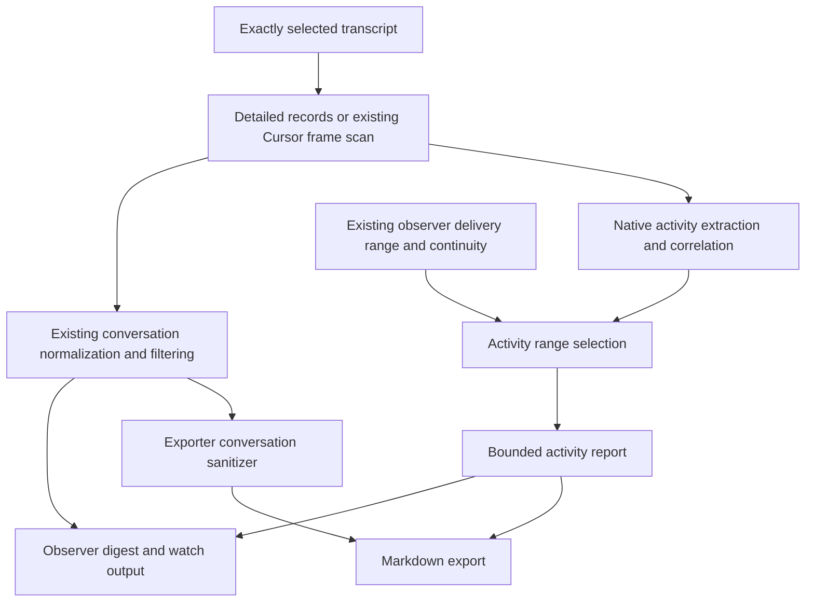

# Design: session-fidelity

## Overview

Add a shared deterministic activity pipeline alongside conversation normalization. `--include-activity` exposes source-attributable calls, results, lifecycle evidence, and selected metadata through both `session-observer` and `session-export-transcript`. With the flag absent, activity does not alter serialized output, legacy flags, or sanitization. The separately authorized Codex identity correction deliberately fixes parent/child selection and refuses unsafe saved cursor reuse in all modes. The digest retains its current schema v1 or Cursor v2 and gains an optional `activity` object with `activitySchemaVersion: 1`; the exporter remains Markdown-only.

Read one captured transcript view, extract native evidence without display truncation, correlate calls and results across that view, select the existing delivery range, then project a bounded activity report. A result delivered later can reference a prior call through minimal contextual identity without redelivering or recounting that call. Physical byte/line provenance, legacy logical record positions, and Cursor frame/delivery positions remain separate coordinates.

The first increment uses evidence recorded in the selected transcript. It includes parent-side subagent spawn, lifecycle messages, and returned results when recorded; it does not read the child's own trajectory or external output sidecars. Such references carry recorded identity and explicit `not-read` coverage. The user approved this source-local scope in Fable’s session and explicitly added the Codex child-pinning fix to this project. Real-session schema evidence and sanitized fixtures are also approved project scope. Source-local metadata is included conservatively; instruction bodies and recorded reasoning remain excluded from the new flag.

## Architecture



The shared owner is `src/shared/transcript/activity/`, plus an additive detailed reader beside the current `readRecords`. Each skill owns flag parsing, consumer policy, and presentation. Shared code never writes offsets, arms collaboration, discovers adjacent sessions, reads output-linked files, or executes provider commands.

For Claude/Codex activity mode, reuse the same decoded read result for legacy normalization and activity extraction. Whole-source correlation is already compatible with existing whole-file reads, but extraction has additional CPU/memory cost; do not claim it is free. No persistent activity cache, daemon, or warehouse is introduced. The captured view records byte length and capture time, and its offsets refer to that read only; no immutable-snapshot claim is made.

Cursor reuses the existing frame scanner and analyzer. Its activity delivery obeys the same safe prefix, malformed/partial-frame barrier, stable content checks, grow-in-place reconciliation, terminal lifecycle, and exact identity evidence as observation. Export activity uses a stateless frame scan with honest availability, while its default conversation export retains its existing terminal-oriented normalization. It must not acquire or advance an observer cursor.

## Component Design

### Native identity and saved cursor binding

Implement the Codex identity fix first. For actual `session_meta` records, the native `payload.id` identifies the physical session; a message record's `payload.id` never identifies a session. Retain root/parent lineage independently, using `payload.session_id` and explicit `source.subagent.thread_spawn.parent_thread_id` only according to their observed meaning. Validate authoritative metadata for consistency. Older supported records without native metadata retain their documented session-ID field handling, not a new alias for child sessions.

Carry native identity and recorded parent/subagent annotations through discovery, candidates, cache, exact lookup, digest/export metadata, and whoami. Cwd/recency lookup should prefer root sessions when root and child candidates coexist and expose children as labelled candidates; explicit child pins override ranking. An exact pin must resolve to one canonical source path. Duplicate or contradictory native identities fail with an ambiguity diagnostic listing the candidates; neither recency nor snippet ranking may decide an exact pin.

Bind stateful reads and an armed watcher to native ID plus canonical transcript path. A changed path under the same pin fails before emitting a delta or updating offsets; never treat the wrong-file transition as ordinary shrink/replay. Existing cached ID mappings are revalidated against authoritative metadata and replaced through the owning cache mechanism. Persist a source-binding marker on new validated state. Nonzero legacy offsets without a provable binding require explicit scoped reset/replay; do not automatically migrate a child offset to the parent or use the current file to guess which file an old cursor consumed. Fresh zero-offset state can establish a binding. Existing scoped reset remains the recovery operation; unrelated sessions are untouched.

This strengthens the existing exact-identity decision and changes faulty selection behavior intentionally. The implementation plan must cover shared consumers, cache invalidation, ambiguity reporting, watcher path checks, and recovery diagnostics, not just swap one ID expression. No native provider fork/continuation, public alias, or broad state cleanup is added.

### Evidence inventory and native schema documentation

Use the approved existing local session corpus read-only; do not start providers or create new conversations for capture. Fable's concurrent evidence lane owns bounded raw inspection and schema reports under project `references/session-schemas/`. The driver owns synthesis and the design/plan. Reports distinguish observed structure, inferred semantics, unsupported shapes, unread or skipped records, and version uncertainty. Preserve research packets unchanged and record differences in the new evidence.

The inventory reduces data to record discriminators, field paths/types, bounded counts, observation dates, and corroborated client versions. Values are emitted only at explicitly validated native discriminator/version paths. A field called `name`, `source`, or `action` is not globally safe; arbitrary object keys, parsed argument JSON, URLs, identifiers, and filenames must be generalized rather than copied into paths. Include read/size/depth/sample limits and diagnostics so a partial corpus is never represented as complete. Keep private source locators local; tracked reports use synthetic source identifiers and aggregate provenance.

Document the three supported runtimes' identity/lineage and activity-relevant shapes in the engineering docs beside transcript-core, with a navigation group if needed. Each shape states observed versions/date, required versus merely observed fields, parser support, and what was not observed. A locally installed current version is not proof that it created an old transcript. Use corroborated source metadata when present and explicitly unknown versions otherwise. New schema docs must not convert a sample's absence into a provider guarantee.

Derive small fixtures from selected observed records with consistent ID remapping, synthetic paths/text/commands, preserved call/result relationships and type structure, and removed encrypted reasoning. Review every candidate fixture for private literals and free-form/dynamic keys before committing. Authored stress/error fixtures supplement these captured shapes. Keep temporary raw material outside tracked paths. Promote the bounded inventory/sanitization workflow to dev tooling under `scripts/` during implementation; it is not a runtime dependency.

### Detailed source reader

Add `readRecordsDetailed(path)` returning decoded records with physical locations, logical indices, and parse diagnostics. Parse from UTF-8 bytes so multibyte characters, CRLF, and blank lines do not corrupt byte offsets. Byte ranges are start-inclusive/end-exclusive; physical lines are one-based. The compatibility projection yields exactly the current decoded array, skip behavior, warning behavior, and treatment of a valid final line without newline. Cursor keeps its stricter frame scanner semantics.

The detailed result holds the raw source carrier and parsed value internally. Public output uses a bounded preview plus a JSON Pointer/source locator, never an unbounded copy of the carrier. Diagnostics cover malformed interior lines and incomplete trailing input without inventing a record or renumbering later physical lines.

### Native extractors and correlation

Claude extraction preserves `tool_use`/`tool_result` blocks, every content block, exact names/IDs, error flags (including empty errors), and supported model/usage/lifecycle/compaction fields. Codex covers `function_call`, `function_call_output`, `custom_tool_call`, `custom_tool_call_output`, and source-native web-search shapes demonstrated by fixtures. Parsed object arguments and original string/object carriers coexist; invalid argument JSON leaves the call available with a parse diagnostic.

Keys are scoped by runtime, selected native session, canonical source identity, source record/frame and block pointer. Native call IDs are separate fields, never substituted with message IDs. Pair only by explicit native correlation; ambiguous reuse remains unmatched and warned. Missing IDs do not justify matching by tool name, proximity, or argument text. Multiple outputs remain ordered events. Repeated identical commands remain distinct invocations.

A tool result may establish the outcome of that invocation; it does not necessarily establish the outcome of a running shell process. A returned process/session handle means the command is pending or unknown. Preserve later poll/stdin invocations separately and link their process evidence only when an explicit handle and source context support it. Recorded terminal status, recorded exit code, and prose-parsed outcome have distinct evidence strength; no absent `is_error` default or generic result text implies success.

### Classification and projection

Classify native calls into shell/read/write/edit/grep/glob/search/fetch/task/ask/MCP/other while retaining their exact native names. Unknown MCP tools retain generic calls/results without bespoke handlers. Enrichments such as command, query, URL, file path, and diff preview derive only from recorded payloads; they are not claims that files changed successfully.

The pure projector receives extraction, delivery range, and an internal budget policy. It returns chronological events, minimal out-of-range call contexts, grouped invocation summaries, curated metadata, and coverage. Grouping does not replace chronology or conflate invocations. A late result receives a `callContext` containing the prior event key, exact tool name/native call ID when recorded, and source locator, marked `outside-delivered-range`; this context is not a delivered event and contributes no invocation count.

Initial internal limits: 32 KiB UTF-8 serialized activity envelope, at most 80 displayed activity events, and at most 2 KiB per input/output preview within that total. Reserve space for source/range/coverage and bounded omission summaries. Metadata, tool groups, diagnostics, and call contexts all count toward the same envelope budget. Truncate previews first; if still oversized, select events deterministically, prioritizing explicit failures/cancellations and recent activity, then restore chronological display order. Every omitted event is counted; record bounded omitted source ranges and a per-category/outcome summary so a late failure cannot disappear silently. If even mandatory context cannot fit, retain a minimal coverage-only report identifying the omission instead of exceeding the cap or emitting a broken event.

Tail previews operate on the entire available inline payload before truncation. If only a source-truncated prefix or external-output stub was recorded, label that limitation and any unread external content; never call it the true complete-output tail. These limits are initial product defaults, tested as contracts and documented, not a new CLI tuning surface.

### Observer integration

Thread `includeActivity` through review, catch-up, catch-up-then-watch, digest options, and watch-loop configuration. Apply conversation tail limits and its large-digest fallback independently before attaching activity. Activity uses the delivered source range plus its own budget; it may include activity outside the displayed conversation window, which the separate ranges explain. `--max-turns` and `--max-bytes` retain their existing conversation meanings.

In activity mode, suppress duplicate legacy tool-call/result markers while preserving ordinary messages and operator questions/answers. Keep ask-user human/automatic-resolution caveats and do not label automatic control as human content. Counts come from extracted invocations, not rendered marker count. Without activity, every legacy flag combination retains its current behavior.

A watch delta with new activity is renderable even if it contains no conversation entry. `--quiet-empty` must not discard it. Polls with no newly deliverable events remain quiet; report a new parse/coverage diagnostic once per source change, not on every poll. Each delta's activity object is independently capped; the pre-existing conversation line size is not redefined by this feature. Metadata-only activity does not imply idle or terminal success. Observer offsets continue to advance through the existing delivery/write path only, including when activity display is truncated. Turning activity on later does not replay consumed history; use stateless review for retrospective activity.

Cursor tools inherit frame-derived identity and availability. A changing tool block has a stable event identity plus a source revision fingerprint; its update retains that identity and does not count as a new invocation. Reuse existing continuity and pending-delivery reconciliation, adding activity-specific delivered revision evidence only where necessary to prevent replay. Keep such evidence optional and inactive without the flag; its schema/ownership must be tested before any persistent-state change. The delivery receipt must bind activity revision keys to the same accepted source prefix and atomic state update as the corresponding observation. Retain receipts only for revisable open-turn events and retire them once settled; do not build a cross-session event ledger. Activity cannot advance a stability-wait suffix or promote an error/aborted/cancelled turn. Collaboration's schema/index dispatch and confirmed-completion projection remain unchanged and cannot be triggered by this additive activity envelope.

### Exporter integration

The exporter adds only `--include-activity`. It keeps existing candidate/session selection, conversation normalization, sanitizer, output destination, marker handling, and `--all` behavior. Each explicitly selected activity export contains the normal sanitized conversation and a separate clearly labelled activity/debug section with sensitivity and coverage notes. Activity payloads bypass conversation-content detectors because recorded tool evidence can resemble a skill body, but are always treated as data: escape Markdown fences/HTML as needed, never execute tool text, and never emit a continuation directive.

`--all --include-activity` makes the broader exposure explicit in the generated artifacts. Default filenames and output semantics remain compatible; the content/header identifies activity exports. No exporter JSON mode, sidecar artifact dump, or publish-safe claim is introduced.

## Data Models

| Model            | Required content and invariants                                                                                                                                                                                                                                                                                             |
| ---------------- | --------------------------------------------------------------------------------------------------------------------------------------------------------------------------------------------------------------------------------------------------------------------------------------------------------------------------- |
| Detailed record  | Parsed native object, zero-based logical record index, one-based physical line, UTF-8 byte bounds, original carrier, diagnostics. Compatibility projection preserves current reader output.                                                                                                                                 |
| Source reference | Source identity/path at report scope; per-event record or frame location and JSON Pointer. For Cursor, original frame and delivery frame remain distinct.                                                                                                                                                                   |
| Extracted event  | Stable event key, native IDs/names, kind/category, full available native values or pointers, availability, outcome evidence, optional revision identity and explicit related-call key. Internal only; no output budgets applied yet.                                                                                        |
| Activity report  | `activitySchemaVersion: 1`, runtime/session/source identity, capture time/byte length, declared index base and delivered half-open range, displayed events, call contexts, groups, selected metadata, coverage. Optional on the existing digest; no outer schema bump.                                                      |
| Coverage         | Per data class/source: available/not-recorded/not-found/not-read/unsupported/malformed/truncated; source omissions and presentation omissions distinguished. Counts for captured, delivered, displayed, omitted, unmatched calls/results, with bounded diagnostics and recovery locators.                                   |
| Child reference  | Recorded child native ID, provider, agent path/nickname, parent relation, and spawn/result locators when present. Child trajectory coverage is `not-read`; missing identity fields stay absent. The locator fix makes the native child ID usable as an explicit pin; this does not mean the child trajectory has been read. |

Outcomes are success/error/cancelled/pending/unknown, independent of coverage and availability. For surfaces known not to persist results (the supported Cursor transcript surface), use `not-recorded`. An unmatched call in an otherwise result-capable source is pending/unknown with unmatched accounting, not automatically `not-recorded`. `not-found` requires an actual permitted lookup; since v1 adds no sidecar reads, it cannot claim an external file was sought and absent. Missing optional metadata in a measured source is distinguished from an unrecognized shape.

Invocation counts identify the scope explicitly: captured source, delivered range, or displayed range. Results and revision updates are not new calls; out-of-range contexts are excluded. Captured counts mean this source read, not a complete session's lost, compacted, or external history. Preserve cumulative versus per-message usage semantics and do not sum cumulative samples as message totals. Compaction summaries are source-authored summaries, not reconstructed history.

## API Design

Public CLI change: `--include-activity` on observer and exporter only. Internal interfaces follow this conceptual split:

```typescript
readRecordsDetailed(path): Promise<DetailedRead>
extractActivity({ runtime, session, source, recordsOrFrames }): ExtractedActivity
projectActivity(extracted, { deliveryRange, budgets }): ActivityReport
```

Exact TypeScript types are authored with fixtures in the shared owner. A source locator can always point back to the selected transcript; it does not grant permission to follow an arbitrary path contained in tool output. Existing `readRecords()` and `normalizeEntries()` signatures remain usable by other consumers. Distribution build declarations already admit the shared transcript root and bundle import closure; only change catalog/build declarations if an actual boundary requires it.

## Error Handling

Malformed arguments retain the invocation plus raw carrier location and a warning. Malformed Claude/Codex lines follow current tolerant reader behavior and contribute diagnostics; Cursor preserves its blocker semantics. Unrecognized native shapes produce explicit unsupported coverage, never fabricated success. A known parse failure degrades activity honestly; unexpected extraction exceptions fail the requested operation before its normal commit/mark-read boundary rather than silently losing activity and advancing state. No-flag behavior stays unchanged.

Identity, continuity, rotation, and permission errors remain owned by observer/exporter selection and state layers, including the newly required Codex source binding. Activity introduces no fallback to a newer same-cwd session. External output stubs and child references are reported as unread; no implicit file access or provider operation occurs. Watch event logs remain metadata-only. Error and truncation previews use the same budgets and data-only rendering as normal output.

## Testing Strategy

Begin with a fixture/provenance audit before implementing extraction. Existing observer fixtures are documented as synthetic; preserve that label. Use the user-approved small sanitized fixtures derived from locally recorded Claude, Codex, and Cursor structures. Keep raw transcripts outside Git; preserve structural keys/relationships while replacing commands, content, identifiers, and private paths with synthetic values. Record actual client version only when corroborated; otherwise state version unknown. Authored edge-case fixtures remain valuable but cannot prove installed-client support. No live provider actions are required.

Identity tests first cover parent and newer child sharing a root ID, exact root/child selection, native-versus-message IDs, root-first unpinned listing, multiple conflicting native records, duplicate pins, stale cache entries, whoami, armed-path changes, nonzero legacy state requiring explicit recovery, and preservation of unrelated offsets.

Shared tests cover physical/logical offsets, CRLF/Unicode, malformed interior and partial/valid no-newline tails; Claude multiblock/empty-error results; Codex function/custom/web-search carriers; malformed arguments; independent message/call IDs; repeated calls; ambiguous/unmatched/multiple/late results; continuing process/poll outcomes; unknown MCP names; source metadata/usage semantics; child references; and external-output stubs.

Projection tests assert exact serialized byte caps including JSON escaping, independent conversation/activity budgets, chronological ordering after sampling, later failure omission visibility, actual available tails, omission/recovery ranges, context-only calls, and count scopes. Consumer tests protect default output and state, activity with tools/debug without duplicate markers, ask-user attribution, activity-only watch deltas, quiet polls, re-arm/exact-pin delivery, and read-only review. Export tests preserve sanitization and mark activity sections as sensitive while safely rendering hostile Markdown/instruction-shaped data.

Test Cursor observer v2 and stateless exporter separately using closed, pending, grow-in-place, repaired, malformed, replaced, and unsuccessful frames. Assert revision identity, invocation deduplication, safe-prefix delivery, unchanged collaboration completion gating, and explicit unavailable results. Activity-only changes to an already observed open frame require a regression demonstrating no skip or replay before state changes are accepted.

Use owner-colocated Vitest suites through `pnpm run test:vitest <test-path>`. Build generated entrypoints for CLI tests protecting installed behavior. Final implementation checks include `pnpm run type-check`, `pnpm run build`, `pnpm run build:check`, `pnpm run test`, `pnpm run validate`, `pnpm run smoke`, changed-file lint/format, and `pnpm run validate:skill-versions -- --base-ref <implementation-base>`. Determine all transitively affected skill versions from actual generated changes and update the changelog. These are planned checks, not results of this design run.

## Design Validation

The user selected lightweight design, then explicitly requested the complete draft on 2026-09-18. That overrides the saved selective/collaborative interaction preference for this project pass. This document is a full draft awaiting holistic user review; it is not implementation authorization or a completed plan.

Self-review covers all four required checks:

- Placeholders: no template placeholders remain; proposed budgets and interfaces are concrete.
- Internal consistency: coverage, outcome, availability, source coordinates, and delivery coordinates are distinct; defaults and outer digest versions remain unchanged.
- Scope: required Claude/Codex and Cursor stages are included; sidecar reads and live-provider operations remain excluded; child pinning and observed-schema documentation are included by explicit observed user direction.
- Ambiguity: observed user choices below are recorded; Cursor revision delivery is a named test/design obligation rather than a claim of already supported behavior.

Fable's completed feedback at Claude record 221 informed call contexts, split budgets, schema versioning, child identity qualification, available-tail wording, and fixture-first sequencing. Peer feedback is advisory; no final peer consensus is claimed.

## Recorded User Direction and Review Status

Human-origin records in the pinned Fable transcript establish: include the locator fix (record 309); choose identity-rich unread references and sanitized real-session fixtures, and document observed schemas (record 457). The request to gather schema evidence now is record 478; the request to store that detail in project references appears in the later user delivery of the queued record 512. These shape planning and local research; they do not authorize implementation, publishing, installation of the pending feature, or live provider execution.

The remaining review is of this complete design. In particular, verify the deliberate identity behavior change, explicit replay for unsafe legacy offsets, bounded activity reports, and Cursor revision receipt semantics. No renewed choice between already-decided sidecar/fixture options is needed.

## References

- [Discovery](discovery.md)
- [Collaboration summary](references/collaboration-summary.md)
- `.oat/repo/pjm/backlog/items/BL-260916-session-fidelity-opt.md`
- `.oat/repo/reference/research/session-fidelity-2026-09-10/06-optional-activity-flag-design.md`
- `.oat/repo/reference/research/session-fidelity-2026-09-10/07-implementation-plan-and-tests.md`
- Current source seams and governing repository decisions are listed in discovery.
