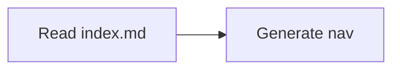

# Contributing to skills

Documentation should ship with the code it explains. This docs app is scaffolded to give contributors and agents a shared contract for navigation, Markdown features, and local tooling.

## Navigation contract

- Every documentation directory must contain an `index.md`.
- Each `index.md` must include a `## Contents` section.
- The `## Contents` section is the machine-readable local map for sibling pages and child directories.
- `overview.md` is deprecated in favor of `index.md`.

## Local workflow

1. Install dependencies:

   ```bash
   cd documentation && pnpm install
   ```

2. Run the live preview:

   ```bash
   cd documentation && pnpm dev
   ```

3. Run Markdown formatting as configured for this docs app.

## Supported Markdown features

### GFM alerts

Styled callout blocks using GitHub-flavored Markdown syntax:

> [!NOTE]
> Useful supporting context.

> [!WARNING]
> Important information to be aware of.

### Mermaid diagrams

Fenced code blocks with the `mermaid` language identifier are rendered as diagrams:

````text

````

### Code blocks

Syntax-highlighted fenced code blocks with a copy button included by default.

### Full-text search

Built-in FlexSearch-powered static search for discovering content without browsing the full tree.

### Dark/light mode

Theme toggle is included in the layout. Mermaid diagrams re-render on mode switch.

## Agent guidance

See `AGENTS.md` in this directory for how agents should work inside this docs app. This `contributing.md` covers human authoring conventions; `AGENTS.md` covers agent runtime discipline (adding pages, restructuring nav, audit/apply, three agent-instruction surfaces). Keeping those concerns separate keeps each file useful to its audience.
