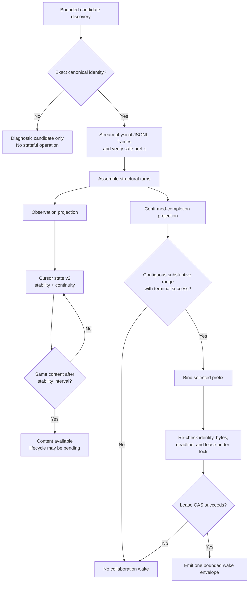

# Cursor Collaboration Reliability

Cursor can persist meaningful assistant content before it writes a dependable
lifecycle terminal. Treating every closed record as a completed turn loses
useful content; treating content alone as completion can wake another agent from
an open, failed, or stale turn.

The reliability architecture keeps those facts separate:

- **Observation** may expose prefix-stable substantive content while lifecycle
  is still pending.
- **Completion-sensitive collaboration** requires a contiguous substantive
  range with terminal success and re-verifies the selected bytes before
  advancing a private lease.

This page describes the engineering contract behind the user-facing
[Session Observer](../../user-guide/skills/session-observer.md) and
[Session Observer Collaboration](../../user-guide/skills/session-observer-collab.md)
workflows.

## End-to-end pipeline

The observation and collaboration branches share transcript parsing, but they
do not share cursor authority. A public observer read cannot spend a private
collaboration cursor or authorize automatic continuation.

## Exact identity before state

Working-directory, project-slug, and recency matches are useful for finding
candidates, but they are not sufficient ownership evidence. Stateful Cursor
operations require agreement on:

- canonical project working directory,
- exact runtime and session identifier,
- canonical transcript path, and
- file and prefix continuity from the saved checkpoint.

Discovery can report weak matches for diagnosis. It cannot inherit state,
switch an active pin, or arm a lease from them. Duplicate canonical candidates,
path aliases, incomplete indexes, or an identity mismatch fail visibly.

Cursor transcript discovery is bounded before expensive traversal begins.
Entry, byte, elapsed-time, and retained-path budgets cover generic discovery,
explicit pins, provider-state snapshots, and transcript-body reads. Exhaustion
returns a typed failure instead of silently widening the search or accepting a
partial identity.

## Physical frames and structural turns

Cursor uses a frame-indexed contract rather than the record-index contract used
by Claude Code and Codex:

- `src/transcript/core/cursor-frames.ts` streams physical JSONL frames and
  preserves closed, blank, malformed, partial, repaired, appended, and replaced
  boundaries.
- `src/transcript/core/cursor-analysis.ts` assembles structural turns and keeps
  substantive content separate from lifecycle records.
- Cursor digest schema v2 declares
  `zero-based-jsonl-frame-index`. `fromIndex` is inclusive and `nextIndex` is the
  first unconsumed safe frame.

An entry's delivery frame may differ from its original content frame.
`recordIndex` identifies the delivery frame and `sourceFrameIndex` preserves the
source. Consumers dispatch on both schema version and declared index base; they
never infer position semantics from the runtime name.

See [Shared transcript-core](transcript-core.md) for the canonical source and
consumer topology.

## Availability is not completion

The ordinary observer requests the `observation` projection. When substantive
content is unchanged across the configured stability interval, it can become
available with lifecycle still pending. This supports useful catch-up and
foreground watching even when Cursor delays or omits a terminal record.

The collaboration adapter requests `confirmed-completion`. It accepts only a
contiguous, unsliced substantive prefix whose lifecycle terminal is successful.
Open turns and `aborted`, `error`, `cancelled`, or unknown outcomes remain
diagnostics and cannot wake a peer.

A later open turn does not invalidate an earlier completed prefix. Selection
therefore identifies the exact completed prefix rather than assuming the newest
turn owns the entire transcript tail.

## Cursor state v2 and continuity

Cursor observation state lives in owner-only `cursor-state.json`, isolated from
legacy record-index offsets. Each session entry retains:

- exact canonical identity,
- first unconsumed physical frame,
- device, inode, size, and verified prefix checkpoint,
- open-turn and stability-candidate state,
- delivery reservation and finalization state, and
- the last independent status facets.

Mutation uses an owner-only lock plus atomic replacement. Delivery is a
reservation/finalization protocol so a crash or uncertain output does not
silently lose content. Duplicate delivery attempts reconcile against the same
source key.

Shrink, prefix mismatch, replacement, unsupported rotation, corrupt state, or
unverified legacy state blocks advancement. Recovery is explicit:

- reset one exact Cursor session and replay from frame zero when sibling state
  is independently safe;
- reset the Cursor runtime store only when every Cursor session can be replayed.

The CLI reports the recovery scope rather than silently resetting a checkpoint.

## Private collaboration continuity

Session Observer Collaboration keeps its own lease-scoped cursor. Cursor lease
schema v6 binds:

- canonical peer runtime, session, cwd, and transcript path,
- the frame-index base,
- the private peer cursor,
- the verified file/prefix continuity checkpoint, and
- continuation count, wait limit, loop limit, and expiry.

Before a wake, the adapter records the selected successful prefix. The hook then
re-reads and verifies the same bounded bytes immediately before the lease
compare-and-swap. Cursor advancement and its continuity checkpoint commit
together.

This closes two stale-success races: a public read cannot consume private wake
authority, and an earlier success cannot authorize continuation after the
selected bytes or canonical identity change.

Wake envelope v2 carries validated schema and index-base provenance, but the
envelope is not cursor authority. Only the producer hook's successful
lease-scoped CAS changes collaboration state. Unknown schemas, mismatched index
bases, discontinuous ranges, stale continuity, or exhausted deadlines fail
closed.

## Independent status facets

Cursor status deliberately avoids one aggregate “healthy” inference. Observer
and watcher output independently report:

- engagement and transcript activity,
- content availability,
- lifecycle completion,
- delivery and buffering,
- identity and continuity, and
- watcher health and control state.

For example, content may be available while lifecycle remains pending, or a
watcher may be active while continuity requires repair. Callers must use the
facet that matches their decision instead of treating activity as completion or
process liveness as delivery success.

## Evidence-gated provider claims

Provider support labels come from bounded automated coverage plus sanitized live
evidence:

- **`live-validated`** means the measured provider path completed the declared
  live sequence.
- **`automated-only`** means deterministic repository fixtures and tests cover
  the behavior without promoting a provider claim.
- **`documented-but-unvalidated`** preserves a supported recipe whose live
  delivery has not been demonstrated.
- **`unavailable`** means a finite probe found no usable surface.
- **`unsupported`** means the surface is deliberately outside the shipped
  contract.

Evidence retains structural facts such as provider version, frame shape,
boolean identity availability, exit status, and cleanup results. It excludes
substantive transcript prose, credentials, personal absolute paths, and raw
session or lease identities.

The measured Cursor agent-transcript observation path is live-validated.
Cursor's top-level Stop and managed-subagent probes delivered no same-parent
callback, and no existing scheduled surface could submit a future pinned
catch-up. Cursor therefore uses **`buffered-manual`**: a user or external turn
starts the pinned catch-up before acting on peer context. The project does not
claim autonomous Cursor wake.

## Source and shipped runtime boundaries

The canonical frame, analysis, observer state, digest, locate, and watch
implementation lives under `src/transcript/`. `pnpm run build` generates the
committed dependency-free `.mjs` runtime under
`skills/session-observer/scripts/`.

The collaboration skill's control, completion, lease, selected-prefix, and hook
modules are authored dependency-free `.mjs` under
`skills/session-observer-collab/`. They consume observer-generated Cursor
modules rather than maintaining a second transcript parser.

After changing canonical TypeScript, regenerate and verify committed output.
After changing either shipped skill, bump its skill version and reconcile the
canonical user install and provider mirrors according to the repository
dogfooding contract. See
[Generated runtime outputs](generated-runtime.md) for the complete build and
sync rules.
