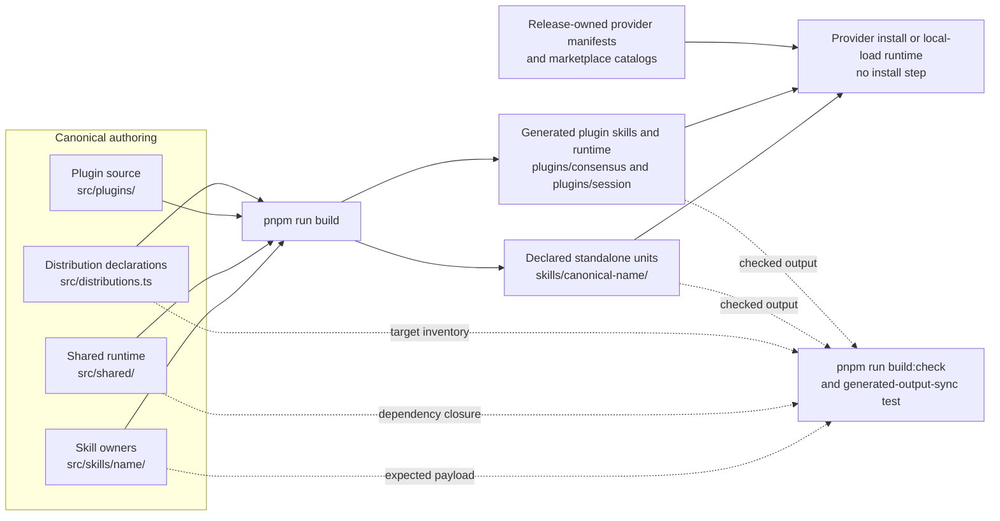
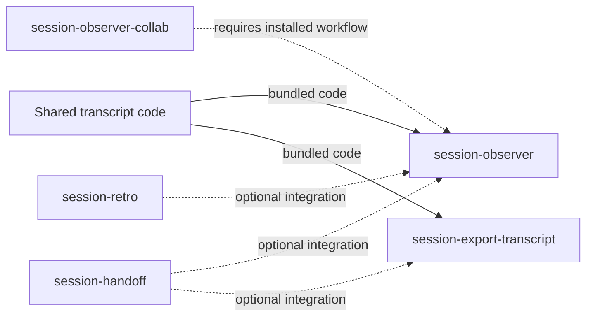

# Generated installation units

Every product skill is authored once under `src/skills/`. The distribution
catalog renders complete committed installation units under `skills/` and
`plugins/`, including target-specific names, references/assets, and bundled
dependency-free `.mjs` runtime where needed. Edit the canonical owner or shared
source, never a generated payload.

## The build contract

- `pnpm run build` runs `tsx scripts/build-generated.ts` and writes all
  declared installation units through staged validation and replacement.
- `pnpm run build:check` runs the same owner with `--check`, comparing complete
  file inventories, content, and executable modes without mutating tracked
  files.
- `tests/tooling/generated-output-sync.test.ts` runs the drift guard as part of
  `pnpm test`.
- `pnpm run sync:transcript-core` is a compatibility command for the same
  generated-output build.

TypeScript, Vitest, and esbuild are developer tooling only. Installed skills
still run committed Node ESM with no dependency installation step.

### Build and shipping topology

The build owns declared skill payloads and generated plugin runtime. Provider
manifests and shared marketplace catalogs remain independently maintained
release surfaces; a generated plugin target does not register or release a
plugin by itself.

## Canonical owner to generated forms

| Canonical owner                                                                        | Generated forms                                                                         |
| -------------------------------------------------------------------------------------- | --------------------------------------------------------------------------------------- |
| `src/skills/create`, `decide`, `plan`, `refine`, `evaluate`, `panel`, `phone-a-friend` | Matching `plugins/consensus/skills/<name>/` payloads                                    |
| `src/skills/session-observer`                                                          | `skills/session-observer/` and `plugins/consensus/skills/observer/`                     |
| `src/skills/session-observer-collab`                                                   | `skills/session-observer-collab/` and `plugins/consensus/skills/observer-collab/`       |
| `src/skills/session-handoff`                                                           | `skills/session-handoff/` and `plugins/session/skills/handoff/`                         |
| `src/skills/session-retro`                                                             | `skills/session-retro/` and `plugins/session/skills/retro/`                             |
| `src/skills/session-export-transcript`                                                 | `skills/session-export-transcript/` and `plugins/session/skills/export-transcript/`     |
| `src/skills/session-fork-to-destination`                                               | `skills/session-fork-to-destination/` and `plugins/session/skills/fork-to-destination/` |
| `src/skills/complexity-review`                                                         | `skills/complexity-review/` only                                                        |
| `src/skills/next-steps`                                                                | `skills/next-steps/` only                                                               |
| `src/skills/must-we`                                                                   | `skills/must-we/` only                                                                  |

Executable owners declare entrypoints in `build.json`; prompt-only skills do
not need one. The build follows actual imports into permitted shared roots,
bundles that closure into each installation unit, and rejects undeclared source
escapes, duplicate targets, or runtime package dependencies.

The authored collaboration `.mjs` and `.d.mts` modules live under
`src/skills/session-observer-collab/src/`. Their runtime is bundled into each
generated form by the same build rather than maintained as a second authored tree. An
authored `.mjs` entrypoint must have an adjacent `.d.mts` declaration, but the
builder bundles the `.mjs` dependency closure and does not ship declarations.

For the concrete authoring sequence, see
[Adding a skill or distribution](../contributing/development/adding-a-skill.md).

## Code and workflow relationships

Bundled code and workflow prerequisites solve different problems. A runtime
import enters the generated installation unit. A required workflow must already
be installed, while an optional integration may be absent without blocking the
core skill.

The distribution declaration carries required and optional workflow references
so generated instructions can use the right standalone or plugin-local name.
It does not install those workflows automatically.

## Target-specific names and versions

Canonical identity is independent from plugin-local identity. For example,
`session-export-transcript` becomes `export-transcript` inside the session
plugin. The generated frontmatter uses the target name, while every form
inherits the canonical owner's single quoted stable `metadata.version`.

Plugin releases are separate: `plugins/consensus/` and `plugins/session/` each
have their own provider and marketplace manifest version. Bumping a plugin does
not rewrite its member skill versions; bumping a skill does not rewrite either
plugin release version.

The historical mapping for `export-session-transcript` and
`coding-session-handoff` exists only so the version guard can compare renamed
owners. The builder emits no legacy payload, alias, redirect, wrapper, or old
script entrypoint.

## Consensus plugin-local runtime layout

Consensus wrappers live under `plugins/consensus/skills/<name>/scripts/`, while
the shared loop and provider CLI live once under `plugins/consensus/scripts/`.
Generated wrappers keep plugin-root-relative imports, so a provider install or
local load must preserve `scripts/` beside `skills/`.

The plugin also contains `skills/observer/` and `skills/observer-collab/`.
Their shared transcript and observer runtime closure is materialized into the
plugin unit; they do not import the standalone `skills/` tree at runtime.

Standalone copies of peer wrappers remain supported only where declared and
through the existing pinned provider-CLI recovery path at
`~/.consensus/consensus.mjs`.

## Session plugin-local runtime layout

The session plugin is a separate complete package. `export-transcript` and
`fork-to-destination` each carry their own bundled runtime closure inside their
skill directory; `handoff` and `retro` are instruction-only with bundled
templates. Their
canonical standalone names stay `session-export-transcript`,
`session-fork-to-destination`, `session-handoff`, and `session-retro`.

## Import rewriting

Canonical TypeScript uses normal `.js` specifiers. The build derives import
rewrites from actual source imports and resolves them against declared outputs.
An unresolvable or ambiguous specifier fails loudly. This keeps generated local
`.mjs` paths correct without a hand-maintained second consumer graph.

## Never hand-edit generated output

Files under declared `skills/` and `plugins/*/skills/` installation units are
produced by the build, including rendered `SKILL.md`, references/assets,
schemas, and executable runtime. Change the canonical owner under `src/skills/`,
shared code under `src/shared/`, or plugin source under `src/plugins/`, then run
`pnpm run build`. `pnpm run build:check` and the generated-output-sync test flag
inventory, content, or executable-mode drift.

## When build or check fails

| Failure                                                         | What it means                                                                           | Safe response                                                                                                                                                          |
| --------------------------------------------------------------- | --------------------------------------------------------------------------------------- | ---------------------------------------------------------------------------------------------------------------------------------------------------------------------- |
| Missing, stale, or orphan generated file                        | The committed unit differs from the complete staged inventory.                          | Inspect the canonical source and declaration first. If the change is intentional, run `pnpm run build`, inspect the generated diff, then rerun `pnpm run build:check`. |
| Source escapes its allowed roots or a runtime imports a package | The declared ownership boundary or dependency-free runtime contract was crossed.        | Fix the declaration or import. Do not repair the failure by installing a runtime dependency.                                                                           |
| Replacement failed; prior outputs restored                      | Publication failed after staging, but the reported rollback restored the prior outputs. | Fix the reported cause and rebuild.                                                                                                                                    |
| Replacement failed and rollback was incomplete                  | Some replacement or restoration operation failed.                                       | Treat the paths in the error's recovery details as authoritative and inspect them individually. Do not guess at cleanup targets.                                       |
| Distribution installed but backup cleanup failed                | New outputs were installed, but one or more reported recovery backups remain.           | Verify the installed output and inspect only the exact backup paths named by the error before cleanup.                                                                 |

The builder stages and validates complete units before replacing outputs. Its
errors distinguish restoration from incomplete recovery; they are not a
promise that every failed filesystem operation is losslessly reversible.
