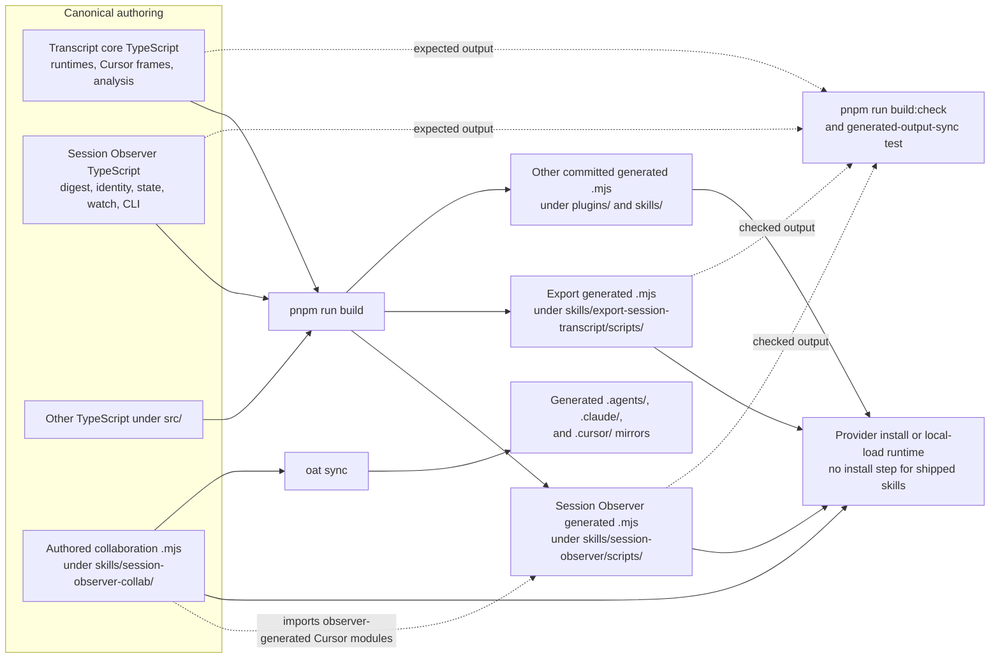

# Generated runtime outputs

Some shipped runtime `.mjs` files are generated from canonical TypeScript source
under `src/`, while staying committed at the same paths that provider manifests,
docs, and users already execute under `plugins/` and `skills/`. Edit the
canonical TypeScript source, not generated `.mjs` output with a `// GENERATED`
banner.

## The build contract

- `pnpm run build` runs `node scripts/build-generated.mjs` and writes the
  generated runtime output.
- `pnpm run build:check` runs `node scripts/build-generated.mjs --check` without
  mutating tracked files.
- `tests/tooling/generated-output-sync.test.ts` runs the drift guard as part of
  `pnpm test`, so editing a canonical module without rebuilding breaks the suite.
- `pnpm run sync:transcript-core` is a compatibility wrapper around the same
  generated-output build.

TypeScript, Vitest, and bundling are developer tooling only; shipped skills still
run committed `.mjs` with no install step.

### Build and shipping topology

The arrows below show authoring, build, verification, and sync relationships.
They are not runtime imports: providers execute the committed `.mjs` files from
their installed or locally loaded package shape.

## Canonical source → generated output

| Canonical TypeScript source                                                                                            | Generated output                                                                                                                 |
| ---------------------------------------------------------------------------------------------------------------------- | -------------------------------------------------------------------------------------------------------------------------------- |
| `src/consensus/core/consensus-loop.ts`                                                                                 | `plugins/consensus/scripts/consensus-loop.mjs`                                                                                   |
| `src/consensus/refine/consensus-refine.ts`                                                                             | `plugins/consensus/skills/refine/scripts/consensus-refine.mjs`                                                                   |
| `src/consensus/evaluate/consensus-evaluate.ts`                                                                         | `plugins/consensus/skills/evaluate/scripts/consensus-evaluate.mjs`                                                               |
| `src/consensus/create/consensus-create.ts`                                                                             | `plugins/consensus/skills/create/scripts/consensus-create.mjs`                                                                   |
| `src/consensus/decide/consensus-decide.ts`                                                                             | `plugins/consensus/skills/decide/scripts/consensus-decide.mjs`                                                                   |
| `src/consensus/plan/consensus-plan.ts`                                                                                 | `plugins/consensus/skills/plan/scripts/consensus-plan.mjs`                                                                       |
| `src/transcript/core/runtimes.ts`                                                                                      | `skills/session-observer/scripts/lib/runtimes.mjs` and `skills/export-session-transcript/scripts/lib/runtimes.mjs`               |
| `src/transcript/core/cursor-frames.ts`                                                                                 | `skills/session-observer/scripts/lib/cursor-frames.mjs` and `skills/export-session-transcript/scripts/lib/cursor-frames.mjs`     |
| `src/transcript/core/cursor-analysis.ts`                                                                               | `skills/session-observer/scripts/lib/cursor-analysis.mjs` and `skills/export-session-transcript/scripts/lib/cursor-analysis.mjs` |
| `src/transcript/session-observer/lib/digest.ts`                                                                        | `skills/session-observer/scripts/lib/digest.mjs`                                                                                 |
| `src/transcript/session-observer/lib/{locate,observe,rank,session-classifier,state,cursor-state,watch-state,watch}.ts` | matching committed `.mjs` files under `skills/session-observer/scripts/lib/`                                                     |
| `src/transcript/session-observer/session-observer.ts`                                                                  | `skills/session-observer/scripts/session-observer.mjs`                                                                           |
| `src/transcript/session-observer/probe-local.ts`                                                                       | `skills/session-observer/scripts/probe-local.mjs`                                                                                |
| `src/transcript/export-session/sanitize.ts`                                                                            | `skills/export-session-transcript/scripts/lib/sanitize.mjs`                                                                      |
| `src/transcript/export-session/export-session-transcript.ts`                                                           | `skills/export-session-transcript/scripts/export-session-transcript.mjs`                                                         |

`skills/session-observer-collab/` is a different boundary: its dependency-free
`.mjs` control, hook, and lease modules are authored shipped runtime files, not
TypeScript build output. Keep those files in the canonical `skills/` tree and
refresh provider mirrors through `oat sync`; do not hand-edit `.agents/`,
`.claude/`, or `.cursor/` copies.

The authored collaboration hooks consume the observer-generated Cursor frame,
analysis, digest, and continuity modules. They do not own a second transcript
parser. Import rewriting keeps canonical `.js` TypeScript specifiers aligned
with the committed `.mjs` layout; missing or ambiguous mappings fail the build.

## Consensus plugin-local runtime layout

Consensus wrapper outputs live under
`plugins/consensus/skills/<name>/scripts/`, but the shared loop output now lives
once at `plugins/consensus/scripts/consensus-loop.mjs`. Generated wrappers import
that plugin-local runtime with `../../../scripts/consensus-loop.mjs`, so a
provider install or local-load runtime must preserve the plugin root with
`scripts/` beside `skills/`.

The Phase 1 provider-layout spike verified that Claude Code and Codex installed
caches, Cursor Agent `--plugin-dir`, and an isolated Copilot CLI local install
preserve that plugin-root shape. Those checks prove the local/package layout used
by the generated imports; they are not broader marketplace or skills.sh
availability claims. Standalone single-skill copies are not the primary runtime
contract. They remain supported only through the existing recovery path that
looks for `~/.consensus/consensus.mjs`.

## Import rewriting

Wrappers type-check against canonical TypeScript imports such as
`../core/consensus-loop.js`, `../core/runtimes.js`, and `./sanitize.js`. The build
derives each mapping's import rewrites from the source file's own module
specifiers (resolved against the generated-output mapping table) and rewrites
them to shipped local `.mjs` imports; an unresolvable or ambiguous specifier
fails the build loudly rather than being skipped.

For Consensus wrappers, the `../core/consensus-loop.js` import rewrites to the
shared plugin-local output at `../../../scripts/consensus-loop.mjs`. Keep that
relative path in sync with `scripts/build-generated.mjs` and
`tests/tooling/generated-output-sync.test.ts`.

## Never hand-edit generated output

Files carrying a `// GENERATED` banner are produced by the build and must never
be hand-edited. Change the canonical TypeScript source under `src/` and run
`pnpm run build`; `pnpm run build:check` and the generated-output-sync test will
flag any committed output that has drifted from its source.
