# Hooks and safety

## Git hooks

Hooks install automatically on `pnpm install`. Manage them with:

```bash
pnpm hooks:status
pnpm hooks:disable-all
```

Bypass a single commit with `git commit --no-verify`. Set `GIT_HOOKS=0` to skip
hook setup entirely (CI/Docker).

### Where each gate runs

The checks are six independent triggers, not a pipeline: no CI job declares `needs`, the pull-request-only jobs run in parallel with `validate`, and the docs deployment and live-provider workflows are separate.

```mermaid
flowchart TB
  NOTE["Six independent triggers, not a pipeline.<br/>Nothing below is gated on anything else:<br/>the PR jobs run in parallel and no job declares needs."]

  subgraph commit["Trigger: git commit · local hooks"]
    C1["pre-commit: lint-staged<br/>oxlint + oxfmt on staged files only"]
    C2["pre-commit: oat status --scope project --hook<br/>non-blocking"]
    C3["commit-msg: commitlint<br/>Conventional Commits"]
  end

  subgraph push["Trigger: git push · pre-push hook"]
    P1["pnpm run validate"]
    P2["pnpm run build:check"]
    P3["pnpm run type-check"]
    P4["validate:skill-versions against the merge base"]
    P5["validate:internal-flags"]
    PN["No tests, no smoke — the hook stays fast"]
  end

  subgraph pr["Trigger: pull_request · Validate workflow"]
    V["validate job<br/>build:check, type-check, test, validate, smoke"]
    J1["skill-versions"]
    J2["internal-flags"]
    J3["commitlint"]
    J4["lint: oxlint + oxfmt --check on changed files"]
    JN["These four run in parallel with validate —<br/>no job declares needs"]
  end

  subgraph prdocs["Trigger: pull_request touching documentation/**"]
    D1["Docs CI workflow<br/>builds the docs app; does not publish"]
  end

  subgraph main["Trigger: push to main"]
    M1["Validate workflow: validate job only<br/>the PR-only jobs are skipped"]
    M2["Deploy Docs workflow — independent<br/>paths: documentation/** and its own workflow file"]
  end

  subgraph tag["Trigger: tag consensus-v* / session-v*"]
    T1["Release workflow: build, then<br/>git diff --exit-code on generated outputs"]
    T2["type-check, build:check, test, validate, smoke"]
    T3["Verify selected plugin version"]
  end

  subgraph manual["Trigger: workflow_dispatch"]
    MAN["Live Provider E2E — dispatch-ONLY<br/>real CLIs, real quota; no workflow invokes it"]
    MAN2["Deploy Docs — also dispatchable,<br/>in addition to its push-to-main trigger"]
  end

  C1 --> C2 --> C3
  P1 --> P2 --> P3 --> P4 --> P5
  T1 --> T2 --> T3
```



_Mermaid updated 2026-09-16_

## Pre-commit: lint-staged

The `pre-commit` hook runs `lint-staged` over staged files only. JavaScript,
TypeScript, JSON, and Markdown are formatted with **oxfmt**; JavaScript and
TypeScript are also linted with **oxlint**. Config: `.oxlintrc.json`,
`.oxfmtrc.json`, and `.lintstagedrc.mjs`.

Adoption is **incremental**: the `pre-commit` hook runs `lint-staged` over staged
files only, and CI lints/format-checks only the files a PR changes. The repo has
not yet been formatted wholesale; a one-time repo-wide `oxfmt` is a planned
follow-up. Until then, do not run `pnpm format` across the whole tree in unrelated
PRs.

## Pre-push: skill version-bump enforcement

The pre-push hook runs `validate`, `build:check`, `type-check`, skill-version
validation, and internal-flag validation. Tests and smoke are intentionally
left to the full local check set and CI, not duplicated in this fast hook.

Changed skills must bump their version. Any change under a canonical skill
directory (`src/skills/<name>/`) requires that skill's quoted
`metadata.version` to increase. This is enforced by
`scripts/validate-skill-versions.ts`:

```bash
pnpm run validate:skill-versions -- --base-ref <ref>
```

It is wired into the PR-only `skill-versions` CI job and the local `pre-push`
hook. Shared roots, generated outputs, plugin-shared areas, and rename history
can affect more than the directly edited path; see the
[version-impact table](conventions.md#skill-version-bump-on-edit).

## Pre-push: OAT tooling internal-flag enforcement

The OAT tooling skills mirrored under `.agents/skills/**` must stay hidden from
`npx skills` discovery — the CLI honors `metadata.internal: true` in frontmatter
to drop a skill from normal discovery (it reappears only under
`INSTALL_INTERNAL_SKILLS=1`). Because those files are regenerated by
`oat tools update` / `oat sync`, the flag is re-applied by an idempotent script and
guarded by a gate rather than hand-edited:

- After refreshing tooling, re-stamp the flag: `pnpm tsx scripts/apply-internal-flags.ts`,
  then `oat sync`. The script is idempotent and skips the symlinked
  `session-observer` mirror (a canonical standalone skill that must stay publicly
  discoverable).
- The detector `scripts/validate-internal-flags.ts`:

  ```bash
  pnpm run validate:internal-flags
  ```

  is wired into the PR-only `internal-flags` CI job and the local `pre-push` hook,
  so a missing flag cannot merge to `main`. If it fails, run the apply script and
  re-commit the stamped files.

Do not add this flag to canonical or generated product skill payloads under
`src/skills/`, `skills/`, or `plugins/*/skills/`; those are intended public
entries. See DR-260627 for the rationale.

## Lint/format exclusions

Never lint/format generated, OAT-synced, or agent-instruction files: generated
installation outputs from `scripts/build-generated.ts`, `.agents/**`,
`.claude/rules/**`, `.cursor/rules/**`, and `AGENTS.md` / `CLAUDE.md` at every
level.

Format exclusions must stay in sync across `.oxfmtrc.json`, `.lintstagedrc.mjs`,
and the CI `oxfmt --check` step in `.github/workflows/validate.yml`; generated
`.mjs` lint exclusions must also stay in sync across `.oxlintrc.json`,
`.lintstagedrc.mjs`, and the CI `oxlint` step.

oxlint/oxfmt are **dev tooling** — they do not touch what shipped skills run.
