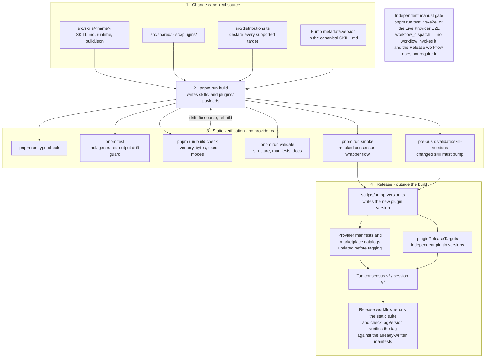

# Development

How to set up and verify a local change to this repo. Runtime plugin code uses
Node ESM and the Node standard library only; developer tooling uses
pnpm-managed dev dependencies.

## Prerequisites

- Node.js 22 or newer.
- pnpm for developer dependencies. Install with `pnpm install`. Git hooks install
  automatically on `pnpm install`.

## Change, generate, verify, release

Edit the canonical owner and its distribution declaration, bump `metadata.version`, run `pnpm run build`, then verify. The live-provider check is an independent manual gate: no workflow invokes it and the release workflow does not require it.



_Mermaid updated 2026-09-16_

## Verification command set

Run:

```bash
pnpm run type-check
pnpm test
pnpm run build:check
pnpm run validate
pnpm run smoke
```

- `pnpm run type-check` — checks canonical TypeScript, development scripts, and tests without emitting runtime files.
- `pnpm test` — the full Vitest suite, including the generated-output drift guard.
- `pnpm run build:check` — compares every declared committed installation unit
  with a freshly staged payload, including file inventory, bytes, and executable
  modes, without mutating tracked files.
- `pnpm run validate` — repository structure, manifest, and docs invariants.
- `pnpm run smoke` — the mocked end-to-end consensus wrapper flow.

## Contribution workflow

For the contribution rules — canonical `src/skills/` ownership, distribution
declarations, plugin-manifest constraints, sole `metadata.version`, and the
cross-provider testing release requirement — see
[`CONTRIBUTING.md`](https://github.com/tkstang/skills/blob/main/CONTRIBUTING.md).

## Minimum sufficient testing

Match proof to the boundary changed: owner behavior, shared code, packaging,
or installed execution. [Testing](testing.md) provides the selection table,
focused commands, and the distinction between deterministic checks and live
acceptance. [TypeScript & Build Tooling](typescript-and-build-tooling.md)
explains why type checking and runtime generation are separate steps.

## Contents

- [TypeScript & Build Tooling](typescript-and-build-tooling.md) — Understand the compiler, script runner, bundler, imports, and authored JavaScript exception.
- [Adding a skill or distribution](adding-a-skill.md) — Add prompt-only or executable owners, new targets, workflow references, or a new plugin without creating parallel sources.
- [Testing](testing.md) — Choose focused tests, verify installed artifacts, and distinguish mocked checks from live acceptance.
- [Conventions](conventions.md) — Repository conventions: dependency-free shipped skills, canonical owners, generated distributions, skill version bumps, and worktrees.
- [Commit conventions](commit-conventions.md) — Conventional Commits format, common types, and how it is enforced.
- [Hooks and safety](hooks-and-safety.md) — Git hooks, lint-staged, skill version-bump enforcement, and lint/format exclusions.
