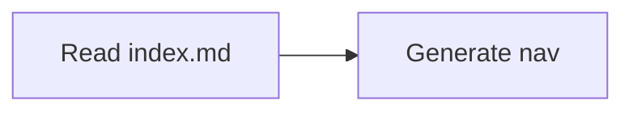

# Markdown Features

The syntax reference for this docs app. Everything listed here is rendered by the
current scaffold — if a pattern isn't on this page, assume it is not supported and
verify with a local `pnpm build` before relying on it.

Pages are authored as `.md` by default. Use `.mdx` only when a page needs
embedded JSX (a custom component or interactive widget); plain Markdown covers
everything below.

## Frontmatter

Every page carries YAML frontmatter with at least `title` and `description`:

```yaml
---
title: Page Title
description: A short summary of the page.
---
```

`title` drives the sidebar label and the page `<title>`. `description` drives
search previews, social cards, and sibling summaries in `## Contents` lists. An
empty or missing `description` degrades all three, so always write one.

## GFM alerts

GitHub-flavored Markdown alert blockquotes render as styled callouts. Supported
types include `NOTE`, `TIP`, `IMPORTANT`, `WARNING`, and `CAUTION`:

```text
> [!NOTE]
> Useful supporting context.

> [!WARNING]
> Important information to be aware of.
```

Rendered:

> [!NOTE]
> Useful supporting context.

> [!WARNING]
> Important information to be aware of.

## Mermaid diagrams

Fenced code blocks tagged `mermaid` render as diagrams:

````text

````

Rendered:


Mermaid diagrams re-render when the theme is toggled, so they stay legible in both
light and dark mode.

## Code blocks

Fenced code blocks are syntax-highlighted, and a copy button is included by
default. Always put a language identifier on the opening fence so highlighting
works:

````text
```bash
cd documentation && pnpm dev
```
````

Rendered:

```bash
cd documentation && pnpm dev
```

Use `bash` for shell commands, matching the rest of this repo's examples.

## Full-text search

The site ships with built-in FlexSearch-powered static search. Readers can find
content by keyword without browsing the directory tree. Search quality depends on
good frontmatter `title` and `description` values and on descriptive headings —
another reason to keep both current.

## Dark/light mode

The layout includes a theme toggle. Content, code blocks, and Mermaid diagrams
all re-render on a mode switch, so author with both themes in mind — avoid baking
in colors or contrast assumptions that only hold for one.
