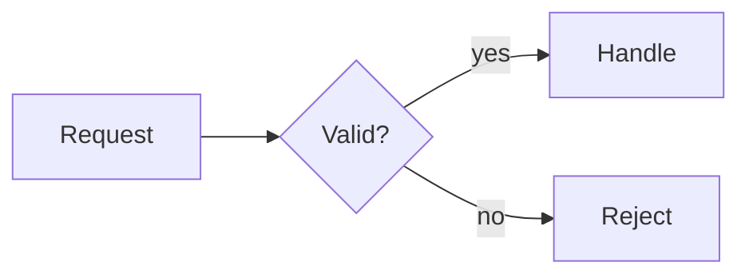

# Markdown & Visuals

The syntax catalog for this docs app. Every pattern below is shown twice: the
copyable source, then the same source rendered by the current app, so you can
compare what you write with what a reader sees. If a pattern is not on this
page, do not assume the app supports it; add it here with a rendered example
after verifying it with the [build checks](#verify-before-committing).

Pages are authored as `.md` by default. Use `.mdx` only when a page needs
embedded JSX. For where pages live and how navigation is wired, see
[Authoring](authoring.md); for what to check before a docs commit, see the
[Review checklist](review-checklist.md).

## Baseline Markdown

Standard CommonMark and GitHub-flavored Markdown render as expected. The forms
this site relies on:

```text
Link to a sibling page with a relative `.md` path: [Authoring](authoring.md).
Link to a heading on this page: [Tabs](#tabs).

Inline `code`, *emphasis*, and **strong** text.

- An unordered list item
  - A nested item
1. An ordered list item

| Column | Column |
| ------ | ------ |
| cell   | cell   |

> A plain blockquote, for quoted material rather than callouts.
```

Rendered:

Link to a sibling page with a relative `.md` path: [Authoring](authoring.md).
Link to a heading on this page: [Tabs](#tabs).

Inline `code`, _emphasis_, and **strong** text.

- An unordered list item
  - A nested item

1. An ordered list item

| Column | Column |
| ------ | ------ |
| cell   | cell   |

> A plain blockquote, for quoted material rather than callouts.

Headings get anchor links automatically, so `#tabs` resolves to the "Tabs"
heading below. Relative `.md` links are rewritten to site routes by the docs
transforms; keep writing the file path, including `subdir/index.md`.

## Frontmatter

Every page starts with YAML frontmatter:

```yaml
---
title: Page Title
description: A short summary of the page.
---
```

`title` is the page's default title in the sidebar, the browser tab, and search
results, unless sidebar metadata overrides the label. `description` is emitted as
page metadata and indexed for search. Requiring both is this repository's
authoring convention, not a renderer requirement; the app renders a page without
them, badly labelled. Summaries in `## Contents` lists are authored prose and are
not derived from `description`.

## Callouts

GitHub-flavored Markdown alert blockquotes render as styled callouts. All five
types:

```text
> [!NOTE]
> Useful supporting context.

> [!TIP]
> A shortcut or a better default.

> [!IMPORTANT]
> Something the reader must not skip.

> [!WARNING]
> Important information to be aware of.

> [!CAUTION]
> An action with consequences that are hard to undo.
```

Rendered:

> [!NOTE]
> Useful supporting context.

> [!TIP]
> A shortcut or a better default.

> [!IMPORTANT]
> Something the reader must not skip.

> [!WARNING]
> Important information to be aware of.

> [!CAUTION]
> An action with consequences that are hard to undo.

Use one callout per idea and keep it to two or three lines. A page with more than
a couple of callouts per section is usually a page whose prose needs restructuring.

## Mermaid diagrams

Fenced code blocks tagged `mermaid` render as diagrams:

````text

```mermaid
flowchart LR
  A[Request] --> B{Valid?}
  B -->|yes| C[Handle]
  B -->|no| D[Reject]
```
````

Rendered:


```mermaid
flowchart LR
  A[Request] --> B{Valid?}
  B -->|yes| C[Handle]
  B -->|no| D[Reject]
```

Mermaid diagrams re-render when the theme is toggled. The app initialises
Mermaid with its own palette in `components/mermaid.tsx`, so diagrams pick up the
same surfaces, text colour, and accent as the rest of the page in both modes.

Because the palette is applied centrally:

- Do not add `%%{init: ...}%%` directives, `style` lines, or `classDef` colour
  overrides. They fight the site theme and break one of the two modes.
- Keep node labels short. Use `<br/>` for a line break inside a flowchart label;
  the Mermaid transform expects it.
- Prefer `flowchart LR` / `flowchart TD`, `sequenceDiagram`, and `stateDiagram-v2`.
  They are the shapes that stay readable at ordinary page width.
- In `stateDiagram-v2`, a semicolon inside a state description ends the
  statement and renders the rest as a stray state; use a comma or a dash.
- HTML entities such as `&lt;name&gt;` inside a state label blank the whole
  diagram in the browser; write the pattern in prose instead.
- A Mermaid fence inside an inactive tab is not in the static export, so a
  build proves nothing about it; open the tab in a browser.

Mermaid is the **source of truth** for every diagram on this site. Agents and
reviewers read the Mermaid in the Markdown file; a polished SVG, when one exists,
is a rendering for people. See [SVG-plus-Mermaid diagrams](#svg-plus-mermaid-diagrams).

## Tabs

Tab groups use the `=== "Label"` syntax from the shared docs-transforms remark
plugin. Each label starts a new tab, tab content is indented four spaces under
its label, and a blank line separates labels. Indented content is ordinary
Markdown, so a command belongs in a fenced block inside the tab:

````text
=== "pnpm"

    ```bash
    pnpm install
    ```

=== "npm"

    ```bash
    npm install
    ```
````

Rendered:

=== "pnpm"

    ```bash
    pnpm install
    ```

=== "npm"

    ```bash
    npm install
    ```

The first label is the default active tab. Tab content may include paragraphs,
code fences, Mermaid diagrams, and images.

## SVG-plus-Mermaid diagrams

Some overview diagrams carry a hand-authored SVG next to their Mermaid source.
The SVG lives in `public/diagrams/` and is referenced by its site-root path.
Wrap the pair in a tab group, SVG first, and give each tab an italic date caption
so drift between the two representations is visible to the reader. The complete
recipe:

````text
=== "Diagram"

    

    *SVG regenerated 2026-09-16*

=== "Mermaid"

    ```mermaid
    flowchart LR
      subgraph author["Authored once · src/"]
        SRC["src/skills/session-retro/<br/>SKILL.md + assets"]
        DECL["src/distributions.ts<br/>declares the forms"]
      end
      BUILD["pnpm run build"]
      subgraph forms["Generated forms · committed"]
        STANDALONE["skills/session-retro/<br/>standalone"]
        PLUGIN["plugins/session/skills/retro/<br/>Session plugin member"]
      end
      INSTALL["Declared install targets<br/>no install step"]
      subgraph install["Install targets · declared"]
        CC["Claude Code"]
        CX["Codex"]
        CU["Cursor"]
      end
      RELEASE["Provider manifests and marketplace catalogs<br/>release-owned, not generated"]
      SRC --> BUILD
      DECL --> BUILD
      BUILD --> STANDALONE
      BUILD --> PLUGIN
      STANDALONE --> INSTALL
      PLUGIN --> INSTALL
      INSTALL --> CC
      INSTALL --> CX
      INSTALL --> CU
      RELEASE -.-> INSTALL
      STANDALONE -.->|"pnpm run build:check"| BUILD
      PLUGIN -.->|"pnpm run build:check"| BUILD
    ```

    *Mermaid updated 2026-09-16*
````

Rendered:

=== "Diagram"

    

    *SVG regenerated 2026-09-16*

=== "Mermaid"

    ```mermaid
    flowchart LR
      subgraph author["Authored once · src/"]
        SRC["src/skills/session-retro/<br/>SKILL.md + assets"]
        DECL["src/distributions.ts<br/>declares the forms"]
      end
      BUILD["pnpm run build"]
      subgraph forms["Generated forms · committed"]
        STANDALONE["skills/session-retro/<br/>standalone"]
        PLUGIN["plugins/session/skills/retro/<br/>Session plugin member"]
      end
      INSTALL["Declared install targets<br/>no install step"]
      subgraph install["Install targets · declared"]
        CC["Claude Code"]
        CX["Codex"]
        CU["Cursor"]
      end
      RELEASE["Provider manifests and marketplace catalogs<br/>release-owned, not generated"]
      SRC --> BUILD
      DECL --> BUILD
      BUILD --> STANDALONE
      BUILD --> PLUGIN
      STANDALONE --> INSTALL
      PLUGIN --> INSTALL
      INSTALL --> CC
      INSTALL --> CX
      INSTALL --> CU
      RELEASE -.-> INSTALL
      STANDALONE -.->|"pnpm run build:check"| BUILD
      PLUGIN -.->|"pnpm run build:check"| BUILD
    ```

    *Mermaid updated 2026-09-16*

The second tab is labelled "Mermaid", not "Source", on purpose: the Mermaid
fence inside it renders as a second diagram, so the tab shows the Mermaid
rendering, not copyable text. The copyable source is the fence in the page's
Markdown file, which is what agents and reviewers read.

Rules for the pair:

- When you edit the Mermaid for a behaviour change, bump its date caption in the
  same commit. The SVG may lag until someone regenerates it; the captions say
  which one is current.
- Every node and labelled edge in a diagram must be verifiable against source
  code, not only against prose. Keep the evidence list that accompanied the
  diagram when it was drawn, and do not add a node the code does not support.
- Do not inline an authored SVG without a Mermaid counterpart unless the layout
  is not expressible in Mermaid.
- Diagrams without a polished counterpart use a plain `mermaid` fence.

### Authoring an SVG counterpart

The SVGs are hand-written and follow one visual vocabulary so the site reads as
one system:

- `role="img"` with `<title>` and `<desc>` referenced by `aria-labelledby`.
- System font stack; monospace for paths and commands.
- Size text for the displayed width, not the `viewBox`. The content column is
  about 830px wide on desktop, so a 1240-unit-wide `viewBox` displays at roughly
  two thirds scale: 12-unit text shows at about 8px. Use body text of at least
  15 units and titles of at least 20 units at that width, or narrow the
  `viewBox`, and confirm legibility at desktop and phone widths.
- White cards with near-black text, so the file reads on both light and dark
  pages. Mid-grey only for connectors, column bands, and any text drawn directly
  on the page background. Never draw black or white text on the page background.
- Colours set through CSS custom properties with fallbacks
  (`fill: var(--diagram-card, #ffffff)`), so the same file can be themed if it is
  ever inlined.
- Accent meaning is fixed site-wide: teal for a standalone form or the primary
  flow, lavender for a plugin member or secondary path, amber for release-owned
  or out-of-band elements, green for a verified state.
- Keep each file under about 24 KB, with no embedded fonts or rasters.

Before committing, render the file on a white and on a `#0d1117` background
(for example with `rsvg-convert -b <colour>`) and look at both at the size the
page will display. A label that is invisible in one mode, or unreadable at
display size, is the most common defect.

## Images and asset paths

Static assets live under `public/` and are referenced from the site root, for
example `/diagrams/<name>.svg`. Production is served under the `/skills` base
path. The build does not rewrite root-relative Markdown image sources for that
base. The app's `components/image.tsx`, mapped to the MDX `img` element,
renders every string `src` as a plain image and prefixes a root-relative path
with `NEXT_PUBLIC_BASE_PATH`; only non-string sources, such as imported images,
go through the Fumadocs default component. The
[build checks](#verify-before-committing) show how to confirm the emitted URL
for a new asset.

## Code blocks

Fenced code blocks are syntax-highlighted, and a copy button is included by
default. Always put a language identifier on the opening fence so highlighting
works:

````text
```bash
cd documentation && pnpm dev
```
````

Rendered:

```bash
cd documentation && pnpm dev
```

Use `bash` for shell commands, matching the rest of this repo's examples.

## Full-text search

The site ships client-side full-text search over a generated static index.
Search quality depends on good frontmatter `title` and `description` values and
on descriptive headings, another reason to keep both current.

## Dark/light mode

The layout includes a theme toggle. Content, code blocks, and Mermaid diagrams
all re-render on a mode switch, so author with both themes in mind and avoid
baking in colours or contrast assumptions that only hold for one. The palette
itself is defined once in `app/globals.css`; change tokens there rather than
styling individual pages.

## Verify before committing

Run both builds from the `documentation/` directory. The default build is what
`pnpm dev` and local checks use; the base-path build is what CI and the Pages
deployment run:

```bash
pnpm build
NEXT_PUBLIC_BASE_PATH=/skills pnpm build
```

Both invoke the configured `prebuild` step, which regenerates the MDX collection
and the generated inventory. Inspect its changes and never hand-edit the
generated inventory.

For a new image or SVG, confirm the emitted URL in the base-path export, then
open the page:

```bash
grep -o ']*src="[^"]*"' out/<page-path>/index.html
```

The base-path export must show `src="/skills/..."`. A successful build proves
the Markdown compiled and the asset was copied. It does not prove a diagram is
readable or that its labels survive display scaling; open the page in both
themes, at desktop and phone widths.
