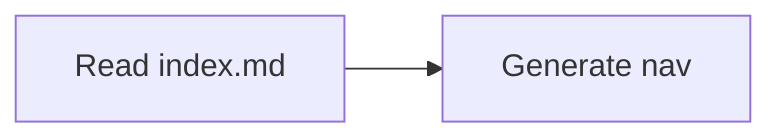

# Markdown Features

The syntax reference for this docs app. Everything listed here is rendered by the
current scaffold — if a pattern isn't on this page, assume it is not supported and
verify with a local `pnpm build` before relying on it.

Pages are authored as `.md` by default. Use `.mdx` only when a page needs
embedded JSX (a custom component or interactive widget); plain Markdown covers
everything below.

## Frontmatter

Every page carries YAML frontmatter with at least `title` and `description`:

```yaml
---
title: Page Title
description: A short summary of the page.
---
```

`title` drives the sidebar label and the page `<title>`. `description` drives
search previews, social cards, and sibling summaries in `## Contents` lists. An
empty or missing `description` degrades all three, so always write one.

## GFM alerts

GitHub-flavored Markdown alert blockquotes render as styled callouts. Supported
types include `NOTE`, `TIP`, `IMPORTANT`, `WARNING`, and `CAUTION`:

```text
> [!NOTE]
> Useful supporting context.

> [!WARNING]
> Important information to be aware of.
```

Rendered, all five:

> [!NOTE]
> Useful supporting context.

> [!TIP]
> A shortcut or a better default.

> [!IMPORTANT]
> Something the reader must not skip.

> [!WARNING]
> Important information to be aware of.

> [!CAUTION]
> An action with consequences that are hard to undo.

Use one callout per idea and keep it to two or three lines. A page with more than
a couple of callouts per section is usually a page whose prose needs restructuring.

## Mermaid diagrams

Fenced code blocks tagged `mermaid` render as diagrams:

````text

```mermaid
flowchart LR
  A[Read index.md] --> B[Generate nav]
```
````

Rendered:


```mermaid
flowchart LR
  A[Read index.md] --> B[Generate nav]
```

Mermaid diagrams re-render when the theme is toggled. The site initialises
Mermaid with its own palette (see `documentation/components/mermaid.tsx`), so
diagrams pick up the same surfaces, text colour, and teal accent as the rest of
the page in both modes.

Because the palette is applied centrally:

- Do not add `%%{init: ...}%%` directives, `style` lines, or `classDef` colour
  overrides. They fight the site theme and break one of the two modes.
- Keep node labels short. Use `<br/>` for a line break inside a flowchart label;
  the Mermaid transform expects it.
- Prefer `flowchart LR` / `flowchart TD`, `sequenceDiagram`, and `stateDiagram-v2`.
  They are the shapes that stay readable at ordinary page width.

Mermaid is the **source of truth** for every diagram on this site. Agents and
reviewers read the Mermaid; a polished SVG, when one exists, is a rendering for
people. See [SVG-plus-Mermaid diagrams](#svg-plus-mermaid-diagrams).

## Tabs

Tab groups use the `=== "Label"` syntax from the shared docs-transforms remark
plugin. Each label starts a new tab, tab content is indented four spaces under
its label, and a blank line separates labels.

```text
=== "pnpm"

    pnpm install

=== "npm"

    npm install
```

Rendered:

=== "pnpm"

    pnpm install

=== "npm"

    npm install

The first label is the default active tab. Tab content may include any Markdown:
paragraphs, code fences, Mermaid diagrams, images.

## SVG-plus-Mermaid diagrams

Some overview diagrams carry a hand-authored SVG next to their Mermaid source.
The SVG lives in `documentation/public/diagrams/` and is referenced by its
site-root path. Wrap the pair in a tab group with the SVG first and the Mermaid
second, and give each tab an italic date caption so drift between the two
representations is visible to the reader.

````text
=== "Diagram"

    

    *SVG regenerated 2026-09-16*

=== "Source"

    ```mermaid
    flowchart LR
      …
    ```

    *Mermaid updated 2026-09-16*
````

Rules for the pair:

- When you edit the Mermaid for a behaviour change, bump its date caption in the
  same commit. The SVG may lag until someone regenerates it; the captions say
  which one is current.
- Every node and labelled edge in a diagram must be verifiable against source
  code, not only against prose. Keep the evidence list that accompanied the
  diagram when it was drawn, and do not add a node the code does not support.
- Do not inline an authored SVG without a Mermaid counterpart unless the layout
  is not expressible in Mermaid.
- Diagrams without a polished counterpart use a plain `mermaid` fence.

### Authoring an SVG counterpart

The SVGs are hand-written and follow one visual vocabulary so the site reads as
one system:

- `role="img"` with `<title>` and `<desc>` referenced by `aria-labelledby`.
- System font stack; body text 12–14px, titles 18px, nothing under 11px;
  monospace for paths and commands.
- White cards with near-black text, so the file reads on both light and dark
  pages. Mid-grey only for connectors, column bands, and any text drawn directly
  on the page background. Never draw black or white text on the page background.
- Colours set through CSS custom properties with fallbacks
  (`fill: var(--diagram-card, #ffffff)`), so the same file can be themed if it is
  ever inlined.
- Accent meaning is fixed site-wide: teal for a standalone form or the primary
  flow, lavender for a plugin member or secondary path, amber for release-owned
  or out-of-band elements, green for a verified state.
- Keep each file under about 24 KB, no embedded fonts or rasters, `viewBox`
  around 1240 wide.

Before committing, render the file on a white and on a `#0d1117` background
(for example with `rsvg-convert -b <colour>`) and look at both. A label that is
invisible in one mode is the most common defect.

## Images and asset paths

Static assets live under `documentation/public/` and are referenced from the
site root, for example `/diagrams/<name>.svg`. The production site is served
under the `/skills` base path; the build rewrites root-relative asset paths for
that base, and the build check below is how you confirm it for a new asset.

## Code blocks

Fenced code blocks are syntax-highlighted, and a copy button is included by
default. Always put a language identifier on the opening fence so highlighting
works:

````text
```bash
cd documentation && pnpm dev
```
````

Rendered:

```bash
cd documentation && pnpm dev
```

Use `bash` for shell commands, matching the rest of this repo's examples.

## Full-text search

The site ships with built-in FlexSearch-powered static search. Readers can find
content by keyword without browsing the directory tree. Search quality depends on
good frontmatter `title` and `description` values and on descriptive headings —
another reason to keep both current.

## Dark/light mode

The layout includes a theme toggle. Content, code blocks, and Mermaid diagrams
all re-render on a mode switch, so author with both themes in mind and avoid
baking in colours or contrast assumptions that only hold for one. The palette
itself is defined once in `documentation/app/globals.css`; change tokens there
rather than styling individual pages.

## Verify before committing

Build the site and look at the affected pages in both modes:

```bash
cd documentation && pnpm build
```

A successful build proves the Markdown compiled. It does not prove a diagram is
readable or an asset path resolves; open the page.
