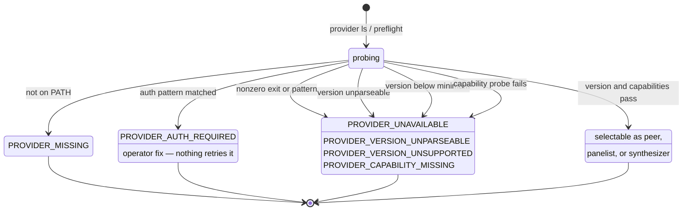
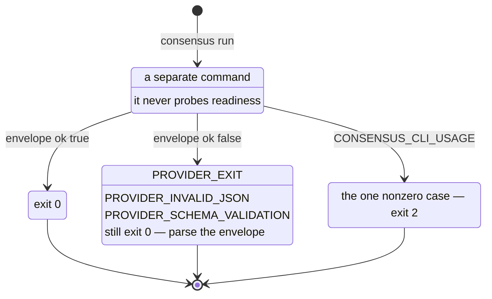

# Configuration

Configuration shared by [`create`](create.md), [`decide`](decide.md),
[`plan`](plan.md), [`refine`](refine.md), [`evaluate`](evaluate.md), and
[`panel`](panel.md).

## What can I configure?

The config file stores default participants, not a separate settings profile for
each skill. `peers` is shared by all five converging workflows; `panelists` and
`panel_size` apply to Panel.

| Workflow                               | Saved defaults                                | Model and effort behavior today                                                                  |
| -------------------------------------- | --------------------------------------------- | ------------------------------------------------------------------------------------------------ |
| Create, Decide, Plan, Refine, Evaluate | `defaults.peers`                              | Provider selection works. Configured `model` and `effort` are forwarded to each peer's provider. |
| Panel                                  | `defaults.panelists`, `defaults.panel_size`   | Configured `model` and `effort` are forwarded to the selected provider.                          |
| [Phone a Friend](phone-a-friend.md)    | No automatic saved advisor-default resolution | The host can pass `--model` and `--effort` to `consensus run` for an individual consultation.    |

There are no `plan`, `refine`, or `phone-a-friend` config sections. Settings such
as `--agency`, `--cold-start`, and `--synthesizer` are per-run controls, not saved
config keys. See the individual workflow guides for their flags.

## Configuration file example

The file is **strict JSON**: comments and trailing commas are not supported.
Use the annotated tab to understand the fields, and the JSON tab when saving a
file. Replace the model placeholders with IDs supported by your installed
provider CLI and account, or remove `model` to leave that choice to the provider.
The effort strings illustrate the shape; supported values depend on the
provider and model.

=== "Annotated explanation (not a config file)"

    ```jsonc
    {
      // Required schema identifier; only "v1" is accepted.
      "schema_version": "v1",
      // Optional object of shared workflow defaults.
      "defaults": {
        // Exactly two distinct providers for Create/Decide/Plan/Refine/Evaluate.
        // Model/effort fields here are forwarded to that peer's provider.
        "peers": [
          {
            "provider": "claude", // Required provider ID, not a model name.
            "model": "<claude-model-id>", // Optional nonempty string; replace this ID.
            "effort": "high" // Optional nonempty string; check provider/model support.
          },
          { "provider": "codex" } // Omit both to keep the provider CLI defaults.
        ],
        // At least two distinct providers for Panel; model/effort work here too.
        "panelists": [
          {
            "provider": "claude", // Required provider ID.
            "model": "<claude-model-id>", // Optional nonempty string; replace this ID.
            "effort": "high" // Optional nonempty string; check provider/model support.
          },
          {
            "provider": "codex",
            "model": "<codex-model-id>",
            "effort": "medium"
          }
        ],
        // Optional integer >= 2; otherwise uses the panelist list length, or 2.
        "panel_size": 2
      }
    }
    ```

=== "JSON (replace model IDs before use)"

    ```json
    {
      "schema_version": "v1",
      "defaults": {
        "peers": [
          {
            "provider": "claude",
            "model": "<claude-model-id>",
            "effort": "high"
          },
          { "provider": "codex" }
        ],
        "panelists": [
          {
            "provider": "claude",
            "model": "<claude-model-id>",
            "effort": "high"
          },
          {
            "provider": "codex",
            "model": "<codex-model-id>",
            "effort": "medium"
          }
        ],
        "panel_size": 2
      }
    }
    ```

For a minimal config that selects providers without overriding their models or
effort, use:

```json
{
  "schema_version": "v1",
  "defaults": {
    "peers": [{ "provider": "claude" }, { "provider": "codex" }]
  }
}
```

### Field reference

Only `schema_version` is required in the root object; `defaults` and each of its
fields are optional. Inside an agent object, `provider` is required. Unknown keys are rejected at every level;
omit optional values rather than setting them to `null`.

| JSON field                   | Type and constraints                                    | When omitted / behavior                                                                 |
| ---------------------------- | ------------------------------------------------------- | --------------------------------------------------------------------------------------- |
| `schema_version`             | Required string, exactly `"v1"`                         | Invalid if missing.                                                                     |
| `defaults`                   | Object                                                  | This file supplies no overrides.                                                        |
| `defaults.peers`             | Array of exactly two agent objects, distinct providers  | Falls through to lower-precedence peer defaults, then built-ins.                        |
| `defaults.panelists`         | Array of at least two agent objects, distinct providers | Falls through to lower-precedence panel defaults, then built-ins.                       |
| `defaults.panel_size`        | Integer ≥ 2, not a numeric string                       | Uses a lower-precedence size when applicable, otherwise the selected list length, or 2. |
| `defaults.roles`             | Object with only the three keys below                   | Reserved configuration; not applied by current workflow composition resolvers.          |
| `defaults.roles.panelist`    | Array of at least one agent object, distinct providers  | Reserved; not an alternative to `defaults.panelists`.                                   |
| `defaults.roles.advisor`     | One agent object                                        | Reserved; does not automatically select Phone a Friend's peer.                          |
| `defaults.roles.synthesizer` | One agent object                                        | Reserved; does not replace `--synthesizer`.                                             |

An **agent object** has this shape:

| Field      | Type and constraints                                    | Meaning                                                                                                                                       |
| ---------- | ------------------------------------------------------- | --------------------------------------------------------------------------------------------------------------------------------------------- |
| `provider` | Required string matching `^[A-Za-z0-9][A-Za-z0-9._-]*$` | Provider adapter ID, currently `claude`, `codex`, or `cursor`. A syntactically valid ID still needs an available adapter and usable provider. |
| `model`    | Optional nonempty string                                | Provider-specific model ID. No model catalog is validated by the config parser.                                                               |
| `effort`   | Optional nonempty string                                | Provider-specific effort value. The config parser does not enforce an enum.                                                                   |

Uniqueness is by **provider**, not by provider/model pair: two Codex entries with
different models are rejected in the same list. A provider may appear in both
`peers` and `panelists`, since those are separate lists.

### Model and effort support

These are the capabilities of this plugin's adapters, not a claim about every
feature of the upstream provider CLI:

| Provider | Model forwarding            | Effort forwarding                   |
| -------- | --------------------------- | ----------------------------------- |
| `claude` | `--model <value>`           | `--effort <value>`                  |
| `codex`  | `--model <value>`           | `-c model_reasoning_effort=<value>` |
| `cursor` | Unsupported by this adapter | Unsupported by this adapter         |

When a workflow forwards them, omitted fields leave the corresponding provider
options unset. The provider CLI supplies its own defaults. Model availability
and allowed effort values depend on the provider, selected model, and account;
successful config parsing does not prove those values are usable. Passing either
option to this plugin's Cursor adapter yields `PROVIDER_UNSUPPORTED_OPTION`.

A peer whose configured model or effort the selected provider cannot honor
fails with `PROVIDER_UNSUPPORTED_OPTION` rather than running with the option
silently dropped. `consensus config get` shows stored values; provider
availability still decides whether a stored value is usable.

## Config paths and precedence

The generated provider CLI owns default composition through `consensus config`.
Defaults are stored in JSON config files:

- User config: `${XDG_CONFIG_HOME:-$HOME/.config}/consensus/config.json`.
- Project config: the nearest existing `.consensus/config.json` found by walking
  upward from the invocation cwd or `--cwd`. This is not tied to a Git root. If
  none exists, a project-scoped write targets `<cwd>/.consensus/config.json`.

Effective composition is resolved in this order:

1. Invocation flags such as `--peers`, `--panelists`, and `--panel-size`.
2. Project config from `.consensus/config.json`.
3. User config from `.config/consensus/config.json` or `XDG_CONFIG_HOME`.
4. Built-in defaults.

Lists replace whole lists; entries are not merged by provider across scopes.
For example, a project's provider-only `peers` or `panelists` list replaces the
user's entire list, including its model/effort settings. `panel_size` is resolved
separately. An explicit `--panelists` list ignores lower-scope panel sizes unless
you also supply `--panel-size` for that invocation. It also replaces saved
model/effort settings with provider-only entries.

Inspect defaults with:

```bash
consensus config get --json --scope effective
consensus config get --json --scope project
consensus config get --json --scope effective --workflow panel
consensus config list --json
```

The workflow-specific form also resolves provider inventory. Plain effective
output shows merged saved fields and their sources, including reserved fields;
it is not evidence that every field affects a run.

Set or clear defaults with:

```bash
consensus config set --json --scope user --peers claude,codex
consensus config set --json --scope project --panelists claude,codex,cursor --panel-size 3
consensus config clear --json --scope project --key panelists
```

From a repository checkout, run the same commands through
`plugins/consensus/scripts/consensus.mjs` with `node`.

The list flags set provider IDs only. To save model/effort fields, edit the JSON
file directly or import a complete config file:

```bash
consensus config get --json --scope user
consensus config set --json --scope user --from-file ./consensus-config.json
consensus config get --json --scope user
```

`--from-file` replaces the target scope's config with the supplied file (plus
any explicit set flags); it does not merge that file into the existing config.
Inspect and preserve any existing settings you want to keep before importing.

## Peer selection

By default, host detection chooses `claude,codex` on Claude Code and Cursor, and
`codex,claude` on Codex. Override peers with `--peers`:

```bash
node plugins/consensus/skills/refine/scripts/consensus-refine.mjs draft.md --peers claude,codex
```

Converging workflows always resolve exactly two peers. `--peers` has precedence
over project config, user config, and built-in defaults. It takes provider IDs
only and replaces the whole configured list, so a run with `--peers` uses no
saved model or effort; drop the flag to use the configured peers with their
saved selections.

## Panelist selection

[`panel`](panel.md) resolves at least two provider-backed panelists. Override
panelists for one run with `--panelists`:

```bash
node plugins/consensus/skills/panel/scripts/consensus-panel.mjs \
  --question "What risks should we inspect?" \
  --panelists claude,codex
```

Set a target size with `--panel-size`:

```bash
node plugins/consensus/skills/panel/scripts/consensus-panel.mjs \
  --question-file question.md \
  --panel-size 3
```

`--panelists` must list at least two provider ids. `--panel-size` must be 2 or
larger. If `--panel-size` is smaller than the configured panelist list, the first
N configured panelists are selected. If it is larger, the resolver appends ready
providers from inventory order when possible.

## Provider floor, inventory, and preflight

Peer IDs come from provider inventory. The first supported provider floor is
`claude`, `codex`, and `cursor`; future providers are extension points, not v0.1
support claims. Requested peers must be present and usable in provider inventory
and preflight before live use:

```bash
consensus provider ls --json
consensus preflight --json --provider claude --capability run
```

From a repository checkout the same provider CLI lives at
`plugins/consensus/scripts/consensus.mjs` and can be run with `node`:

```bash
node plugins/consensus/scripts/consensus.mjs provider ls --json
node plugins/consensus/scripts/consensus.mjs preflight --json --provider <selected-provider-id> --capability run
```

### Readiness states

Readiness is a state machine, not a boolean. `consensus run` is a separate command that never probes; its terminal failures still exit 0 inside a JSON envelope, with usage errors (exit 2) the only exception.



`consensus run` is a separate command and never probes readiness:



_Mermaid updated 2026-09-16_

## Diagnostics

The wrappers surface provider-neutral diagnostics when a requested peer cannot be
used:

- `PROVIDER_MISSING`
- `PROVIDER_AUTH_REQUIRED`
- `PROVIDER_UNAVAILABLE`
- `PROVIDER_VERSION_UNPARSEABLE`
- `PROVIDER_VERSION_UNSUPPORTED`
- `PROVIDER_CAPABILITY_MISSING`
- `PROVIDER_UNSUPPORTED_OPTION`

Provider `run` results are machine-readable envelopes. Terminal provider
failures such as `ok: false`, `PROVIDER_EXIT`, `PROVIDER_INVALID_JSON`, or
`PROVIDER_SCHEMA_VALIDATION` still exit process `0`; shell callers must parse
the JSON envelope instead of checking `$?`. CLI usage failures
(`CONSENSUS_CLI_USAGE`) exit `2`. The peer-facing `consensus submit` subcommand
uses ordinary nonzero exit codes for validation or capture failures so the peer
can correct the verdict in-turn.

## Synthesizer

In `parallel_synthesized` mode the synthesis call defaults to the first
configured peer's provider. Override it with `--synthesizer <provider-id>` to
select a different provider for routine merging; this flag does not select a
model or effort. The provider must be present and usable in the
provider inventory or preflight fails (`SYNTHESIZER_UNAVAILABLE`). The flag is
warned-and-ignored outside `parallel_synthesized` mode.

## Cold starts

`create`, `decide`, and `plan` default to
`--cold-start independent_draft`: in round 1 each peer drafts from the brief,
options, or goal/constraints before the deliberation converges. `refine` and
`evaluate` remain `shared_input` only because they operate on an existing draft
or artifact.

## Agency

`--agency` controls who resolves a stuck section. At `minimal` agency, unresolved
peer disagreement is surfaced to the user rather than silently decided; this is
the default for `evaluate`. Escalations are routed by `--agency` to the user or
the host (see [Refine → Escalation](refine.md#escalation)).

## Cursor auth

Cursor is included in the provider floor, but local auth state is still
operator-owned. If inventory or preflight reports Cursor as `auth_required`,
unlock the OS keychain or authenticate the Cursor CLI in the current user session
before retrying. Cursor submit-tool support is reserved for a later acceptance
path and is not selected by default.

## Permissions

The consensus `create`, `decide`, `plan`, `refine`, `evaluate`, `panel`, and
`phone-a-friend` skills need permission to run:

- `node` for the wrapper and loop scripts.
- `consensus` for provider inventory/preflight when exposed as a command.
- read/write access to input files, generated `.consensus/` run state, and output
  artifacts.

Refine parallel section mode additionally requires host-native subagent dispatch.
Codex authorization must fail closed: if dispatch approval is unavailable or
denied, the host should report that parallel mode did not run.
