# Consensus

The consensus plugin uses provider-CLI-backed AI peers for three related
workflows: converging artifacts through peer deliberation, single-round panel
responses with side-by-side attribution, and one-shot advisory takes that the
host dispositions. It also packages `observer` and `observer-collab`, the
plugin-local forms of the standalone session observation skills. The peers are invoked through the generated consensus CLI; the
converging wrappers parse your document, run the peers through structured verdict
rounds, and write a markdown deliberation artifact with the final output,
resolution metadata, and a deliberation log.

The peer-workflow scope stays intentionally narrow: five converging skills, one
panel skill, and one advisory skill. The plugin additionally ships two
session-observation skills because observing and collaborating across providers
belong with consensus behavior.

- **[`create`](create.md)** — creates a new artifact from a brief with
  `independent_draft`, `parallel_synthesized`, maximum agency, a deliberation
  log, and a `consensus-resolution` block.
- **[`decide`](decide.md)** — chooses between documented options with
  `independent_draft`, `parallel_synthesized`, minimal agency, required decision
  headings, explicit `## Dissent / Unresolved Disagreement`, and a
  `consensus-resolution` block.
- **[`plan`](plan.md)** — turns a goal and inline constraints into a structured
  markdown plan with `independent_draft`, `parallel_synthesized`, moderate
  agency, required `## Steps`, `## Dependencies`, and `## Risks` headings, and a
  `consensus-resolution` block.
- **[`refine`](refine.md)** — refines a markdown draft by asking two peers to
  deliberate toward a converged artifact with an audit trail.
- **[`evaluate`](evaluate.md)** — judges an artifact against a rubric, with
  unified findings, per-peer reasoning, and dissent preserved in the
  deliberation log.
- **[`panel`](panel.md)** — asks multiple provider-backed panelists the same
  question and writes side-by-side attributed responses while the host stays a
  neutral moderator.
- **[`phone-a-friend`](phone-a-friend.md)** — asks one other provider-backed peer
  for a structured advisory take, then leaves the host responsible for agreeing,
  applying, ignoring, or following up.
- **`observer`** — plugin-local form of
  [`session-observer`](../skills/session-observer.md).
- **`observer-collab`** — plugin-local form of
  [`session-observer-collab`](../skills/session-observer-collab.md); it requires
  the observer workflow and accepts either supported installation identity.

For the deepest reference — operator-QA walkthroughs, exact commands, and example
inputs — see the
[consensus plugin README](https://github.com/tkstang/skills/blob/main/plugins/consensus/README.md).

## Peers, not personas

Consensus invokes provider CLIs as separate processes, rather than assigning
several roles inside one conversation. The host remains responsible for acting
on results. Disagreement is preserved in the artifact and deliberation log:
an impasse is a valid result, `decide` includes a dissent section, and `panel`
does not synthesize its independently attributed responses.

For example, after installing the plugin in Claude Code:

```text
/consensus:refine draft.md --goal "tighten the failure-handling section"
/consensus:panel --question "Should retries live in the client or gateway?" --panel-size 3
```

The first seeks a refined artifact with an audit trail; the second gives you
separate perspectives to judge. Codex uses `$consensus:refine` and
`$consensus:panel`. Cursor's local plugin load uses the local skill names;
see [Installation](../installation.md) for the host-specific setup.

The wrapper emits JSONL status events while the generated CLI returns one JSON envelope per run and spawns the other providers' CLIs as separate OS processes. `IMPASSE` is checked before convergence; a declined convergence consults the escalation triggers. Every terminal outcome writes the artifact.

=== "Diagram"

    

    *SVG regenerated 2026-09-16*

=== "Mermaid"

    ```mermaid
    flowchart TD
      HOST["Host session<br/>Claude Code, Codex, or Cursor"]
      WRAP["Skill wrapper (refine, decide, …)<br/>emits JSONL status events"]
      CLI["Generated consensus CLI<br/>one JSON envelope per run"]
      subgraph peers["Independent peer subprocesses"]
        P1["claude --print --output-format json"]
        P2["codex exec --json<br/>--output-last-message &lt;file&gt;"]
        P3["cursor-agent --output-format json --force"]
      end
      ROUND["Structured verdict round<br/>schema-validated JSON"]
      IMP{"Any IMPASSE verdict?"}
      STOP["Stop and report impasse<br/>status: impasse"]
      CONV{"Converged?"}
      ESC{"Escalation trigger?"}
      ESCOUT["escalation_required<br/>routed to the host or the user<br/>(an auto-routed trigger terminates as<br/>status converged and emits no event)"]
      ART["Refine artifact<br/>&lt;input&gt;.consensus.md"]
      A1["## Final Output"]
      A2["consensus-resolution block<br/>plus a separate consensus-section-states block"]
      A3["## Deliberation Log<br/>per section, per round"]
      DEC["decide writes its own artifact<br/>consensus-decision.md"]
      A4["## Dissent / Unresolved Disagreement<br/>a required decide heading, validated in<br/>each peer's decision text and re-rendered"]

      HOST --> WRAP
      WRAP --> CLI
      CLI --> P1
      CLI --> P2
      CLI --> P3
      P1 --> ROUND
      P2 --> ROUND
      P3 --> ROUND
      ROUND --> IMP
      IMP -->|yes| STOP
      IMP -->|no| CONV
      CONV -->|yes| ART
      CONV -->|no| ESC
      ESC -->|no| ROUND
      ESC -->|yes| ESCOUT
      STOP --> ART
      ESCOUT --> ART
      ART --> A1
      ART --> A2
      ART --> A3
      WRAP --> DEC
      DEC --> A4
    ```

    *Mermaid updated 2026-09-16*

## Who decides: refine, panel, phone-a-friend

The three shapes are not interchangeable. `refine` deliberates to convergence or a reported impasse, `panel` returns attributed takes and refuses to synthesize, and `phone-a-friend` returns one advisory take that the host must disposition.

```mermaid
flowchart TB
  subgraph refine["refine · converging"]
    R0["One draft, two peers"]
    R1["Verdict rounds<br/>peers revise and respond"]
    R2{"Agreement, or IMPASSE?"}
    R3["Converged artifact<br/>+ deliberation log"]
    R4["Reported impasse<br/>resume with --user-direction"]
    RW["Who decides: the peers converge;<br/>an impasse is handed back to you"]
    R0 --> R1 --> R2
    R2 -->|agreement| R3
    R2 -->|impasse| R4
    R3 --> RW
    R4 --> RW
  end
  subgraph panel["panel · non-converging"]
    N0["One question, 2+ panelists"]
    N1["Single independent round<br/>panelists never see each other"]
    N2["Side-by-side attributed responses"]
    N3["Host stays neutral moderator:<br/>no synthesis, no vote, no consensus<br/>(instruction, not code)"]
    NW["Who decides: you, after reading<br/>the attributed takes"]
    N0 --> N1 --> N2 --> N3 --> NW
  end
  subgraph phone["phone-a-friend · advisory"]
    F0["One question, one peer"]
    F1["One provider turn<br/>advisory.schema.json"]
    F2["take, recommendation,<br/>risks, confidence"]
    F3["Host dispositions: agree, disagree,<br/>apply, ignore, follow-up<br/>(instruction, not code)"]
    FW["Who decides: the host agent,<br/>and it must state the disposition"]
    F0 --> F1 --> F2 --> F3 --> FW
  end
```



_Mermaid updated 2026-09-16_

## Iteration modes

The shipped consensus skills support three iteration modes, selected with
`--iteration`:

- **`alternating`** (default for `refine`) — one peer revises and the other
  responds, turn by turn. Lowest cost: one peer call per round.
- **`parallel_revision`** (default for `evaluate`) — both peers revise the same
  input simultaneously each round, each critiquing its own and the peer's
  previous revision; the run converges on emergent agreement. Costs **2x peer
  calls** per round.
- **`parallel_synthesized`** — parallel revision plus a per-round synthesis call
  that merges both revisions into the next round's shared input. Costs **2x peer
  calls plus one synthesis call** per round.

Parallel modes disclose their per-round call multiplier in the `run_started`
JSONL event (`calls_per_round`) and report actual `peer_calls` /
`synthesis_calls` totals at completion.

## Synthesizer, agency, and escalation

- **Synthesizer** — in `parallel_synthesized` mode, a synthesis call merges both
  peers' revisions each round. It defaults to the first configured peer's
  provider and can be overridden with `--synthesizer <provider-id>`. The
  synthesizer must be present in the provider inventory, and the flag is
  warned-and-ignored outside `parallel_synthesized`.
- **Agency** — `--agency` controls who resolves a stuck section. At `minimal`
  agency, unresolved peer disagreement is surfaced to the user rather than
  silently decided.
- **Escalation** — when a parallel-mode section gets stuck (persistent
  disagreement, oscillation, budget exhaustion, or near-done drift), the wrapper
  emits an `escalation_required` JSONL event routed by `--agency` to the user or
  the host. A user decision re-enters with `--user-direction`; a host decision
  re-enters with `--host-direction` and records as an attributed orchestrator
  round.

See [Configuration](configuration.md) for peer selection, the provider floor,
diagnostics, and permissions, and the per-skill pages for the full command set.

## What leaves the machine

Transcripts, observer and collaboration state, and `.consensus/` run state stay local. No artifact file crosses to a peer: the skill reads it locally and compacts it into the prompt string passed on the child's argv, alongside a schema and a few submit environment variables. Everything that comes back is schema-validated and treated as untrusted data.

=== "Diagram"

    

    *SVG regenerated 2026-09-16*

=== "Mermaid"

    ```mermaid
    flowchart TB
      subgraph local["Stays on this machine"]
        TR["Peer transcripts<br/>~/.claude/projects, ~/.codex/sessions,<br/>~/.cursor/projects — read only"]
        ST["Read offsets, watcher, control state<br/>~/.local/state/session-observer/<br/>collab leases: .../collab/leases/"]
        RUN[".consensus/ run state<br/>and output artifacts"]
      end
      HOST["Host skill / wrapper<br/>reads the input artifact locally and<br/>compacts it into the prompt string"]
      subgraph crossing["Crosses the boundary — approval is a skill instruction, not a code gate"]
        PR["argv prompt string<br/>facts, constraints, and the<br/>compacted artifact text"]
        SCH["Claude: the schema is ALSO passed<br/>inline in argv as --json-schema"]
        ENV["Submit env, 4 vars — set for every provider<br/>CONSENSUS_SUBMIT_COMMAND / FILE / SCHEMA<br/>and CONSENSUS_SUBMIT_MAX_BYTES"]
        CWD["The child inherits a cwd<br/>with no filesystem confinement"]
      end
      subgraph remote["Provider CLI subprocess"]
        PEER["claude --print --output-format json<br/>codex exec --json --output-last-message &lt;file&gt;<br/>cursor-agent --output-format json --force"]
      end
      subgraph back["Comes back as untrusted data"]
        OUT["Schema-validated before use;<br/>a failure is PROVIDER_SCHEMA_VALIDATION"]
        REV["Advisory data, never instructions:<br/>never auto-apply edits, commands, or decisions"]
      end
      GUARD["Local guards<br/>options files capped at 1 MiB<br/>inputs, outputs, run dirs confined by --allow-root"]

      TR --> HOST
      ST --> HOST
      RUN --> HOST
      HOST --> PR
      HOST --> SCH
      HOST --> ENV
      HOST --> CWD
      PR --> PEER
      SCH --> PEER
      ENV --> PEER
      CWD --> PEER
      PEER --> OUT
      OUT --> REV
      OUT --> GUARD
      GUARD --> RUN
      TR -.->|"untrusted input: prompt injection<br/>is mitigated, not solved"| GUARD
    ```

    *Mermaid updated 2026-09-16*

## Limitations

- The plugin ships `create`, `decide`, `plan`, `refine`, `evaluate`, `panel`,
  `phone-a-friend`, `observer`, and `observer-collab`. The two observer skills
  also have declared standalone forms with their full `session-*` names.
- Remaining consensus-family skills are future work: `consensus-research`.
- Three iteration modes ship (`alternating`, `parallel_revision`,
  `parallel_synthesized`); `parallel_revision` and `parallel_synthesized`
  disclose their per-round call multiplier (2x peer calls, plus 1 synthesis call
  for synthesized) and escalate stuck states through the agency-gated ladder.
- The independent-draft cold-start strategy is exposed through `create`,
  `decide`, and `plan`. `refine` and `evaluate` remain shared-input only.
- Sections converge independently; whole-document harmonization and deliberation
  metrics / cost caps remain deferred.
- Verdict submission is best-effort by default: successful submit sidecars are
  preferred, then wrappers fall back to final-message parsing. Strict
  require-submission mode remains future work.
- Cursor is supported as a host runtime and as a first-floor peer when its local
  CLI is authenticated. Treat `auth_required` inventory/preflight results as a
  local setup issue, not a retryable consensus failure.
- Codex public marketplace submission is not assumed; Git/local install is the
  v0.1 path.
- skills.sh listing should not be claimed until indexing has been verified after
  publication.
- Prompt injection inside input artifacts is mitigated by prompt framing,
  filtering, and schema validation where applicable, but peer CLIs may still
  produce structurally valid bad advice. Review the audit trail before
  publishing outputs.
- This plugin adds no telemetry. Configured provider CLIs may have their own
  behavior; review those tools separately.

## Contents

- [Create](create.md) - `create` usage: brief inputs, `independent_draft` defaults, output contract, and input handling.
- [Plan](plan.md) - `plan` usage: goal and inline constraints, moderate-agency defaults, required headings, and output contract.
- [Decide](decide.md) - `decide` usage: options input, minimal-agency defaults, required headings, dissent surfacing, and output contract.
- [Refine](refine.md) - `refine` usage: sequential default, iteration modes, resume, escalation, and host-mediated parallel sections.
- [Evaluate](evaluate.md) - `evaluate` usage: artifact-vs-rubric command, defaults, output contract, and guided rubric creation.
- [Phone-a-friend](phone-a-friend.md) - `phone-a-friend` usage: one-shot advisory peer call, provider selection, advisory schema, and host disposition.
- [Panel](panel.md) - `panel` usage: single-round multi-peer questions, panelist selection, JSONL status, output contract, and neutral moderation.
- [Observer](../skills/session-observer.md) - Read and watch a pinned peer session; also available standalone as `session-observer`.
- [Collaborative Observer](../skills/session-observer-collab.md) - Coordinate two sessions with explicit authority boundaries; also available standalone as `session-observer-collab`.
- [Configuration](configuration.md) - Shared configuration: peer and panelist selection, provider floor, config paths, diagnostics, synthesizer, agency, and permissions.
