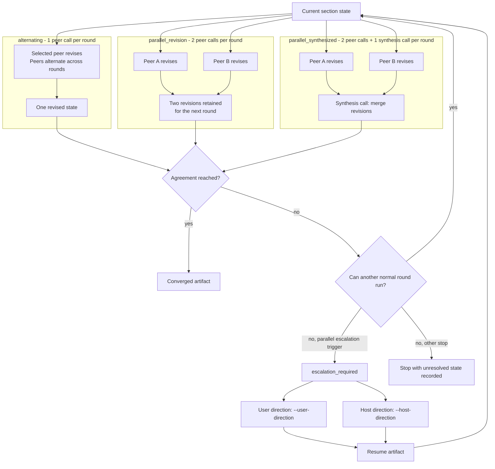

# Refine

`refine` improves a markdown draft by asking two provider-CLI-backed AI peers to
deliberate toward a converged artifact with an audit trail. The wrapper parses
the document into sections, runs the configured peers through verdict rounds, and
writes a deliberation artifact beside the input as `<input>.consensus.md` unless
`--output <path>` is given. The artifact contains the final output, resolution
metadata, section states, and a per-section deliberation log.

For the full hands-on walkthrough of all three iteration modes and the escalation
ladder against live peers — exact commands, example inputs, and expected output —
see the
[consensus plugin README](https://github.com/tkstang/skills/blob/main/plugins/consensus/README.md) and
[`skills/refine/references/operator-qa.md`](https://github.com/tkstang/skills/blob/main/plugins/consensus/skills/refine/references/operator-qa.md).

## Sequential refinement (default)

The default flow is sequential section processing with the `alternating`
iteration mode. Run the wrapper against a markdown file:

```bash
node plugins/consensus/skills/refine/scripts/consensus-refine.mjs draft.md --goal "Make this clearer."
```

## Iteration modes

Select how the two peers deliberate with `--iteration`. The default is
`alternating`.

### Round-flow comparison



```bash
# Both peers revise in parallel each round; converge on emergent agreement (2x peer calls).
node plugins/consensus/skills/refine/scripts/consensus-refine.mjs draft.md \
  --goal "Tighten the draft." --iteration parallel_revision

# Parallel revision plus a per-round synthesis merge (2x peer calls + 1 synthesis call).
node plugins/consensus/skills/refine/scripts/consensus-refine.mjs draft.md \
  --goal "Tighten the draft." --iteration parallel_synthesized --synthesizer claude
```

Parallel modes disclose their per-round call multiplier in the `run_started`
JSONL event (`calls_per_round`) and report actual `peer_calls` /
`synthesis_calls` totals at completion. The synthesizer defaults to the first
peer and must be present in the peer inventory (`SYNTHESIZER_UNAVAILABLE`
otherwise); it is warned-and-ignored outside `parallel_synthesized`.

## Resume and recovery

Resume from a prior artifact with `--resume <artifact-path>`. Use
`--user-direction "<direction>"` when continuing after an impasse or max-rounds
stop. User direction is recorded as a user round in the new deliberation
artifact.

```bash
node plugins/consensus/skills/refine/scripts/consensus-refine.mjs draft.md \
  --resume draft.consensus.md \
  --user-direction "Prefer the shorter introduction."
```

Use the corrupt-section controls only when the wrapper reports blocked resume
state.

## Escalation

When a parallel-mode section gets stuck — persistent disagreement, oscillation,
budget exhaustion, or near-done drift — the wrapper emits an
`escalation_required` JSONL event routed by `--agency` to the user or the host.

- A **user** decision re-enters with `--resume <artifact> --user-direction
"<text>"`.
- A **host** decision re-enters with `--resume <artifact> --host-direction
"<text>"` (optionally `--host-decision-kind <kind>`) and records as an
  attributed orchestrator round. Always disclose a host-decided round to the user
  — host-decided rounds are not silent.

## Host-mediated parallel sections

Parallel section orchestration is host mediated: the wrapper prepares packets and
the host runtime dispatches section runners. Prepare packets first, dispatch
section runners with the host runtime, then fan in the completed section outputs:

```bash
node plugins/consensus/skills/refine/scripts/consensus-refine.mjs draft.md --prepare-parallel --goal "Tighten the draft."
node plugins/consensus/skills/refine/scripts/consensus-refine.mjs --fan-in .consensus/<run-id>/manifest.json
```

Parallel section mode requires host-native subagent dispatch. Under Codex,
dispatch authorization must fail closed: if approval is unavailable or denied, the
host reports that parallel mode did not run rather than silently falling back to
sequential.
