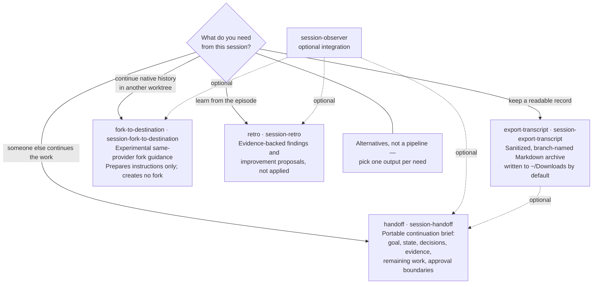

# Session

The Session plugin helps you preserve context and learn from coding sessions.
Choose the output you need; these skills are not a required sequence.

_Mermaid updated 2026-09-16_

| What you need                                        | Skill                                                              | What it produces                                                                                                  |
| ---------------------------------------------------- | ------------------------------------------------------------------ | ----------------------------------------------------------------------------------------------------------------- |
| Let another agent or person continue the work        | [Handoff](../../skills/session-handoff.md)                         | A portable packet of goals, state, decisions, evidence, remaining work, and approval boundaries.                  |
| Keep a readable conversation archive                 | [Export Transcript](../../skills/session-export-transcript.md)     | A sanitized Markdown transcript, not a continuation packet or native session transfer.                            |
| Continue native history in another existing worktree | [Fork to Destination](../../skills/session-fork-to-destination.md) | Alpha, same-provider, destination-safe guidance; preparation does not create a fork or transfer worktree changes. |
| Learn from an invocation or bounded episode          | [Retro](../../skills/session-retro.md)                             | Evidence-backed findings and improvement proposals, without applying them.                                        |

## Installation and names

Install the Session plugin using the [Installation guide](../../installation.md).
Each member also has a standalone form:

| Plugin-local name     | Standalone name               |
| --------------------- | ----------------------------- |
| `handoff`             | `session-handoff`             |
| `export-transcript`   | `session-export-transcript`   |
| `fork-to-destination` | `session-fork-to-destination` |
| `retro`               | `session-retro`               |

The linked guides cover both forms. Invocation syntax depends on the host; do
not assume every provider exposes the same qualified command name.

Session does not require the Consensus plugin. Observer integration is optional
where a guide offers it. [Observer](../../skills/session-observer.md) and
[Collaborative Observer](../../skills/session-observer-collab.md) are available
standalone and as Consensus members, not Session members.

Fork to Destination is alpha: provider coverage and end-to-end verification
are incomplete. Static packaging is not proof of live provider discovery or permissions; keep the
[installation verification limits](../../installation.md) in view.

## Contents

- [Handoff](../../skills/session-handoff.md) — Prepare portable continuation context.
- [Export Transcript](../../skills/session-export-transcript.md) — Save a sanitized conversation archive.
- [Fork to Destination](../../skills/session-fork-to-destination.md) — Prepare alpha same-provider native fork guidance.
- [Retro](../../skills/session-retro.md) — Review a bounded episode and propose improvements.
