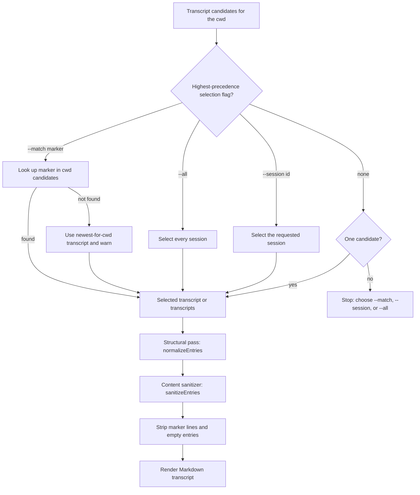

# Export Session Transcript

`export-session-transcript` is a standalone Agent Skill that exports the current
agent session to a sanitized Markdown transcript.

## What it does

- Exports the **current** conversation (yours — Claude Code, Codex, or Cursor)
  to a sanitized Markdown transcript.
- Names the output after the current git branch (`/` replaced with `-`) and
  writes it by default to `~/Downloads`.
- Supports Claude Code, Codex, and Cursor transcript stores.

Only visible user/assistant messages survive: tool calls, tool results,
system/developer instructions, environment/AGENTS.md/skill payloads, subagent
notifications, and the session-marker line are all excluded.

## The session-marker mechanism

The hard problem is identifying **which** transcript is _this_ live
conversation. To solve it, the agent announces a unique random-hex session
marker to the user; the marker lands in the transcript, and the export script
greps cwd candidates for it to select the current session unambiguously. If the
marker has not yet been flushed, it falls back to the newest transcript for the
cwd with a warning — re-run with `--session <id>` if the fallback picked the
wrong session.

## Modes and flags

- `--match <marker>` selects the current session by the announced marker (with
  newest-for-cwd fallback).
- `--session <id>` exports a specific session id.
- `--all` exports every session for the cwd, one file each.
- `--runtime <claude-code|codex|cursor|auto>` selects the runtime (default
  `auto`: env hint, then best-effort detection).
- `--out <path>` overrides the output file or directory (also accepted
  positionally).

Selection is evaluated with precedence `--all` > `--session` > `--match` > no
selector. The highest-precedence flag present wins and lower-precedence flags are
ignored. With no selector, exactly one cwd candidate is selected; multiple
candidates exit with an ambiguity message that asks for `--match`, `--session`,
or `--all`.

## Selection and sanitization flow

## Sanitization

Sanitization is two layers:

1. A **structural pass** (`normalizeEntries` in transcript-core) drops tool
   calls/results and command-message records.
2. An **export-owned content sanitizer** (`sanitizeEntries`) drops hidden-payload
   messages surviving as ordinary text — environment-context wrappers,
   AGENTS.md/SKILL.md/skill-body payloads, system/developer instruction records,
   subagent notifications, and `turn_aborted` markers.

The session-marker line and empty entries are stripped before render.

## Limitations

- Cursor agent transcript JSONL is the supported store; the Cursor SQLite
  chat-history store is out of scope for the session skills.
- Prompt injection inside input transcripts is mitigated by prompt framing and
  filtering, but review exported output before publishing it.
- This repository adds no telemetry. Configured provider CLIs may have their own
  behavior; review those tools separately.
