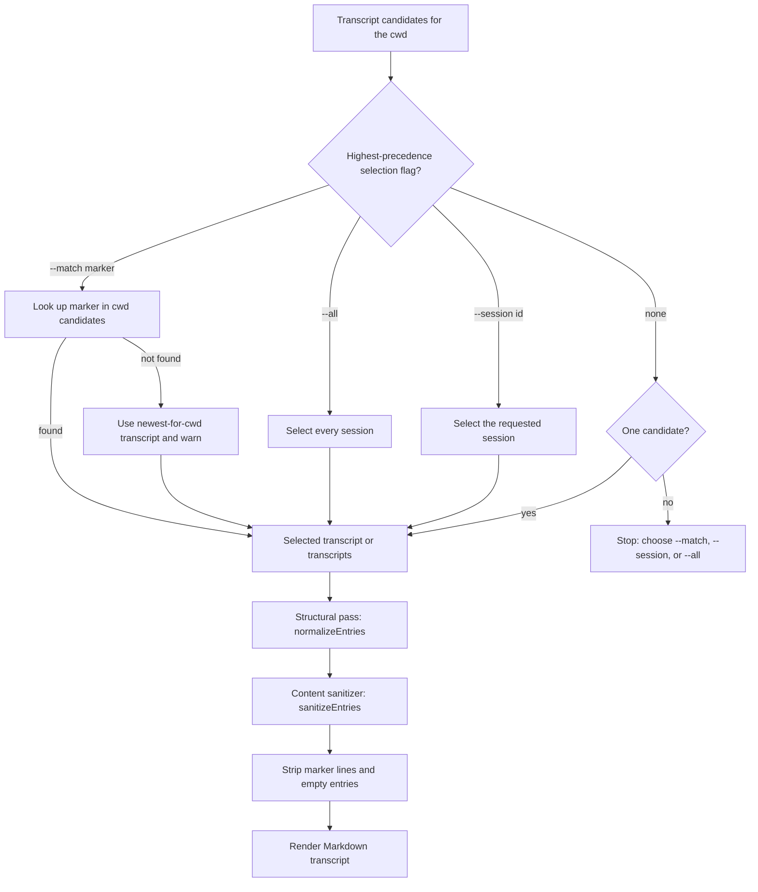

# Session Export Transcript

`session-export-transcript` exports the current agent session to a sanitized
Markdown transcript. Install it standalone under that full name or through the
session plugin as `export-transcript`; both generated forms share one authored
owner and one `metadata.version`.

## What it does

- Exports the **current** conversation (yours — Claude Code, Codex, or Cursor)
  to a sanitized Markdown transcript.
- Names the output after the current git branch (`/` replaced with `-`) and
  writes it by default to `~/Downloads`.
- Supports Claude Code, Codex, and Cursor transcript stores.
- Optionally appends bounded, source-attributed activity with
  `--include-activity`.

Only visible user/assistant messages survive: tool calls, tool results,
system/developer instructions, environment/AGENTS.md/skill payloads, subagent
notifications, automatic-control wake envelopes, and the session-marker line are
all excluded. Wake envelopes carry lease ids and pinned peer-session identity, so
they are dropped on their structural provenance tag rather than by matching their
payload text.

Ask-user exchanges are the one exception. Every runtime asks the operator
questions through a tool call (`AskUserQuestion`, `request_user_input`,
`AskQuestion`), and the question plus any answer the runtime recorded is visible
conversation rather than tool mechanics, so it is exported. What gets recorded
differs by runtime: Claude Code records the answer; Codex records it but cannot
distinguish an operator choice from an `autoResolutionMs` timeout; Cursor
records only the question, and the export says the selected option is
unrecorded.

## The session-marker mechanism

The hard problem is identifying **which** transcript is _this_ live
conversation. To solve it, the agent announces a unique random-hex session
marker to the user; the marker lands in the transcript, and the export script
greps cwd candidates for it to select the current session unambiguously. If the
marker has not yet been flushed, it falls back to the newest transcript for the
cwd with a warning — re-run with `--session <id>` if the fallback picked the
wrong session.

## Modes and flags

- `--match <marker>` selects the current session by the announced marker (with
  newest-for-cwd fallback).
- `--session <id>` exports a specific session id.
- `--all` exports every session for the cwd, one file each.
- `--include-activity` appends a labelled activity report to each selected
  export; it is off by default.
- `--runtime <claude-code|codex|cursor|auto>` selects the runtime (default
  `auto`: env hint, then best-effort detection).
- `--out <path>` overrides the output file or directory (also accepted
  positionally).

Selection is evaluated with precedence `--all` > `--session` > `--match` > no
selector. The highest-precedence flag present wins and lower-precedence flags are
ignored. With no selector, exactly one cwd candidate is selected; multiple
candidates exit with an ambiguity message that asks for `--match`, `--session`,
or `--all`.

## Optional activity appendix

`--include-activity` leaves the sanitized conversation pipeline intact and
adds a separate **Sensitive activity/debug data** section. Each selected
session is captured once, and both the conversation and activity sections are
derived from that snapshot. Export is stateless: it does not read or advance
Session Observer offsets, and `--all` does not change output filenames.

The export activity budget is 64 MiB for the rendered report, with no
invocation-count cap and a 2 KiB preview per value. The shared projection also
reserves 256 bytes for late-call context, although a normal full-session export
starts at zero and includes the call itself. Source and delivery ranges,
locators, captured/delivered/displayed counts, omissions, coverage, and
diagnostics remain explicit.

The report keeps native tool names and adds typed skill evidence when the
transcript supplies it. Claude Code attribution, structured `Skill`
invocations, and names-only skill attachments stay distinct. Cursor `Read` and
`ReadFile` calls can supply inferred `SKILL.md` file-load evidence from their
structured `path`. Historical Codex transcripts can supply the inference only
from the exact experimental `read_file.file_path` carrier; upstream removed the
tool in March 2026, and it is absent from the recent local sample. Shell
commands, aliases, and prose are never treated as skill loads. Source-wide skill
names are labelled `captured-source` and participate in the report byte budget
with explicit omission counts.

The supported runtimes do not record a skill version. A timestamp-relevant
installed-file or Git lookup is inferred context, can remain unknown, and is
not proof of the revision that executed.

Activity previews can contain commands, paths, identifiers, tool inputs, and
tool outputs even though the conversation section remains sanitized. The
exporter does not open Claude persisted-output sidecars, Cursor `agent-tools/`
files, or Claude, Codex, or Cursor child transcripts. Schema v1 emits explicit
`not-read` coverage for persisted-output references recorded by Claude and child
IDs recorded by Claude or Codex. Cursor `agent-tools/` and child-transcript
surfaces have no dedicated per-reference schema-v1 coverage entry. Extraction
failure appears as `record-activity: not-read` with an
`ACTIVITY_EXTRACTION_ERROR` diagnostic.

Cursor activity is retrospective. It includes settled calls and calls visible
in the snapshot with `pending-lifecycle`, identifies them by frame and block
position, reports results as not recorded, and leaves per-call outcome unknown.

## Selection and sanitization flow

## Sanitization

Sanitization is two layers:

1. A **structural pass** (`normalizeEntries` in transcript-core) drops tool
   calls/results and command-message records, except ask-user exchanges, which
   it keeps as visible conversation.
2. An **export-owned content sanitizer** (`sanitizeEntries`) drops hidden-payload
   messages surviving as ordinary text — environment-context wrappers,
   AGENTS.md/SKILL.md/skill-body payloads, system/developer instruction records,
   subagent notifications, and `turn_aborted` markers.

The session-marker line and empty entries are stripped before render.

## Limitations

- Cursor agent transcript JSONL is the supported store; the Cursor SQLite
  chat-history store is out of scope for the session skills.
- Prompt injection inside input transcripts is mitigated by prompt framing and
  filtering, but review exported output before publishing it.
- This repository adds no telemetry. Configured provider CLIs may have their own
  behavior; review those tools separately.
