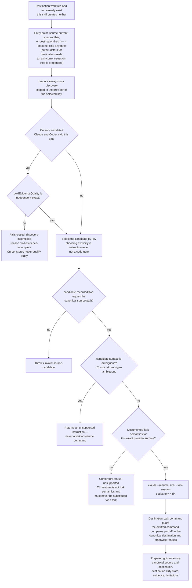

# Session Fork to Destination

`session-fork-to-destination` is an **alpha** skill, available as a standalone
skill and as `fork-to-destination` in the Session plugin. It discovers session
candidates, shows a sanitized preview, and
prepares destination-safe fork instructions. It never runs a provider itself,
so no fork is created by discovery, preview, or preparation.

Use this workflow only for native history continuation within one provider:
Codex to Codex or Claude Code to Claude Code. For portable continuation between
agents or providers, use [Session Handoff](session-handoff.md). A native fork
does not receive a full handoff packet, and this skill does not transfer native
runtime state across providers.

Automatic provider execution is not part of this skill. The user reviews and
runs the prepared native command; preparation itself remains read-only.

Current Cursor transcript discovery is unavailable. Cursor's store layout supplies a
lossy project slug rather than independent exact cwd evidence, so a matching store
returns a path-free `discovery-incomplete` result. No Cursor candidate can be selected
or previewed.

## Choose an entry point

The user creates or opens the existing destination worktree and its editor or
terminal tab. This skill does not create a worktree or manage tabs. Its source
discovery avoids guessing which conversation to fork, its sanitized preview
helps distinguish plausible candidates, and its destination-safe command guard
prevents accidentally opening the fork from the source or another directory.
Those checks are the practical value of preparation even when the final native
command could be run manually.

Use one of three explicit entry points:

- `source-current` when you are working in the exact source session. Direct
  identity is usable only when trustworthy evidence corroborates it; otherwise
  select a discovered candidate explicitly.
- `source-other` when you are in another session and want to select the source
  from bounded discovery results.
- `destination-fresh` when the destination worktree is already open in a fresh
  tab. If the provider cannot switch safely inside that session, exit it, keep
  the tab in the destination worktree, and then run the prepared terminal
  command.

Discovery is separate from qualification. A path match alone does not prove a
current session identity, and display labels are not native provider IDs.

### Qualification gates

`prepare` always runs discovery whatever the entry point. Cursor candidates must carry independent exact working-directory evidence, which the current store never supplies; every candidate then passes recorded-directory equality, the ambiguous-surface refusal, documented fork semantics for that exact surface, and the destination guard.



_Mermaid updated 2026-09-16_

## Prepare guidance

The following examples use synthetic paths and IDs:

```bash
node skills/session-fork-to-destination/scripts/session-fork-to-destination.mjs \
  discover --source /synthetic/source --provider claude --json

node skills/session-fork-to-destination/scripts/session-fork-to-destination.mjs \
  preview --source /synthetic/source \
  --session codex:cli:00000000-0000-4000-8000-000000000001 --json

node skills/session-fork-to-destination/scripts/session-fork-to-destination.mjs \
  prepare --source /synthetic/source --target /synthetic/destination \
  --session claude:cli:00000000-0000-4000-8000-000000000002 \
  --entry-point source-other --json
```

`--provider all` fails closed while Cursor lacks independent exact cwd evidence. Use
an explicit `--provider claude` or `--provider codex` discovery for the supported
guidance workflow.

The output keeps provider and surface in the qualified identifier. It reports
the canonical source and destination, destination dirty state, evidence status,
limitations, and the exact working directory for any terminal instruction.
The terminal command refuses to run outside the canonical destination path.

Preparing instructions does not authenticate, invoke Claude Code, Codex, or
Cursor, mutate provider stores, or transfer uncommitted Git changes. Review the
destination state and the prepared command before choosing whether to run it.
Preparation also does not create a dormant or background fork for later use.

## Fork and resume are different

A fork preserves the selected original session and creates a new conversation.
A resume continues the selected session identity. This skill only emits a fork
instruction when public evidence documents fork semantics for the exact
provider surface. It never substitutes a resume command for a fork.

Claude Code CLI documents `--resume ID --fork-session`. Codex CLI documents
`codex fork ID`. These capabilities are documentation-backed as of 2026-09-12
and have not been live verified for this experiment.

Cursor CLI documents resume, and Cursor IDE documents Duplicate Chat. Cursor
CLI fork semantics, CLI-to-IDE identity interoperability, and reliable
cross-worktree destination placement are unsupported. These capabilities are
future-facing evidence and do not make Cursor transcript discovery available.

## Current limitations

- Alpha maturity: provider coverage and end-to-end verification are incomplete.
- Provider capabilities are based on dated public documentation, not a live
  provider run.
- Discovery reads bounded transcript data and may require explicit selection.
- Cursor discovery reports `discovery-incomplete` because the current store does not
  provide independent exact cwd evidence; no Cursor candidate can be selected or
  previewed.
- Dirty destination state is reported, but Git changes are not transferred.
- Worktree creation and editor-tab management remain the user's responsibility.
- Cursor transitions remain unsupported unless the exact surface has sufficient
  documented evidence.
