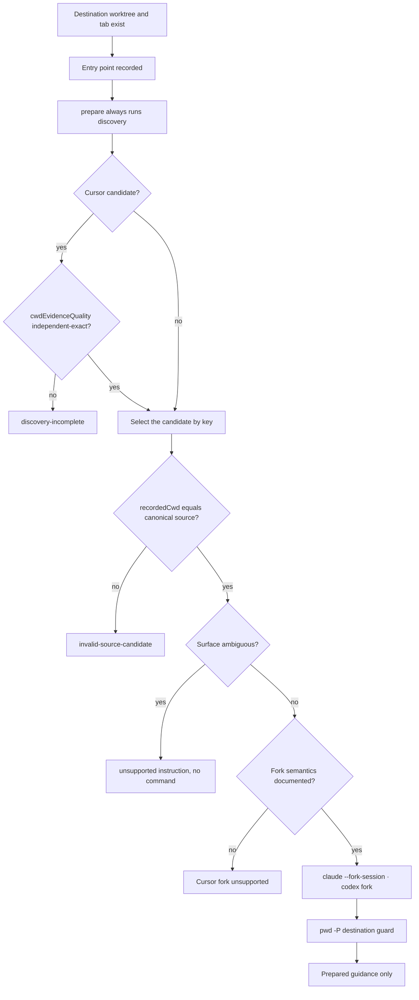

# Session Fork to Destination

`session-fork-to-destination` is an **alpha** skill, available as a standalone
skill and as `fork-to-destination` in the Session plugin. It discovers session
candidates, shows a sanitized preview, and
prepares destination-safe fork instructions. It never runs a provider itself,
so no fork is created by discovery, preview, or preparation.

For the same provider, prepare a native fork directly. For Claude ↔ Codex,
`import` first writes supported history as a reconstructed target-provider seed;
the user then forks that seed. This transfers conversation history, not source
provider runtime state. For a concise continuation brief instead, use
[Session Handoff](session-handoff.md).

Automatic provider execution is not part of this skill. The user reviews and
runs the prepared native command; preparation itself remains read-only.

Current Cursor transcript discovery is unavailable. Cursor's store layout supplies a
lossy project slug rather than independent exact cwd evidence, so a matching store
returns a path-free `discovery-incomplete` result. No Cursor candidate can be selected
or previewed.

## Choose an entry point

The user creates or opens the existing destination worktree and its editor or
terminal tab. This skill does not create a worktree or manage tabs. Its source
discovery avoids guessing which conversation to fork, its sanitized preview
helps distinguish plausible candidates, and its destination-safe command guard
prevents accidentally opening the fork from the source or another directory.
Those checks are the practical value of preparation even when the final native
command could be run manually.

Use one of three explicit entry points:

- `source-current` when you are working in the exact source session. Direct
  identity is usable only when trustworthy evidence corroborates it; otherwise
  select a discovered candidate explicitly.
- `source-other` when you are in another session and want to select the source
  from bounded discovery results.
- `destination-fresh` when the destination worktree is already open in a fresh
  tab. If the provider cannot switch safely inside that session, exit it, keep
  the tab in the destination worktree, and then run the prepared terminal
  command.

Discovery is separate from qualification. A path match alone does not prove a
current session identity, and display labels are not native provider IDs.

### Same-provider qualification gates

`prepare` always runs discovery whatever the entry point. Cursor candidates must carry independent exact working-directory evidence, which the current store never supplies; every candidate then passes recorded-directory equality, the ambiguous-surface refusal, documented fork semantics for that exact surface, and the destination guard.


```mermaid
flowchart TD
  START["Destination worktree and tab exist"]
  EP["Entry point recorded"]
  DISC["prepare always runs discovery"]
  CUR{"Cursor candidate?"}
  CURQ{"cwdEvidenceQuality independent-exact?"}
  STOP1["discovery-incomplete"]
  SEL["Select the candidate by key"]
  QUAL{"recordedCwd equals canonical source?"}
  STOP2["invalid-source-candidate"]
  AMB{"Surface ambiguous?"}
  STOP3["unsupported instruction, no command"]
  EV{"Fork semantics documented?"}
  STOP4["Cursor fork unsupported"]
  EVOK["claude --fork-session · codex fork"]
  GUARD["pwd -P destination guard"]
  OUT["Prepared guidance only"]

  START --> EP --> DISC --> CUR
  CUR -->|yes| CURQ
  CUR -->|no| SEL
  CURQ -->|no| STOP1
  CURQ -->|yes| SEL
  SEL --> QUAL
  QUAL -->|no| STOP2
  QUAL -->|yes| AMB
  AMB -->|yes| STOP3
  AMB -->|no| EV
  EV -->|no| STOP4
  EV -->|yes| EVOK --> GUARD --> OUT
```

_Mermaid updated 2026-09-16_

How the checks affect the prepared guidance:

- `prepare` always runs discovery, whatever the entry point.
- The entry point does not bypass checks. For `destination-fresh`, guidance begins with an `exit-current-session` instruction unless destination switching is documented for that provider surface.
- Cursor needs independent, exact working-directory evidence. Its current stores do not supply that evidence, so discovery fails closed with `discovery-incomplete` and reason `cwd-evidence-incomplete`. Claude and Codex do not use this Cursor-specific gate.
- Choosing a candidate explicitly is a workflow instruction, not an additional runtime gate.
- The recorded working directory must match the canonical source path; otherwise preparation fails with `invalid-source-candidate` before surface and capability checks.
- An ambiguous surface produces an unsupported instruction, never a fork or resume command. Cursor's `store-origin-ambiguous` is one such surface.
- Documented fork semantics: Claude `--resume <id> --fork-session`; Codex `codex fork <id>`; Cursor fork `status: 'unsupported'`.
- The emitted command compares `pwd -P` against the canonical destination and otherwise refuses.

## Prepare guidance

The following examples use synthetic paths and IDs:

```bash
node skills/session-fork-to-destination/scripts/session-fork-to-destination.mjs \
  discover --source /synthetic/source --provider claude --json

node skills/session-fork-to-destination/scripts/session-fork-to-destination.mjs \
  preview --source /synthetic/source \
  --session codex:cli:00000000-0000-4000-8000-000000000001 --json

node skills/session-fork-to-destination/scripts/session-fork-to-destination.mjs \
  prepare --source /synthetic/source --target /synthetic/destination \
  --session claude:cli:00000000-0000-4000-8000-000000000002 \
  --entry-point source-other --json
```

`--provider all` fails closed while Cursor lacks independent exact cwd evidence. Use
an explicit `--provider claude` or `--provider codex` discovery for the supported
guidance workflow.

The output keeps provider and surface in the qualified identifier. It reports
the canonical source and destination, destination dirty state, evidence status,
limitations, and the exact working directory for any terminal instruction.
The terminal command refuses to run outside the canonical destination path.

Preparing instructions does not authenticate, invoke Claude Code, Codex, or
Cursor, mutate provider stores, or transfer uncommitted Git changes. Review the
destination state and the prepared command before choosing whether to run it.
Preparation also does not create a dormant or background fork for later use.

## Import into the other provider

Select an inactive Claude CLI or Codex CLI source and the other target provider.
Both paths must be distinct registered worktrees of the same repository, with a
clean source. End the source conversation after a completed assistant turn and exit
it before importing. Cross-provider `source-current` refuses; invoke from another
session (`source-other`) or the destination (`destination-fresh`).

```bash
node skills/session-fork-to-destination/scripts/session-fork-to-destination.mjs \
  import --source /synthetic/source --target /synthetic/destination \
  --session claude:cli:00000000-0000-4000-8000-000000000002 \
  --to codex --entry-point destination-fresh --json
```

This plans without writing. Review the destination home, seed location, counts,
omissions, and limitations, then repeat the command with
`--apply --expect-plan DIGEST`, substituting the returned digest. Applying creates
the seed only. Run the returned guarded native fork command from the canonical
destination worktree to create the new conversation. A changed plan requires a new
review; an exact repeated import reuses the same seed without replacing it.

**Imports preserve raw supported text and tool payloads, which may contain secrets.**
Preview sanitization does not apply to import. The converter omits reasoning and
recognized provider context, replaces media with visible placeholders, and reports
those omissions. It preserves completed, matched native function/custom calls and
results. Unsupported or incomplete histories refuse instead of silently becoming
plain text. Examples include pending tool calls, rollback, ambiguous runtime
context, queued Claude input, incompatible tool identifiers and summary-only Codex
compaction. Queued input is refused because its delivery order cannot yet be
reconstructed safely. Other Claude attachment records also refuse until their
content can be projected safely.

`--target-home PATH` selects an existing target home outside both selected worktrees. Otherwise the target uses
`CODEX_HOME` or `CLAUDE_CONFIG_DIR` when set, then its conventional home. The printed
command preserves the selection. Source discovery still uses conventional homes
and does not support alternate source-home environment routing. A permission-denied
store write provides a terminal apply command; the skill does not elevate access.

Changed seeds refuse import: manually fork the existing seed if its additional
history is wanted. Archived seeds must be restored through the provider's supported
workflow before replanning. Nothing overwrites or automatically unarchives them.
Raw input/output is bounded to 32 MiB, source records to 100,000, and lines to 4 MiB;
large embedded media may fail before conversion. Long Claude project keys over 200
characters and symlinked store descendants are unsupported. A failed apply can
leave empty store directories; it removes only staging files it created.

## Fork and resume are different

A fork preserves the selected original session and creates a new conversation.
A resume continues the selected session identity. This skill only emits a fork
instruction when public evidence documents fork semantics for the exact
provider surface. It never substitutes a resume command for a fork.

Claude Code CLI documents `--resume ID --fork-session`. Codex CLI documents
`codex fork ID`. These same-provider capabilities are documentation-backed as of
2026-09-12. The separate import checks below exercised reconstructed seeds through
Codex RPC and Claude CLI with noninteractive flags.

Cursor CLI documents resume, and Cursor IDE documents Duplicate Chat. Cursor
CLI fork semantics, CLI-to-IDE identity interoperability, and reliable
cross-worktree destination placement are unsupported. These capabilities are
future-facing evidence and do not make Cursor transcript discovery available.

## Current limitations

- Alpha maturity: provider coverage and end-to-end verification are incomplete.
- Generated-importer 0.3.1 checks passed with Codex 0.159.2 through app-server
  fork/continuation/restart and Claude Code 2.1.285 through CLI fork/resume with
  noninteractive flags. These use synthetic histories and loopback services in
  preinitialized disposable homes.
- Codex's exact printed terminal command passed fork creation, interactive
  continuation, restart and resume with fixture-local `CODEX_EXEC_SERVER_URL=none`.
  This validates the supported embedded-server configuration; default daemon
  startup remains blocked by the test sandbox's refusal to execute setuid `/bin/ps`.
- Claude Code 2.1.285 exact interactive terminal acceptance remains unverified:
  startup tried `api.anthropic.com` and stopped under the network block before
  child creation. No production model-service acceptance or GUI placement is claimed.
- Completion checks reject final Codex commentary or trailing unfinished lifecycle
  state, and check Claude's final retained assistant text and subsequent assistant
  rows even when omitted context follows them. These checks cannot prove a writer is inactive; stop the source before import.
- Discovery reads bounded transcript data and may require explicit selection.
- Cursor discovery reports `discovery-incomplete` because the current store does not
  provide independent exact cwd evidence; no Cursor candidate can be selected or
  previewed.
- Dirty destination state is reported, but Git changes are not transferred.
- Worktree creation and editor-tab management remain the user's responsibility.
- Cursor transitions remain unsupported unless the exact surface has sufficient
  documented evidence.
