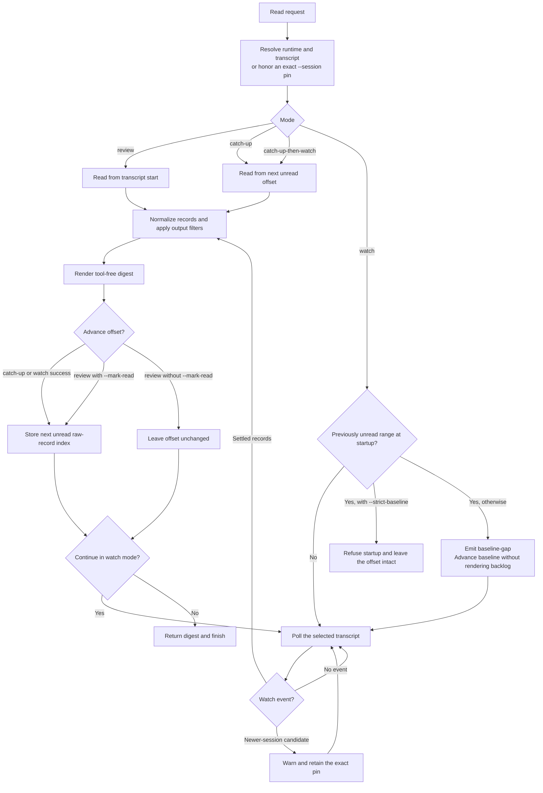

# Session Observer

`session-observer` is a standalone Agent Skill for checking what another coding
agent just did in the current project. It lets you (Claude Code, Codex, or
Cursor) inspect another runtime's transcript, render a tool-free digest, and
track per-runtime read offsets so follow-up checks surface only new content.

## What it does

- Reviews what another coding agent did in this project, from the peer runtime's
  transcript store — Claude Code, Codex, and Cursor are supported.
- Renders **tool-free digests** by default: only natural-language `user` /
  `assistant` messages are included. Tool calls, tool results, and Claude Code
  slash-command payload records are excluded. Opt in with `--include-tools`
  (adds compact call markers), `--include-command-messages` (adds slash-command
  payloads), or `--debug` (adds tool markers and results).
- Tracks **per-session read offsets** (a high-water mark over raw transcript
  records consumed), so `catch-up` shows only records that arrived since the
  last read. A full `review` reads from the start; `catch-up` reads the delta.
- Supports a foreground **watch mode**. `watch` and the top-level `--watch`
  alias poll the active peer transcript, debounce settled changes, emit
  catch-up digests to stdout, and can be controlled with `watch-ctl status`,
  `pause`, `resume`, `flush`, and `stop`. Continuous writes are emitted after
  `--max-pending-sec` even if the transcript never goes quiet.

Automatic responses are bounded to the active agent invocation that keeps the
watcher running and reads its output; backgrounded commands in yield-after-turn
agent harnesses do not wake a future invocation.

It is read-only: it does not write to peer transcripts.

## Usage

```bash
node skills/session-observer/scripts/session-observer.mjs review --runtime codex --cwd "$PWD"
node skills/session-observer/scripts/session-observer.mjs catch-up --runtime cursor --cwd "$PWD"
node skills/session-observer/scripts/session-observer.mjs watch --runtime codex --cwd "$PWD"
node skills/session-observer/scripts/session-observer.mjs watch-ctl status --json
```

Use `review` to read a session from the start and `catch-up` to surface only
what is new since the last read. `catch-up` automatically advances the
high-water mark on success; pass `--mark-read` if you want a `review` run to
advance it too.

## Read and offset flow



## Collaboration flags

The collaboration skill composes with this CLI; it does not replace it. These
flags are the base observer's collaboration-facing contract:

| Flag or command                                  | Purpose                                                                                                                                     |
| ------------------------------------------------ | ------------------------------------------------------------------------------------------------------------------------------------------- |
| `whoami --json`                                  | Resolve and print this session's runtime, session ID, transcript path, and identity source before a peer is pinned.                         |
| `--session <runtime>:<id>`                       | Pin every stateful read or watch to one exact peer identity.                                                                                |
| `--quiet-empty`                                  | Consume metadata-only growth and advance the offset without printing an empty delta.                                                        |
| `--strict-baseline`                              | Refuse a standalone watch that would skip previously unread records; use `catch-up-then-watch` when you need to consume that backlog first. |
| `--event-log <path>`                             | Write metadata-only watch events under the observer state directory; message content remains on stdout.                                     |
| `--include-tools` / `--include-command-messages` | Expand a digest for bounded debugging; these are opt-in and do not change the default tool-free view.                                       |

Watch output can report `baseline-gap`, `newer-session-candidate`, terminal
diagnostics, or automatic control input. A newer-session candidate is a warning,
not permission to switch pins. A filtered or empty digest is not evidence that
the peer was idle; inspect the raw-record accounting or run a pinned review.

For the two-peer handshake, wake tiers, authority rules, and lifecycle setup,
see [Session Observer Collaboration](session-observer-collab.md).

## Runtime resolution (`--runtime`)

The skill defaults to `--runtime auto`, which resolves by host hint, prior
same-cwd state, or candidate availability:

- `auto` picks the peer via `SESSION_OBSERVER_SELF`, a prior same-cwd state
  entry, or tier-population fallback.
- Use `--runtime claude-code | codex | cursor` to select a runtime explicitly,
  or `--session <runtime>:<sessionId>` when multiple matching sessions exist.

For watch mode, `--runtime both` watches Claude Code and Codex in one foreground
process. Cursor remains supported through explicit `--runtime cursor` or
`--runtime auto`. `watch-ctl status --json` includes the resolved session id,
transcript path, current transcript record count, consumed offset, records
behind, and health flags, so consumers can distinguish peer idleness from
watcher drift.

## Permissions

`session-observer` needs permission to:

- run `node`,
- read transcript stores under `~/.claude/projects/`, `~/.codex/sessions/`, and
  `~/.cursor/projects/`, and
- write read-offset, watcher, control, and optional metadata-only event-log
  state under `~/.local/state/session-observer/`.

It does not write to peer transcripts.

## Limitations

- Session observer supports Cursor agent transcript JSONL only;
  `~/.cursor/chats/*/store.db` SQLite chat history is out of scope.
- Watch mode only responds while the active agent invocation keeps the
  foreground watcher running and actively reads stdout or re-polls `watch-ctl
status`; provider-hook automation for future self-triggered turns is out of
  scope. Starting `watch` in a backgrounded shell does not notify Claude Code,
  Codex, or Cursor after the current invocation yields.
- Prompt injection inside transcripts is mitigated by prompt framing, filtering,
  and schema validation where applicable, but review outputs before acting on
  them.
- This repository adds no telemetry. Configured provider CLIs may have their own
  behavior; review those tools separately.
