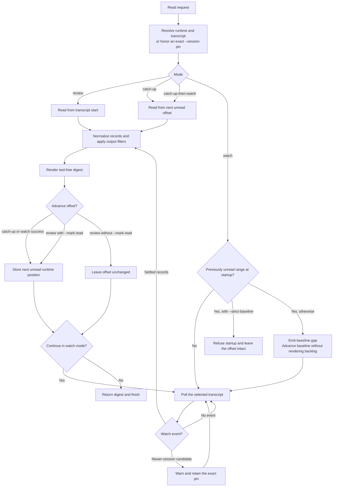

# Session Observer

`session-observer` checks what another coding agent just did in the current
project. It is generated as the standalone `session-observer` skill and as the
consensus plugin-local `observer` skill. Both forms share one canonical owner,
runtime behavior, and `metadata.version`. It lets you (Claude Code, Codex, or
Cursor) inspect another runtime's transcript, render a tool-free digest, and
track per-session read positions so follow-up checks surface only new content.
Claude Code and Codex retain record-index offsets. Cursor uses a separate
frame-indexed state and continuity contract.

## What it does

- Reviews what another coding agent did in this project, from the peer runtime's
  transcript store — Claude Code, Codex, and Cursor are supported.
- Renders **tool-free digests** by default: only natural-language `user` /
  `assistant` messages are included. Tool calls, tool results, and Claude Code
  slash-command payload records are excluded. Opt in with `--include-tools`
  (adds compact call markers), `--include-command-messages` (adds slash-command
  payloads), or `--debug` (adds tool markers and results).
- Keeps **ask-user exchanges** in that default view. Every runtime asks the
  operator questions through a tool call (`AskUserQuestion`,
  `request_user_input`, `AskQuestion`), so the question renders even with tools
  filtered.
  Claude Code and Codex also record the answer, which renders alongside it and
  is counted in `accounting.rendered.askUserEntries`. Cursor records no answer
  at all, and its digest says the selected option is unrecorded rather than
  leaving a silent gap. Claude answers count as human only with native human or
  legacy-absent provenance. Codex auto-resolved answers remain unattributed.
- Tracks **per-session read positions**, so `catch-up` shows only input that
  arrived since the last read. Claude Code and Codex count JSONL records;
  Cursor digest schema v2 counts physical JSONL frames.
- Uses **content-first Cursor observation**. Prefix-stable substantive content
  can be reported while lifecycle is still pending. Confirmed completion
  remains a separate, terminal-only claim.
- Supports a foreground **watch mode**. `watch` and the top-level `--watch`
  alias poll the active peer transcript, debounce settled changes, emit
  catch-up digests to stdout, and can be controlled with `watch-ctl status`,
  `pause`, `resume`, `flush`, and `stop`. Continuous writes are emitted after
  `--max-pending-sec` even if the transcript never goes quiet.

Automatic responses are bounded to the active agent invocation that keeps the
watcher running and reads its output; backgrounded commands in yield-after-turn
agent harnesses do not wake a future invocation.

It is read-only: it does not write to peer transcripts.

## Optional activity evidence

Pass `--include-activity` to add source-attributed tool activity beside the
conversation digest in `review`, `catch-up`, `watch`, or
`catch-up-then-watch`. Activity is off by default. When it is on, ordinary tool
markers are removed from the conversation section and ask-user exchanges remain
visible there.

Activity has a separate fixed budget from the conversation controls:

| Mode                 | Activity bytes | Invocations | Each preview | Late-call context |
| -------------------- | -------------- | ----------- | ------------ | ----------------- |
| `review`             | 128 KiB        | 1,024       | 2 KiB        | 256 bytes         |
| `catch-up` / `watch` | 32 KiB         | 80          | 2 KiB        | 256 bytes         |

The report distinguishes captured-source, delivered-range, and displayed
counts. Its omission counts, coverage, diagnostics, and source locators explain
what was bounded or unavailable. A result whose call occurred before the
delivered range can retain a small `outside-delivered-range` call context
without replaying the call as new activity.

Claude Code and Codex conversation and activity come from one detailed read.
Cursor uses one physical-frame scan. `review` is a stateless full snapshot and
does not move the high-water mark unless `--mark-read` is also present.
Catch-up and watch share the ordinary delivery checkpoint; activity has no
separate cursor.

For Cursor, stateful activity waits for terminal settlement. A later
`turn_ended` can emit an `activityOnly: true` delta when the call was previously
observed but not yet safe to deliver. Stateless review is retrospective and can
show both `settled` and `pending-lifecycle` calls. Cursor records no tool results
or call IDs, so the report uses frame/block position, marks result coverage as
not recorded, and leaves per-call outcome unknown.

Activity is sensitive recorded data. Previews may contain commands, paths,
identifiers, inputs, and outputs. Persisted-output files, Cursor
`agent-tools/`, and child transcripts are not read; references to them produce
explicit `not-read` coverage. Extraction failures likewise remain visible as
`record-activity: not-read` plus `ACTIVITY_EXTRACTION_ERROR`. Empty or unread
coverage is not proof that the session had no activity.

## Identity and provenance

- **Codex identity:** the first physical `session_meta.payload.id` is the
  native rollout identity. Recognized rollout filenames must corroborate it;
  malformed or contradictory first-header evidence fails closed. Root,
  direct-parent, fork, and inherited-history fields remain lineage rather than
  substitutes for the native pin. Child digests warn when parent context may
  precede the child's own work.
- **Claude provenance:** top-level `origin.kind: "human"` is human input and
  `task-notification` is visibly rendered as `runtime-notification`. Absent
  provenance keeps legacy behavior; peer and unknown values remain unmarked.
  Notification records do not count as human engagement, authorize work, or
  enter collaboration/export/fork human previews. These shapes were observed
  across Claude Code 2.1.220–2.1.276; parsing follows the schema without a
  hard-coded version gate.
- **Saved positions:** a nonzero Claude Code or Codex position is bound to one
  provider session and canonical transcript path. Missing, mismatched,
  malformed, or shrunken evidence fails closed before output or advancement.
  Plain `review` stays stateless unless `--mark-read` is passed.

## Usage

```bash
node skills/session-observer/scripts/session-observer.mjs review --runtime codex --cwd "$PWD"
node skills/session-observer/scripts/session-observer.mjs catch-up --runtime cursor --cwd "$PWD"
node skills/session-observer/scripts/session-observer.mjs review --runtime codex --include-activity
node skills/session-observer/scripts/session-observer.mjs watch --runtime codex --cwd "$PWD"
node skills/session-observer/scripts/session-observer.mjs watch-ctl status --json
```

Use `review` to read a session from the start and `catch-up` to surface only
what is new since the last read. `catch-up` automatically advances the
high-water mark on success; pass `--mark-read` if you want a `review` run to
advance it too.

## Read and offset flow


```mermaid
flowchart TD
  S[Read request] --> R["Resolve runtime and transcript<br/>or honor an exact --session pin"]
  R --> M{Mode}
  M -- review --> F[Read from transcript start]
  M -- catch-up --> U[Read from next unread offset]
  M -- catch-up-then-watch --> U
  M -- watch --> B{Previously unread range at startup?}
  B -->|No| W[Poll the selected transcript]
  B -->|"Yes, with --strict-baseline"| Q[Refuse startup and leave the offset intact]
  B -->|"Yes, otherwise"| G["Emit baseline-gap<br/>Advance baseline without rendering backlog"]
  G --> W
  F --> N[Normalize records and apply output filters]
  U --> N
  W --> K{Watch event?}
  K -- Settled records --> N
  K -- Newer-session candidate --> Y[Warn and retain the exact pin]
  Y --> W
  K -- No event --> W
  N --> D[Render tool-free digest]
  D --> A{Advance offset?}
  A -- catch-up or watch success --> O[Store next unread runtime position]
  A -->|"review with --mark-read"| O
  A -->|"review without --mark-read"| Z[Leave offset unchanged]
  O --> T{Continue in watch mode?}
  Z --> T
  T -- Yes --> W
  T -- No --> X[Return digest and finish]
```

## Collaboration flags

The collaboration skill composes with this CLI; it does not replace it. These
flags are the base observer's collaboration-facing contract:

| Flag or command                                  | Purpose                                                                                                                                                                                                                         |
| ------------------------------------------------ | ------------------------------------------------------------------------------------------------------------------------------------------------------------------------------------------------------------------------------- |
| `whoami --json`                                  | Resolve and print this session's runtime, session ID, transcript path, and identity source before a peer is pinned.                                                                                                             |
| `--session <runtime>:<id>`                       | Pin every stateful read or watch to one exact peer identity.                                                                                                                                                                    |
| `--quiet-empty`                                  | Consume metadata-only growth and advance the offset without printing an empty delta.                                                                                                                                            |
| `--strict-baseline`                              | Refuse a standalone watch that would skip previously unread records; use `catch-up-then-watch` when you need to consume that backlog first.                                                                                     |
| `--event-log <path>`                             | Write metadata-only watch events under the observer state directory; message content remains on stdout.                                                                                                                         |
| `--include-tools` / `--include-command-messages` | Expand a digest for bounded debugging; these are opt-in and do not change the default tool-free view. On Claude Code and Codex, `--include-tools` also adds option descriptions to ask-user questions, which render either way. |

Watch output can report `baseline-gap`, `newer-session-candidate`, terminal
diagnostics, or automatic control input. A newer-session candidate is a warning,
not permission to switch pins. A filtered or empty digest is not evidence that
the peer was idle; inspect the digest's declared schema, index base, and
accounting or run a pinned review.

## Re-arm an exact pinned watcher

When a watcher expires or stops, keep the exact `<runtime>:<session-id>` pin.
Stop the old watcher, confirm it is gone, then start one replacement with
`catch-up-then-watch`:

```bash
node skills/session-observer/scripts/session-observer.mjs watch-ctl stop \
  --session codex:<peer-session-id> --json

node skills/session-observer/scripts/session-observer.mjs catch-up-then-watch \
  --session codex:<peer-session-id> --quiet-empty
```

If re-arm instead reports a saved identity/path mismatch, confirm the expected
and observed binding, then reset only that pin and replay it:

```bash
node skills/session-observer/scripts/session-observer.mjs state reset \
  --session codex:<peer-session-id>
node skills/session-observer/scripts/session-observer.mjs catch-up-then-watch \
  --session codex:<peer-session-id> --quiet-empty --until-stopped
```

Use a runtime-wide reset only when every tracked session for that runtime should
replay.

Do not use plain `watch` for this recovery. A plain watch intentionally advances
past an unread startup baseline and emits `baseline-gap`; it does not render that
backlog first. A clean SIGTERM requests an orderly stop but does not force a
pending delta flush. Normal max-runtime expiry performs a final poll and flush.

Interpret the replacement's evidence in three separate layers:

1. **Persisted consumption:** the raw range is `[fromIndex, nextIndex)`, and the
   legacy Claude Code/Codex offset advances to `nextIndex`.
2. **Process output:** `renderedFromIndex` and `renderedToIndex` identify the
   records represented in the digest written to stdout. Tool-, reasoning-, and
   metadata-only records can advance the raw range while rendering nothing.
3. **Agent delivery:** successful stdout does not prove that Monitor or another
   harness delivered those bytes into an observing agent.

Deterministic tests cover known renderable messages across clean SIGTERM,
`watch-ctl stop`, and max-runtime restarts, plus filtered-only ranges, startup
appends, and competing consumers. They found no supported clean-path message
loss. One legacy boundary remains: Claude Code/Codex state is persisted before
stdout completes, so a failed output write consumes that range and a later
exact-pin restart does not replay it. Avoid competing stateful consumers for the
same target; stronger replay guarantees require an acknowledgment/checkpoint
design rather than offset rollback.

For the two-peer handshake, wake tiers, authority rules, and lifecycle setup,
see [Collaborative Observer](session-observer-collab.md).

## Runtime resolution (`--runtime`)

The skill defaults to `--runtime auto`, which resolves by host hint, prior
same-cwd state, or candidate availability:

- `auto` picks the peer via `SESSION_OBSERVER_SELF`, a prior same-cwd state
  entry, or tier-population fallback.
- Use `--runtime claude-code | codex | cursor` to select a runtime explicitly,
  or `--session <runtime>:<sessionId>` when multiple matching sessions exist.

For watch mode, `--runtime both` watches Claude Code and Codex in one foreground
process. Cursor remains supported through explicit `--runtime cursor` or
`--runtime auto`. `watch-ctl status --json` includes the resolved session ID,
transcript path, declared index base, current input count, consumed position,
buffered/behind position, and health details. Cursor targets also expose
independent status facets, so engagement, activity, content availability,
lifecycle, delivery, and watcher health are not inferred from one another.

## Cursor reliability contract

Cursor support is intentionally narrower and more explicit than a generic
record offset:

- **Surface and identity:** the supported baseline is agent-transcript JSONL
  under `~/.cursor/projects/`. Stateful reads require an exact session,
  canonical project cwd, and canonical transcript path. Project-slug or recency
  matches are diagnostic candidates only and never inherit state or authorize a
  pin switch.
- **Digest and index:** Cursor returns digest schema v2 with
  `indexBase: "zero-based-jsonl-frame-index"`. `fromIndex` is inclusive and
  `nextIndex` is the first undelivered safe frame. Entry `recordIndex` is the
  delivery frame; `sourceFrameIndex` identifies the original content frame.
  User frames also define presentation groups, so `--max-turns N` remains
  useful even when Cursor emits many exchanges before one terminal frame. Do
  not reinterpret these values as schema-v1 record indices.
- **Observation versus completion:** the ordinary observer requests the
  `observation` projection. After one unchanged stability interval,
  substantive content may be `available` with entry availability
  `pending-lifecycle`. A later `turn_ended` reconciles lifecycle as success,
  aborted, error, cancelled, or unknown. Completion-sensitive collaboration
  separately requests `confirmed-completion` and cannot consume an open turn.
- **State and continuity:** Cursor state lives in the owner-only
  `cursor-state.json` schema-v2 store. Delivery progress is separate from the
  continuity checkpoint: pending content can advance the former, while the
  byte-prefix hash advances only through `turn_ended`. Open-turn frames are
  therefore never treated as immutable history. Canonical identity, open-turn
  reconciliation, stability candidates, delivery reservations, and last status
  remain isolated from legacy `state.json` record offsets.
- **Recovery:** a legacy checkpoint found inside a grow-in-place trailing frame
  is re-anchored automatically at the affected session's last terminal-settled
  boundary; sibling Cursor sessions are preserved. A changed settled prefix,
  shrink, replacement, unsupported rotation, or unverified legacy state still
  fails closed. Use `state reset --session cursor:<session-id>` for explicit
  single-session replay. Use `state reset --runtime cursor` only when every
  Cursor session can be reset and replayed; the CLI reports the broader reset's
  destructive scope.

Cursor observed-side reading and bounded foreground watching are
`live-validated` for the measured local Cursor 3.11.13 agent-transcript surface.
That label does not promote other Cursor stores, lifecycle continuation,
scheduled callbacks, or background-agent surfaces. Unmeasured behavior remains
`documented-but-unvalidated` or `unavailable`; collaboration therefore keeps
buffered manual catch-up when no effective wake route is proven.

## Permissions

`session-observer` needs permission to:

- run `node`,
- read transcript stores under `~/.claude/projects/`, `~/.codex/sessions/`, and
  `~/.cursor/projects/`, and
- write read-offset, watcher, control, and optional metadata-only event-log
  state under `~/.local/state/session-observer/`.

It does not write to peer transcripts.

## Limitations

- Session observer supports Cursor agent transcript JSONL only;
  `~/.cursor/chats/*/store.db` SQLite chat history is out of scope.
- Watch mode only responds while the active agent invocation keeps the
  foreground watcher running and actively reads stdout or re-polls `watch-ctl
status`; provider-hook automation for future self-triggered turns is out of
  scope. Starting `watch` in a backgrounded shell does not notify Claude Code,
  Codex, or Cursor after the current invocation yields.
- Prompt injection inside transcripts is mitigated by prompt framing, filtering,
  and schema validation where applicable, but review outputs before acting on
  them.
- This repository adds no telemetry. Configured provider CLIs may have their own
  behavior; review those tools separately.
